# AI駆動型開発スタイルガイド

## 1. 本書の目的 — What is AI-Driven Agile Development?

本書は、チームが日々の開発をどのような考え方で進めるかをまとめた文書です。
ルールの一覧ではなく、**なぜその進め方を選ぶのか**という背景と合わせて記述しています。

チームが目指すのは、「変化に強く、常に健康な状態を保ち続けるソフトウェアを、チームで育て続ける」ことです。
大きな塊で計画し、長い時間をかけて一気に作り上げるスタイルでは、完成した頃には前提が変わっていた、ということが珍しくありません。
また、動いているソフトウェアが「触ると壊れそうな状態」であれば、そもそも変化に対応することができません。
本書では、この2つの認識を出発点として、スクラムの枠組みとGenAIの活用を組み合わせた開発スタイルを定めます。

読み方の目安として、新しくチームに参加した方はまず第3章（Core Principles）と第4章（Start with Why）を読んでください。
大前提と行動原則が腹落ちしたうえで第8章（Reference Practices）以降の具体的なルールを読むと、なぜそのルールが存在するかが自然に理解できるはずです。
既にチームで開発している方は、日々の判断に迷ったときに第3章に戻ってきてください。判断の拠り所として機能するように書いています。

### 本書が扱わない範囲

本書は、スクラムチームとしての開発の進め方を扱います。次の内容は本書の対象外です。

具体的なアーキテクチャ選定(マイクロサービスかモノリスか、採用するフレームワークなど)、個別のテスト自動化ツールの使い方、CI/CDパイプラインの詳細設定、そして各プロジェクト固有の技術スタックに基づく実装規約は、本書では定めません。これらはプロジェクトごとの`CLAUDE.md`やリポジトリのドキュメント(README、docs配下)で定めます。

本書はあくまで「チームとしての共通の進め方」を定めるものです。

---

## 2. なぜAIは開発を変えるのか — Why Does AI Change Development?

我々はGenAIをチームの生産性向上に積極的に活用します。AIが開発にもたらす変化の核心は、「何をするか」そのものよりも、これまで人間が担ってきたフィードバックループの一部をAIが担い、ループの回る速度と所在が変わることにあります。

なお、Phaseが進んだ先でAIが担う「自律ループ」（実行・検証・反映までをAIが自走させる回し方。第13章「AI協働の成熟度モデル」の「自律ループの自律度レベルとPhaseの段階運用」）は、まったく新しい概念ではありません。出力を検証し次に反映するというフィードバックループ自体は、スクラムの「検査と適応」、CIの自動テスト、トヨタ生産方式の自働化と構造的に同じものです。新しいのはループという概念ではなく、**ループを回す所在と速度**です。これまで人間が担い、スプリントやCIの周期（週〜分）で回っていたフィードバックループの一部が、AIによって担われ、分・秒のオーダーまで速くなる。この所在と速度のずれが、AI駆動開発で新たに向き合う変化です。したがって自律ループは、一部の先進的なチームだけの特殊事例でも、従来と断絶した別物でもありません。本書が既に持つループの考え方（第3章「中核となる原則」の「行動原則①『小さく作って、大きく繋げる』」で述べた「フィードバックのループを短く保つ」という考え方）の延長線上にあり、その回り方が一段速く・一段自律的になったものとして、段階的に扱います（具体的な段階運用は第13章「AI協働の成熟度モデル」の「自律ループの自律度レベルとPhaseの段階運用」）。

AIとの協働がどこまで深まるかは個人・領域によって段階があります。その段階（Phaseモデル）の詳細は第13章（AI Collaboration Maturity Model）で扱います。

---

## 3. 中核となる原則 — Core Principles

我々の開発は、1つの大前提と3つの行動原則を土台とします。以降のすべてのルールは、ここから導かれます。

### 大前提 — 常に健康な状態を保ち続けるソフトウェアであれ

**― ソフトウェア・サービスの未病・予防にフォーカスせよ ―**

アジャイル開発の本質は「変化への対応」です。
しかし、変化に対応するには、**変更を安全に適用できる状態**がソフトウェア側に担保されていなければなりません。
これは行動原則の前にある、揺るがせにできない前提条件です。

論理の流れは次の通りです。

アジャイルは変化への対応を目指します。変化に対応するためには、変更を安全かつ高頻度で適用できる必要があります。
そのためには、変更の影響を素早く検知できる仕組みが必要です。
つまり、テストとモニタリングの自動化、そして影響範囲を局所化できる疎結合なアーキテクチャが不可欠です。
これらがない状態でスプリントを回すと、変更のたびに品質が劣化し、アジリティそのものが失われていきます。

やろうと思ったときに、素早く・低コストでテストが実行でき、ソフトウェア・サービスの状態が可視化されている。
この　**「健康な状態」**　を保ち続けることが、アジリティの前提条件です。

#### 健康な状態とは何か

具体的には、次の3つが担保されている必要があります。

第一に、**疎結合なアーキテクチャが維持されている状態**です。すなわち、モジュール間の依存が明示的で、ある箇所の変更の影響が局所に限定され、その限定が保たれ続けている状態を指します。なお、この状態は人間にとって変更を安全に適用できる前提であると同時に、AIにとっても同様です。依存が明示的で局所的な変更が可能であることは、複数のAIエージェントが互いに干渉なく並列で作業できる前提条件でもあります。

##### 疎結合は、組織の切れ目が成果物に写ることへの備えでもある

疎結合なアーキテクチャを保つ理由は、変更の影響範囲を明示的で局所的なものに保つことだけではありません。もう一つ、コンウェイの法則と呼ばれる力学への備えという側面があります。

コンウェイの法則が述べているのは、突き詰めれば「成果物の継目は、作り手の側の切れ目に沿って入る」ということです。ここで言う切れ目とは、作り手の間で連携が途切れている境界のことです。連携が途切れている境界を跨いで滑らかな設計を作ることはできません。滑らかに繋ぐには密な相談が要るのに、その相談が途切れているからです。結果として、連携の切れ目があるところには、成果物の側にも継目が入ります。逆に、連携が途切れなく続いている範囲の内側は、いくらでも滑らかに繋げられます。

この「切れ目」が何によって決まるかは、作り手が人間かAIかで異なります。人間のチームでは、切れ目は「誰と誰が一緒に動いているか」で決まります。フロントエンド担当とバックエンド担当が別々に動いていれば、そこが切れ目であり、成果物のフロント・バック境界に継目が入ります。一方AIの場合、切れ目は「AIに渡す情報がどう分かれているか」で決まります。コードのモジュール分け、CLAUDE.mdの章立て、チケットの切り方——AIはこの与えられた情報の構造を、そのまま自分の作業の切れ目として受け取ります。決め手が人間では組織の組み方、AIでは情報の渡し方という違いはありますが、「継目は切れ目に沿って入る」という法則そのものは同じです。

疎結合なアーキテクチャは、この法則に対する備えです。継目が入ること自体は避けられない以上、継目が入っても害が小さい構造——モジュール間の依存が明示的で、変更の影響範囲が局所に留まる構造——を保っておくことで、切れ目が成果物に写ったときのダメージを吸収します。この考え方は本書の随所に効いてきます。継目を望ましい位置に置く垂直スライス(第8章「実践のリファレンス」の「垂直スライスと避けるべき分割」)、切れ目そのものを作らないスウォーム(第8章「実践のリファレンス」の「チーム・スウォーム（Team Swarming）による開発」)、そしてAI側の切れ目を人間側と揃える環境管理(第13章「AI協働の成熟度モデル」の「AIが性能を発揮できる環境を整える」)は、いずれもこのコンウェイの法則を望ましい方向に働かせるための仕組みです。

第二に、**ユニットテスト（UT）・受け入れテスト（AC）が自動化され、変更のたびに低コストで実行できる状態**です。すなわち、変更を加えるたびに回帰テスト（Regression Test）が自動的に走り、その影響を素早く検証できる状態が保たれていることを指します。加えて、新たに追加・変更された機能に対しては、それに対応するユニットテストと受け入れテストが必ず作成され、テストが実装の変化に追随している状態であることを含みます。

第三に、**ログ収集・ヘルスチェックが自動化され、本番の状態が常時可視化されている状態**です。すなわち、本番で何が起きているかを、人手を介さずいつでも観測でき、異常を早期に検知できる状態が保たれていることを指します。

これらが担保されていない場合、その解消を**最優先課題（Top Priority）**として扱います。
これらを抱えたままアジリティのある開発を行うことは不可能だからです。スプリントを回す前に、まずこの土台を整える、あるいは整えながら進める。これをチームの共通認識とします。

#### テストとレビューは、健康を証明する行為ではなく、欠陥を見える化する行為である

ここで、健康な状態を保つための「可視化」が具体的に何をしているのかを、一段深めておきます。本章の「健康な状態とは何か」で挙げたテストの自動化やレビューは、いずれも「見える化し続ける」ための手段です。静的な検査であるレビューも、動的な検査であるユニットテスト・受け入れテストも、種類は違えど、ソフトウェアの内部状態を見える化するという一点で同じ営みです。

ここで取り違えてはならないのは、これらが何を証明する行為かです。テストもレビューも、ソフトウェアが健康であること(欠陥がないこと)を証明する行為ではありません。テストが示せるのは欠陥の存在であって、欠陥の不在ではありません。全てのテストがGreenであっても、それは「まだ見つかっていない」ことを意味するにすぎず、「欠陥がない」ことの証明にはなりません。レビューも同じで、レビューを通過したことは欠陥がないことの保証ではなく、その回のレビューで欠陥が見つからなかったという事実にすぎません。

この非対称性から、逆説的な結論が導かれます。健康であることを直接証明する手段はない以上、限られたリソースの中で欠陥を見つけにいく行為を止めずに続けること、それ自体が、品質が保たれていることの唯一の裏付けになる、ということです。見える化を続けている集団だけが、自分たちのソフトウェアが今どの程度健康かを語れます。見える化を止めた瞬間、健康かどうかは誰にも分からなくなります。これは第13章「AI協働の成熟度モデル」の「行動原則③ GenAIとの協働は段階的に深化する」で述べる「実行と学習の循環」を、品質の側から捉え直したものでもあります。

この目的論を握っているかどうかが、テストやレビューが機能するかどうかを分けます。テストもレビューも「欠陥を見つけにいく行為」だと理解している人は、何を見つけにいくのか、すなわち何を基準に何を検証するのかを持って臨みます。理解していない人は、見つけるべき欠陥の像を持たないまま、レビューという形式だけをなぞることになります。「なんとなくレビューする」状態がこれです。何を発見するための行為なのかが定まっていなければ、静的な検査であれ動的なテストであれ、見える化は成立しません。

したがって、健康な状態を保ち続けるとは、テストやレビューを形式として実施することではありません。何の欠陥を見える化するのかを定めた上で、それを見つけにいく行為を止めないことです。何を見つけにいくのかを定めるとは、そのソフトウェアが満たすべき価値・受け入れ条件(AC)・完了基準(DoD)を先に言葉にすることであり、これは第4章「行動原則② まずはIssueから始めよ」、および第8章「実践のリファレンス」の「垂直スライスと避けるべき分割」〜「サブタスクの設計原則（2トラック制）」（受け入れテストとDoD）で具体化されます。この基準が定まって初めて、テストもレビューも「欠陥の見える化」という本来の仕事をします。そしてこの構造は、見える化を担うのが人間のレビューであっても、AIによる自動チェックであっても変わりません(第13章「AI協働の成熟度モデル」の「AIと人間の責務境界」)。

この大前提は本書の全編にわたって効いてきます。
特に第8章「実践のリファレンス」の2トラック制・Value StreamとLocal合格ゲート、第10章「Claude Codeリファレンス実装」のガードレールのCI構成は、すべてこの「健康な状態を保つ」仕組みの実装です。

### 行動原則① 小さく作って、大きく繋げる

#### バッチを小さく保ちCIで統合する（TPS）

開発の単位を小さく保ち、CI（継続的インテグレーション）を通じて1つのプロダクトへと統合していく。これが我々の基本的な開発スタイルです。

この姿勢は、トヨタ生産方式における「バッチサイズを小さくすることが生産性に直結する」という考え方と根を同じくします。
大きなバッチで作ろうとすると、手戻り・在庫・待ち時間が膨らみ、問題の発見も遅れます。
小さな単位で作り、頻繁に統合することで、早期に問題を検知でき、フィードバックのループを短く保てます。

「小さく作る」とは、スプリント単位・機能単位の小さな成果物を指します。
「大きく繋げる」とは、それらをCIパイプラインで継続的に統合し、1つのプロダクトとして育てていくことを指します。
個人の成果物で終わらせず、チームとプロダクト全体の価値に接続することが狙いです。

なお、この原則は本章冒頭の大前提「常に健康な状態を保ち続けるソフトウェアであれ」があって初めて成立します。
疎結合なアーキテクチャとテスト自動化が担保されていなければ、「頻繁に統合する」ことそのものが事故のトリガーになるからです。
小さく作って繋ぐリズムは、健康なソフトウェアの上でしか成立しません。

この原則は第8章「実践のリファレンス」（特に「Value StreamとLocal合格ゲート」）で具体化されます。
WIP=1の原則、垂直スライス、サブタスクのサイズ原則、2トラック制はすべて、この原則を日々の作業に落とし込むための仕組みです。第8章「実践のリファレンス」の「Local開発フロー」は、1人のエンジニアとGenAIの協働における日々の作業サイクルを示します。

#### 工程を繋ぐ条件 — バリューストリームを定義することは、受け渡しを定義することである

本章の「バッチを小さく保ちCIで統合する（TPS）」で述べた「大きく繋げる」——小さく作った成果物をCIで1つのプロダクトへ統合していくこと——は、成果物が工程から工程へと流れていくことを前提にしています。この流れ、すなわちバリューストリームが健全に機能するには、工程と工程の繋ぎ目が正しく定義されている必要があります。繋ぎ目を定義するとは、次の2つを定めることです。

##### DoDは、後工程が引き取れる条件を含んでいなければならない

第一は、その工程が「完了した」と言えるための条件、すなわちDoD(完了の定義。第8章「実践のリファレンス」の「各サブタスクの定義（DoD）」)です。ここで本書が強調するのは、DoDは後工程が手戻りなく引き取れる条件を含んでいなければならない、という点です。

前工程が「完了した」と言うことと、後工程が「引き取れる」と言うことは、本来同じでなければなりません。もし後工程が引き取れない成果物を「完了」と呼んでいるなら、そのDoDは不完全です。後工程が手戻りなく自分の作業の入力として使えることは、DoDと別に定める第二の基準ではなく、DoDが満たすべき内容そのものです。

この考え方は、トヨタ生産方式の自工程完結——品質を工程の中で造り込み、不良を後工程へ流さない——と同じものです。後工程が引き取れない成果物を次へ流すことは、不良を下流へ送ることにほかならず、統合のたびに不良が伝播します。本章の「健康な状態とは何か」で述べた「疎結合とテスト自動化がなければ頻繁な統合そのものが事故のトリガーになる」状態は、まさにこれです。CIがmainを常にリリース可能な状態に保てるのは、各工程が「後工程が引き取れる状態」でしか成果物を流さないからです。したがって、後工程の受け入れ条件をDoDに含めることは、本章の「バッチを小さく保ちCIで統合する（TPS）」の「小さく作って大きく繋げる」が成立するための前提条件です。この受け入れ条件をDoDの成熟の中でどう育てるかは第8章「実践のリファレンス」の「各サブタスクの定義（DoD）」で扱います。

##### いつ流すか — Just in Time

第二は、その成果物を、必要な後工程へ、必要なときに流すこと、すなわちJust in Timeのタイミングです。早すぎれば仕掛り(WIP)が積み上がり(第8章「実践のリファレンス」の「WIPの拡張条件」)、遅すぎれば後工程が手待ちになります。DoDが「何を満たせば渡せるか」を定めるのに対し、JITは「いつ渡すか」を定めます。この2つが揃って初めて、工程の繋ぎ目が定義されます。

##### 繋ぎ目を定義することは、受け渡しの主体・タイミング・品質水準を定義することである

ここで見落としてはならないのは、DoDとJITによって工程の繋ぎ目を定義するという行為が何を意味するかです。

後工程が引き取れる条件を含んだDoDと、流すタイミングであるJITを定義することは、「誰が・いつ・どのような品質水準の成果物を、後工程に渡すのか」を定義することにほかなりません。工程の繋ぎ目の定義と、受け渡しの主体・タイミング・品質水準の定義は、別々のものではなく、同じ一つのことを工程の側から見たか受け渡しの側から見たかの違いにすぎません。トヨタ生産方式のかんばんが、後工程が「何を・いつ・どれだけ」引き取るかを一枚で規定するのは、工程の定義と受け渡しの定義が本来分離できないものだからです。

このことは、チームでしばしば問題になる「責任の流れ」——誰が決め、誰が次に動き、誰が最後に引き受けるのか——に対する、本書の立場を示しています。責任の所在を号令として明確にしようとする前に、まずバリューストリームと繋ぎ目の条件を定義する。工程の繋ぎ目に「何を満たせば渡せる・引き取れるか」「いつ渡すか」が定義されていれば、「誰が・いつ・どのレベルの成果物を渡すか」は工程定義の中に既に書き込まれています。責任の流れは、工程定義と切り離して別途明確にするものではなく、工程を定義するという行為の中で同時に定まるものです。

逆に、これらが曖昧なまま「責任を明確にせよ」と求めても、渡す側は何を満たせば渡してよいか分からず、受け取る側は何を基準に突き返してよいか分からないため、成果物は品質の定まらないまま流れるか、あるいは押し付け合いと差し戻しの往復に陥ります。責任の流れの問題に見えるものの多くは、その実、工程の繋ぎ目が定義されていないことの症状です。

##### 工程を定義してもなお人間に残るもの — 採否の最終責任

ただし、工程定義に埋め込まれて定まる「受け渡し」と、工程定義とは独立に人間へ残り続けるものを、区別しておく必要があります。

繋ぎ目を定義すれば、誰が・いつ・どの品質水準で渡すかという受け渡しの流れは定まります。しかし、渡された成果物を採用するか・修正させるか・却下するかという採否の最終判断は、工程条件からは導けません。DoDは「何を満たしていれば引き取れるか」という基準を与えますが、その基準に照らして具体的な成果物を可とするか否とするかの最終ゲートは、人間が握り続けます(第13章「AI協働の成熟度モデル」の「AIと人間の責務境界」)。これは作業の主体が人間であってもAIであっても変わりません。工程を定義することと、その工程を通る個々の成果物の採否を下すことは、別の責務です。

したがって本書がバリューストリームと繋ぎ目の定義を重視するのは、それによって受け渡しを明確にするためであり、採否の責任を工程に肩代わりさせるためではありません。工程の繋ぎ目を定義し尽くしてなお、最後に「これでよいか」を判断する一線は、人間の責務として残ります。


我々はここまで、大前提と行動原則①「小さく作って、大きく繋げる」を見てきました。これに加えて、行動原則②「まずはIssueから始めよ」（第4章で詳述）と、行動原則③「GenAIとの協働は段階的に深化する」（第13章で詳述）を合わせた3つの行動原則が、本書全体の土台を構成します。

### 行動原則を貫くリズム ― 進化型開発のフラクタル構造

本節は、新しい第四の行動原則ではありません。行動原則①「小さく作って、大きく繋げる」と③「GenAIとの協働は段階的に深化する」を貫いて流れる、本書の開発スタイルの通奏低音を明示するものです。

我々の開発は、あらゆる粒度で「進化型」です。進化型開発とは、次の2つの車輪を同時に回す開発の仕方を指します。

- **Incremental（少しずつ足す）**: 全体を一度に作らず、動く部分を小さく積み増していく
- **Iterative（回して整える）**: 足したものを回して検証し、作り直して洗練させる

Incrementalだけでは、足し続けるうちに構造が歪んでも直されず、やがて破綻します。Iterativeだけでは、同じものを磨き続けるだけで前へ進みません。少しずつ足し、足すたびに整える。この両輪が揃って初めて、動く状態を保ちながら育て続けることができます。

本書の開発には、この両輪が3つの異なる粒度で反復して現れます。同じ原理が粒度を変えて入れ子に繰り返される——この構造をフラクタルと呼びます。

**Level 1 ― Subtask内：TDDのリズム（分〜時間で回る）**。テストと実装をメソッド単位で交互に刻むTDD（Red-Green-Refactor）です。Greenで実装を少しずつ足し（Incremental）、Refactorで整えます（Iterative）。全部のテストを先に書いてから実装するのではなく、小さな正解を1つ定義しては実現する反復を、1つのサブタスクの中で何度も回します。詳細は第8章「実践のリファレンス」の「サブタスクの設計原則で定めています。

**Level 2 ― Story内：垂直スライス（日〜スプリント内で回る）**。S0（スケルトン）→S1（ハッピーパス）→S2…（バリエーション）と、動く機能を少しずつ足し（Incremental）、S-finalで全体を整えます（Iterative）。並走する受け入れテストがL0からL5へ成長していく過程（第8章「実践のリファレンス」の「E2E受け入れテストの成長レベル」）は、Level 1のRed-Green-Refactorと同型のリズムです。pending（まだ赤い）状態から始まり、シナリオを1本ずつGreenにし、最後にflaky解消とPage Object化で安定させる（Refactorに相当する仕上げ）。ただしRed-Green-RefactorはTDD固有の用語であるため、Level 2にこの語を流用はせず、同型の構造として捉えます（第13章「AI協働の成熟度モデル」の「言葉の定義と正確性を大事にする」の語彙の規律）。詳細は第8章「実践のリファレンス」の「垂直スライスと避けるべき分割」と第8章「実践のリファレンス」の「E2E受け入れテストの成長レベル」（L0〜L5）で定めています。

**Level 3 ― Sprint内：Human in the loop（スプリントを跨いで回る）**。ここまでの2つのLevelが育てる対象はコードでした。Level 3が育てる対象は、コードではなく仕組み——AIエージェント、ガードレール、そしてDoDそのもの——です。デイリースクラム・スプリントレビュー・レトロスペクティブの中で改善点に気づき、レトロスペクティブで洗い出してIssueとして起票し、プロダクトバックログに積み、リファインメントでTask/SubTaskへ具体化して、次のスプリントでガードレールやルールを強化・修正する。改善を少しずつ足し（Incremental）、レトロで仕組み全体を見直す（Iterative）。この循環は第10章「Claude Codeリファレンス実装」の「AIガードレールの設計と継続的アップデート」（ガードレールのライフサイクルとレトロでの育成）、第13章「AI協働の成熟度モデル」の「自律ループの自律度レベルとPhaseの段階運用」、第8章「実践のリファレンス」の「各サブタスクの定義（DoD）」（DoDは成熟する）で具体化されています。

Level 3の更新は、機能開発とは別枠の活動ではありません。仕組みの改善も、機能開発と同じチケット構造（Issue → Task/SubTask）に乗せて扱います。したがって時間の包含関係は、機能開発では「Sprint＞Story＞SubTask」、仕組みの改善では「Sprint＞Task＞SubTask」となり、どちらも同じ入れ子の中で回ります。

この3つのLevelを重ねると、2つのことが読み取れます。

第一に、**外側ほど遅く、内側ほど速い**。Level 1は分〜時間、Level 2は日〜スプリント内、Level 3はスプリントを跨いで回ります。これは第13章「AI協働の成熟度モデル」の「行動原則③ GenAIとの協働は段階的に深化する」で述べた「ループの所在と速度」の具体的な姿です。AIとの協働が深まるとは、この入れ子のループの一部をAIが担い、内側のループがさらに速く回るようになることを意味します。

第二に、**Level 3を明示的に持つことが、本書を従来のアジャイル開発と分けます**。Level 1・2、すなわちコードを育てる進化型開発は、TDDと垂直スライスを実践するチームであれば従来から持っていたものです。本書はそこに、AIエージェント・ガードレール・DoDという「作る仕組みそのもの」を、同じ進化型のリズムで育てる層を加えます。行動原則③「GenAIとの協働は段階的に深化する」は、このLevel 3の循環を回し続けることによって実現されます。

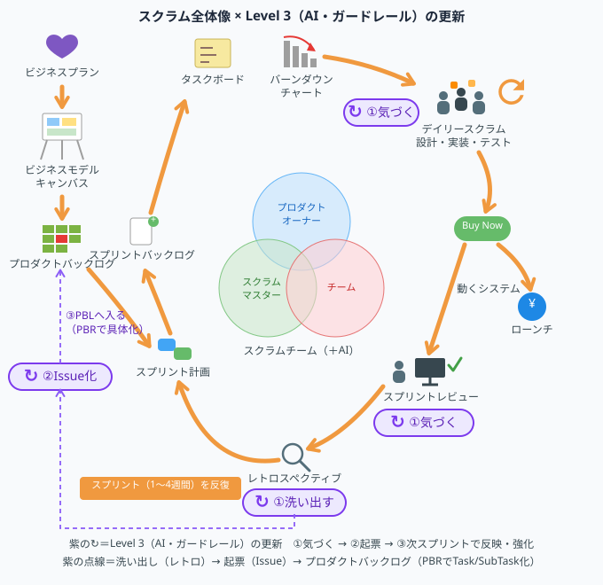

*図：スクラム全体像の中で、Level 3（AI・ガードレールの進化）が「①気づく→②起票→③次スプリントで反映」と回る*

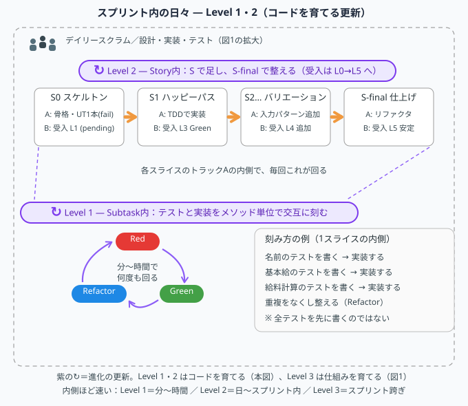

*図：デイリースクラム／設計・実装・テストの内側で、Level 2（Storyの垂直スライス）とLevel 1（TDDの刻み）が日々回る*

### 土台と行動原則の関係

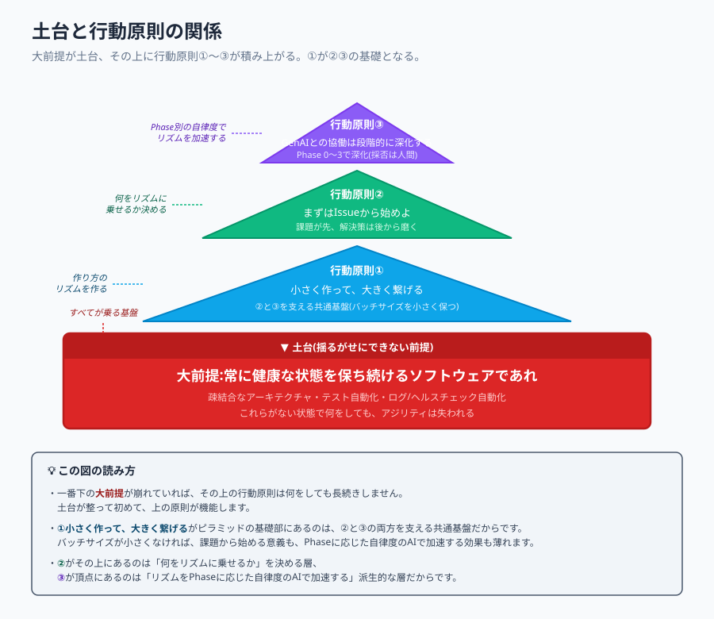

大前提と3つの行動原則は、次のような階層構造にあります。

一番下にあるのが、大前提「常に健康な状態を保ち続けるソフトウェアであれ」です。これは土台そのものであり、ここが崩れていれば何をしても長続きしません。土台が整って初めて、その上で行動原則が機能します。

土台のすぐ上に位置するのが、**行動原則①「小さく作って、大きく繋げる」**です。これは作り方のリズムを定めるもので、②と③の両方を支える展開基盤として機能します。バッチサイズが小さければ、課題から着手する意義も、AIで加速する効果も考えられます。①がピラミッドの底部にあるのは、この依存関係を表しています。

その上で、**行動原則②「Issueから始めよ」**が、何をリズムに乗せるかを定めます。リズムが整っていても、乗せる対象が「課題」ではなく「解決策」になっていれば、出来上がるものは本来解くべき問題からズレます。

ピラミッドの頂点に位置するのが、**行動原則③「GenAIとの協働は段階的に深化する」**です。これは①と②の上に乗り、確立されたリズムと対象をPhaseに応じた自律度のAIで加速する派生的な層です。土台と①②が整っていない状態でAIに頼っても、加速する向きが合わないか、間違った方向に加速するだけです。

実践の優先順位としては、まず大前提の担保、次に②→①→③の順で効いてきます。健康な状態を保ちながら(大前提)、解くべき課題を明確にし(②)、それを小さなバッチで作って繋げるリズムで進め(①)、そのリズムをPhaseに応じた自律度のAIが加速する(③)、という構造です。どれか1つが欠けても、目指す開発スタイルは成立しません。

---

## 4. 行動原則② まずはIssueから始めよ — Start with Why

### 行動原則② まずはIssueから始めよ。課題が先、解決策は後から磨く。

「何を作るか」を先に決めるのではなく、「どの課題を解くか」から始めます。

ウォーターフォール的な進め方では、最初に解決策や仕様を固めてから開発に入ります。
しかし実際のビジネス課題は、解いてみて初めてその構造が見えてくるものが多く、先に解決策を固定すると、本来解くべき課題からズレたものが出来上がりがちです。

先に課題（Issue）を明確にし、解決策は仮説検証を重ねながら磨き上げていく。この順序を守ることで、「作ったものが課題解決に繋がらない」という最大のムダを避けます。
スクラムのプロダクトバックログも、「解決策のリスト」ではなく「課題と価値のリスト」であるべき、という姿勢と一致します。

この原則は第8章「実践のリファレンス」の「PBIとサブタスクの定義」「垂直スライスと避けるべき分割」「見積もりの範囲」で具体化されます。PBIの書き方、バーティカルスライス、見積もり基準、避けるべき分割(工程別・レイヤー別の分割)はすべて、この原則から導かれます。

---

## 5. Why → What → How — Why → What → How

本章は、PLAN.md が定義する原則「Why → What → How」を本書に明文化するための章です。本文は Issue #4（本リポジトリのTask）で執筆予定です。

> この章は現時点ではスタブです。詳細は Issue #4 を参照してください。

---

## 6. 段階的な文脈の精緻化 — Progressive Context Refinement

本章は、PLAN.md が定義する原則「Progressive Context Refinement」を本書に明文化するための章です。本文は Issue #4（本リポジトリのTask）で執筆予定です。

> この章は現時点ではスタブです。詳細は Issue #4 を参照してください。

---

## 7. 追跡可能性 — Traceability

本章は、PLAN.md が定義する原則「Traceability」を本書に明文化するための章です。本文は Issue #4（本リポジトリのTask）で執筆予定です。

> この章は現時点ではスタブです。詳細は Issue #4 を参照してください。

---

## 8. 実践のリファレンス — Reference Practices

本章は、第3章・第4章で定めた原則を日々の開発サイクルにどう落とし込むかを示す、具体的な実践知です。

我々の開発では、開発スタイルとしてスクラムを採用します。
プロダクトバックログアイテム(PBI)を1スプリント単位で計画・実行・レビュー・改善するサイクルを回します。
スクラムのイベント(スプリントプランニング、デイリースクラム、スプリントレビュー、レトロスペクティブ、リファインメント)は、本書のルール群が機能するための枠組みとして存在します。

### ソフトウェアの健康状態に関する前提

第3章「中核となる原則」の「大前提 ― 常に健康な状態を保ち続けるソフトウェアであれ」を実装するため、次の3つの環境要件が担保されている必要があります。これらはアジリティの前提条件であり、本書の他のルールはすべてこの上に乗っています。

| 環境要件 | 担保されているとは |
| --- | --- |
| 疎結合なアーキテクチャ | ある箇所の変更が思わぬ場所に波及しない。<br>レイヤー・モジュール間の依存が明示的で、局所的な変更が可能な状態。 |
| ユニットテスト(UT)・受け入れテスト(AC)の自動化 | 変更のたびにテストを自動実行でき、低コストで影響を検証できる状態。CI上でGreen/Redが明確に判断できる。 |
| ログ収集・ヘルスチェックの自動化 | 本番・ステージング環境の状態が常時可視化されており、異常の検知・原因特定が短時間で可能な状態。 |

### 環境要件が担保されていない場合の扱い

本章の「ソフトウェアの健康状態に関する前提」の環境要件が担保されていない場合、**その解消を最優先課題(Top Priority)として扱います**。これらを抱えたままアジリティのある開発を行うことは不可能だからです。

具体的な運用は次の通りです。

**判定のタイミング**として、スプリントレトロスペクティブまたはリファインメントの場で、チームが環境要件の担保状況を定期的に確認します。いずれかの要件が崩れている、あるいは不十分であると判断された場合、次のいずれかの対処をとります。

第一の対処は、**土台整備を優先したスプリント編成**です。次スプリントのキャパシティの一定割合を土台整備PBIに割り当て、機能開発と並走させて解消します。割合はチームで合意しますが、要件の崩れが深刻な場合は土台整備を主目的としたスプリントを1〜複数本確保することも選択肢とします。

第二の対処は、**土台整備をPBIとしてバックログに積む**ことです。通常の機能開発PBIと同じ形式で起票し、優先順位付けの対象とします。土台整備を「空き時間でやる作業」として扱わず、明示的に価値あるPBIとして扱うことが要点です。

どちらの対処をとる場合も、**チーム全員が土台の現状を認識している状態**を作ります。プロダクトオーナーを含めた全員が、「今、何が健康でないか」「それを放置するとどんなアジリティが失われるか」を言語化できる状態を目指します。

> ⚠️ **注記**: 本節の構成は第3章「中核となる原則」の「行動原則① 小さく作って、大きく繋げる」から導かれます。垂直スライス・2トラック制がどのような考え方のもとで成立するかは、先に第3章を参照してください。

### 行動原則①との接続

第3章「中核となる原則」の「行動原則① 小さく作って、大きく繋げる」では「開発の単位を小さく保ち、CI を通じて1つのプロダクトへと統合していく」ことを行動原則①として定めました。本節（第8章）は、その原則を毎日の開発サイクルに落とし込む仕組みの全体像です。

「小さく作る」ための仕組みとして、本章の「チーム・スウォーム（Team Swarming）による開発」ではチーム全体が同一PBIに集中する**スウォーム**と WIP=1 の原則を定めます。
本章の「垂直スライスと避けるべき分割」では**垂直スライス**によりタスクをレイヤー別ではなく「価値が提供できる、もしくは仮説が検証できる最小単位」で分割する方法を定めます。
本章の「設計タスクの分割とサブタスクのサイズ原則」では**サブタスクのサイズ原則**により、1つの検証可能な単位・1セッションで完結する粒度にサブタスクのサイズ上限を設けます。

「大きく繋げる」ための仕組みとして、本章の「サブタスクの設計原則（2トラック制）」では各サブタスク内で機能実装と受け入れテストを並走させる**2トラック制**を定め、CIが常にGreenであり続ける状態を維持します。

本章の「Local開発フロー」では、1人のエンジニアとGenAIの協働体制における日々の作業サイクルを示します。Local合格ゲートを通じてCI/CDパイプラインとの接続を保証し、本章の「Value StreamとLocal合格ゲート」（Value Stream）で全体像を示します。

これらは独立したルールではなく、行動原則①を一体として実現するための設計です。
いずれか1つを省略すると、「小さく作った成果がプロダクトに繋がらない」「テスト抜きで速度だけ上がる」といった崩壊を招きます。

### チーム・スウォーム（Team Swarming）による開発

我々の開発は、知識の共有とPBIの完了速度最大化を目的として、プロダクトバックログアイテム（PBI）にチーム全体で取り組む「スウォーム」を基本とします。

【原則】

- 進行中にできるバックログ(WIP)は１つで、この１つが完了するまで他のバックログは原則扱ってはならない（※ただし緊急の不具合対応などは例外。※WIP=1はチーム成熟期の出発点であり、拡張条件は 本章の「WIPの拡張条件」を参照）
- チーム・スウォーム（Team Swarming）を採用する

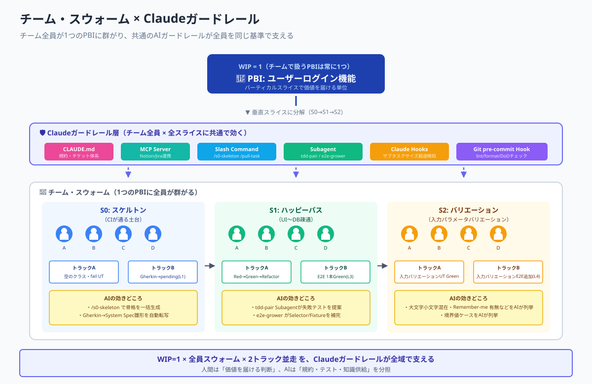

#### 目的

- 知識のサイロ化の解消: 特定の個人に依存しない、チーム全体の知識レベルの向上を目指します。
- PBI完了の迅速化: 一度に多くのPBIに着手せず、一つのPBIを最短時間で完了させ、頻繁に価値を提供します。
- コード品質の均一化: 複数の視点と経験をコードに反映させます。
- コンウェイの法則への備え: チームを機能別に分断せず1つのPBIに集まることで成果物の継目が不用意な位置に入るのを防ぎます（第3章「中核となる原則」の「健康な状態とは何か」）。

#### WIPの拡張条件 ― WIP=1は出発点であって目的ではない

本章の「チーム・スウォーム（Team Swarming）による開発」の【原則】で示した「進行中のPBI（WIP）は1つ」は、スクラムに着手したばかりの、あるいは習熟が初期段階にあるチームのための**出発点としての制約**です。WIP=1という数字そのものが目的なのではありません。

我々がWIPを絞る狙いは、リードタイムを短く保ち、問題を早期に発見することにあります。これはアジャイル開発のより上位にある原則、すなわち「無理なく作れる量（スループット）を最大化する」という考え方に従ったものです。リードタイムは仕掛り（WIP）に比例して伸びるため、初期のチームはまずWIPを1に絞ることで、1つのPBIが完成までプロセスや工程に成果物が流れ切る速さと、流れる過程で滞りや手待ちなど顕在化する問題を、チーム全員が体感できる状態を作ります。

したがって、チームの成熟に応じてWIPを2、3と段階的に拡張していくことは、原則に反するどころか、原則に忠実な進化です。ただし拡張は思いつきで行うものではなく、次の2つの状態が**①→②の順で常態化している**ことを条件とします。この順序は不可逆です。

##### 条件① DoDが拡張され、内面化されている（縦方向の担保）

第一の条件は、**DoD（完了の定義）が、初期の最小観点からリリースに耐える観点まで拡張され、それを各エンジニアが内面化して常態化している**ことです。

着手当初のDoDは「動く」「ユニットテストが通る」といった最小限の観点に留まりがちです。これがリリースに耐える品質（性能、セキュリティ、運用監視、ドキュメント等の観点）まで拡張され、かつ**チームの各人が「何を満たせば採用してよいか」を自分の判断基準として持っている**状態を、WIP拡張の第一条件とします。

ここで重要なのは、DoDが文書に書かれていることではなく、各人に**内面化**されていることです。採否（第13章「AI協働の成熟度モデル」の「AIと人間の責務境界」）を下せる人間とは、そもそも何を満たせば採用してよいかを理解している人間です。DoDを内面化していない人間がいくら採否ゲートに立っても、それは採否ではなく指摘待ちにすぎません(第3章「中核となる原則」の「テストとレビューは欠陥を見える化する行為である」)。第13章「AI協働の成熟度モデル」の「言葉の定義と正確性を大事にする」で定めた「AIに渡す前に自分の語彙（特にAC／DoD）が正しいか確認する」規律は、このDoDの内面化を日々鍛える場でもあります。

##### 条件② 多能工化（またはAIによる垂直スライス遂行）が常態化している（横方向の担保）

第二の条件は、**①で拡張・内面化されたDoDを基準として、各人（またはAI）が垂直スライスを手待ちなく独立して遂行できる状態**が常態化していることです。

WIPを2にして2つのPBIを並行させると、各レーンはフロントエンドからバックエンド、データベースまでを貫く垂直スライスを単独で完遂する必要が生じます。もしメンバーが単能工のままだと、WIP拡張はレーンごとに専門家を貼り付ける形になり、片方のレーンで不得手な工程が詰まると別の専任者が手待ちになります。これは本章の「垂直スライスと避けるべき分割」で「避けるべき分割」として戒めたミニウォーターフォールが、PBIレーン**間**で再発した状態です。

このミニウォーターフォールの再発は、コンウェイの法則(第3章「中核となる原則」の「健康な状態とは何か」)で説明できます。WIPを増やすことは、PBIレーンとPBIレーンの間に切れ目を一本増やすことです。多能工化していれば、その切れ目はレーンとレーンの境界に留まり、各レーンの内側は縦に切れ目なく貫けます。しかし単能工のままレーンを分けると、レーン内部にも工程ごとの切れ目(フロント担当・バック担当の境界)が残ったままになり、その切れ目が成果物の継目として現れます。これがレーン内部に再発するミニウォーターフォールの正体です。WIP拡張の条件②(多能工化)が求めているのは、レーン内部の切れ目を消し、切れ目をレーン境界にだけ限定できる状態です。

これを避けるには、本章の「スウォームにおける作業の進め方（プルシステム）」で促す意図的ローテーションによって多能工化（各レーンを誰でも縦に貫ける状態）が進んでいること、もしくはPhaseの進行に伴いAIが垂直スライスの実装と品質チェックを担えるようになっていることが必要です。AIは領域横断が人間より得意なため、多能工なレーン担当としての適性が高く、これはPhase 2／Phase 3で推奨される姿（第13章「AI協働の成熟度モデル」の「行動原則③ GenAIとの協働は段階的に深化する」）と一致します。なお第13章「AI協働の成熟度モデル」の「Phaseは領域別に混在しうる」という原則に従い、「UIはPhase 2だがDB設計はPhase 1」のようなまだら状態では、まだPhaseの低い領域はWIP拡張に耐えない、という領域別の判断を行います。

##### なぜ①→②の順序は不可逆か

①を飛ばして②だけを実現することは、GenAIを使えば**物理的には可能**です。完了基準を理解していないエンジニアでも、AIに「垂直スライスを実装して」と投げればコードもテストも出てきます。外形上は多能工化が成立したように見えます。

しかしその実態は、本人が完了基準を持たないため自分では採否を判断できず、とりあえずPull Requestを出してリーダーにレビューしてもらい、指摘されたら直す、という**リアクティブな採否転嫁**です。これは課題より先に解決策（コード）が出て品質基準が後追いになる点で第4章「行動原則② まずはIssueから始めよ」と逆であり、本人が基準を持たないまま採否をリーダーへ転嫁する点で第13章「AI協働の成熟度モデル」の「AIと人間の責務境界」の「採否は必ず人間が下す」を空洞化させ、基準がないためAI出力の違和感に気づけず聞き返し技法（第13章「AI協働の成熟度モデル」の「言葉の定義と正確性を大事にする」）も発動できない点で第13章「AI協働の成熟度モデル」の「言葉の定義と正確性を大事にする」の「AIは殆ど否定的なことを言ってこない」という罠にそのまま嵌まります。本書が推奨するプロアクティブな開発とは真逆の姿です。

したがって①が常態化してからでなければ②に進めません。逆に、①が達成された後にAIへ②を委ねることは、推奨されるPhase 2／Phase 3そのものです。「①未達のAI代替」と「①達成後のAI委譲」は外形が同じで中身が正反対であり、両者を分ける判定の実体は**採否を握れるだけのDoD理解があるか**です（第13章「AI協働の成熟度モデル」の「AIと人間の責務境界」「丸投げと委任の境界は採否責務を人間が握っているか」の、DoD観点での具体化）。

##### スウォームとの関係 ― WIP拡張はスウォーム密度とのトレードオフ

WIP拡張を考える際、本章の「チーム・スウォーム（Team Swarming）による開発」のもう一つの柱であるチーム・スウォーム（1つのPBIにチーム全体で群がる）との関係に注意します。

「1つのPBIに集中する」スウォームと「複数PBIを並行させる」WIP拡張は、素朴には逆方向に見えますが、レイヤーの異なる別軸です。「同時にIn Progressにするバックログ項目の数（WIP）」と「1つの項目にどれだけ人を寄せるか（スウォーム密度）」は独立しています。WIP=2でも各PBIにスウォームすることは可能ですが、人数が割れるためスウォーム効果は薄まります。

つまりWIP拡張は、スウォーム密度とのトレードオフを伴います。WIPを増やす判断は、本章の「スウォームの目的」で掲げたスウォームの目的（知識のサイロ化解消・コード品質の均一化）を犠牲にしない範囲で行います。WIPを増やしてよいことは、スウォームをやめて各自がバラバラに別PBIを持ってよいことを意味しません。

##### WIP拡張とPhase 3自律ループの共通前提

ここで述べた①②は、WIPを拡張するための条件であると同時に、**Phase 3の自律ループ（AIが実行・検証・反映まで自律的に進める段階。第13章「AI協働の成熟度モデル」の「行動原則③ GenAIとの協働は段階的に深化する」）に至るための前提条件でもあります**。両者が同じ①②で説明できるのは偶然ではありません。

WIPを増やせる状態とは「各レーンが互いに干渉せず、各レーンの完了品質が担保されている状態」であり、AIが自律ループを回せる状態とは「AIが独立して回せて、その完了品質が機械的に担保されている状態」です。①が完了品質の担保（どこまでで完了か）、②が独立実行能力の担保（誰が／何が回せるか）を指しており、WIP拡張も自律ループも、この2軸が立って初めて成立します。

自律ループの停止条件は拡張されたDoD（①）にほかならず、自律ループが独立して回る能力は多能工的な垂直スライス遂行能力（②）のAI版です。したがってPhase 1／Phase 2の段階では、自律ループの設計・実装に進む前に、まず①DoDをどこまで育て内面化させるか、続いて②多能工化／AI委譲をどこまで進めるかを、意図的な運用課題として扱います。①②の常態化を確認してから、WIP拡張およびPhase 3へ進みます。

##### 拡張可否の判定 ― 実績ベースでレトロにて点検する

①②の「常態化」は、感覚ではなく観測に基づいて判定します。これは第10章「Claude Codeリファレンス実装」の「Phase別のガードレール強度設計」の「強度緩和は実績ベース」と同じ作法であり、第13章「AI協働の成熟度モデル」の「補助的な代理指標」の代理指標の枠組みに接続します。

①の常態化（DoD拡張の定着）は、たとえば拡張DoD項目のうち機械判定に落ちている割合や、リリース後の手戻り（本番不具合・差し戻し）の減少で観測できます。②の常態化（多能工化）は、本章の「スウォームにおける作業の進め方（プルシステム）」のローテーション実績、すなわち各メンバーが不得手領域のタスクをプルできている頻度や、特定領域が特定個人に依存していないかで観測できます。

これらをスプリントレトロスペクティブ（第10章「Claude Codeリファレンス実装」の「レトロスペクティブでガードレールを育てる」）の点検項目に加え、WIP拡張の可否をチームで合意します。拡張後はリードタイムが悪化していないか、各WIPが互いに干渉していないかを継続的に点検し、悪化の兆候があれば一段戻す判断も行います（戻し条件をあらかじめ決めておく作法は第10章「Claude Codeリファレンス実装」の「Phase別のガードレール強度設計」に準じます）。

#### PBIとサブタスクの定義

| 項目 | 定義 | 留意点 |
| --- | --- | --- |
| PBI（ストーリー/エピック） | ユーザーに提供する価値の単位（例: ログイン機能の実装）。 | チームは一度に1つのPBIのみをIn Progressとします。 |
| サブタスク | PBIを完了させるための具体的な作業ステップ。 | 垂直スライス（本章の「垂直スライスと避けるべき分割」参照）で分割し、各サブタスク内で2トラック制（本章の「サブタスクの設計原則（2トラック制）」参照）を回します。 |

> **本書での例示について**: 本書では PBI を `Type: Story`、サブタスクを `Type: SubTask`（ID は `TICKET-123` 形式のチケット番号で表記）として説明します。Story と SubTask の間には `Type: Task`（作業単位をまとめるブランチ単位）が入ります。Notion・Jira・Redmine 等いずれのチケット管理ツールでも、Story／SubTask の親子関係と一意 ID を持つ運用であれば同等に適用できます。詳細はCLAUDE.mdを参照してください。
> タスクのサイズルール（サブタスクのサイズ原則）は 本章の「設計タスクの分割とサブタスクのサイズ原則」を参照してください。

> **Phase 別の主体シフト**: 上記の定義（PBI／サブタスクの粒度・WIP=1・垂直スライス・2トラック制）はPhase共通の不変項です。一方、サブタスクの**実装主体**はPhaseに応じて変化します（第13章「AI協働の成熟度モデル」の「行動原則③ GenAIとの協働は段階的に深化する」）。Phase 1ではチームメンバー（人間）が実装の主体となり、AIは生成・検証補助の副操縦士として支援します。Phase 2ではAIが実装の主体（バディ）となり、人間は発案・トリガ・結果確認に位置を移します。Phase 3ではAIが自律ループで実装を内包し、人間はゴール提示と監督に専念します。どのPhaseでも、サブタスクの粒度設計（1つの検証可能な単位・1セッション完結・サブタスクのサイズ原則 本章の「設計タスクの分割とサブタスクのサイズ原則」）は変わりません。

#### スウォームにおける作業の進め方（プルシステム）

作業はリーダーからの「指名」ではなく、チームメンバーによる「プル（Pull）」によって開始されます。

1. 最も緊急性の高いタスクの特定: Daily Scrumやボードを通じて、現在のPBIを完了させるために「今、最も必要な作業」または「ボトルネックとなっている作業」を特定します。
2. タスクの自発的なプル: 自分の現在の作業が完了したら、TODOまたは作業中（In Progress）の列から、次に必要なタスクを自発的に引き抜き、担当者としてアサインします。
3. 意図的なローテーション（知識の偏り解消）: 常に自分の得意な領域（例: フロントエンド）のタスクをプルするのではなく、意図的に苦手な領域（例: DBやインフラ）のタスクをプルし、知識習得に努めます。苦手なタスクをプルする場合、その知識を持つ専門家に**15分間の口頭での知識共有（KT）**を依頼してから開始することを推奨します。
4. ヘルプへの参加: 誰かがボトルネックになっている場合、他のメンバーは自分のタスクを一時中断してでも、そのタスクを分割して手伝う、またはコードレビューやテスト作成でサポートに回ります。

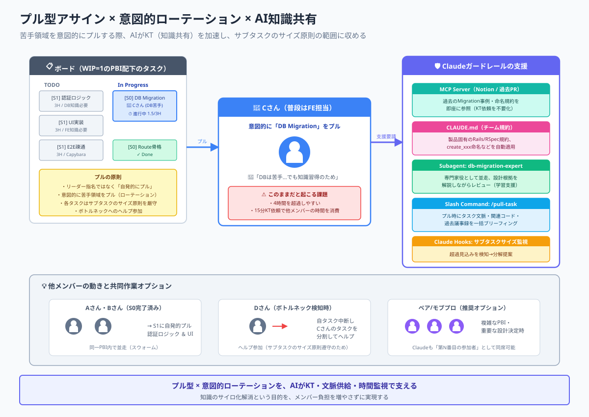

> **Phase 別の主体シフト**: 上記のプル型アサイン・意図的ローテーション・ヘルプ参加はPhase共通の不変原則です。一方、スウォームを構成する**メンバーの内訳**はPhaseに応じて変化します（第13章「AI協働の成熟度モデル」の「行動原則③ GenAIとの協働は段階的に深化する」）。Phase 1 ではスウォームは人間メンバーで構成され、各人がナビゲーター AI を副操縦士として伴走します（KT・ヘルプ参加の主体はすべて人間）。Phase 2 ではバディ AI が1つの「メンバー」として WIP=1 に参画し、人間とバディ AI の混合スウォームを形成します（プル・KT・ヘルプ参加の主体は人間／バディ AI の双方、採否は人間に残る）。Phase 3 では自律 AI が複数の「メンバー」として並走し、人間はゴール提示と監督に専念しつつ、必要時にスウォームへ加わるハイブリッド構成となります。WIP=1（PBI 同時着手は1つ）・プル型の原則はどの Phase でも不変です。

#### 共同作業の促進（推奨オプション）

特に複雑なPBIや、重要な設計決定を伴うタスクについては、以下の協調作業を推奨します。

| 手法 | 定義 | 導入目的 |
| --- | --- | --- |
| ペアプログラミング | 2人1組で1台のPCを操作し、ドライバーとナビゲーターを10～15分ごとに交代する。 | 知識の即時共有とコード品質の向上。 |
| モブプログラミング | 3人以上で1台のPCを操作し、複雑な設計や技術的負債の解消に取り組む。 | チーム全体で技術的な背景を深く理解する。 |
| AI ペアプログラミング | 人間がドライバー、AI（ナビゲーター AI／バディ AI）がナビゲーターとして対話しながら実装する。Phase に応じて役割が交代しうる。 | AI の知識を即時に取り込み、レビュー観点を常時得る。 |
| AI モブプログラミング | 人間と AI（ナビゲーター AI／バディ AI／自律 AI）が複数で 1 つの PBI に取り組み、設計判断・実装・レビューを分担する。 | 複雑な設計を AI の探索力と人間の判断で並走解決する。 |

これらの協調作業が知識共有とコード品質に効くのは、複数の視点が1つの成果物に注ぎ込まれるからです。ここで意識したいのは、参加者の会話ターンが特定の1人に偏らず均等に分布しているほど、チームとしての問題解決力(集合的知性)が高くなるという点です。ドライバー／ナビゲーターの短時間交代(ペア)や、全員が発言する場(モブ)は、この会話ターンの均等化を仕組みとして担保する装置でもあります。発言が一部に偏っていないかは、レトロスペクティブでも点検します(第10章「Claude Codeリファレンス実装」の「レトロスペクティブでガードレールを育てる」)。

> **Phase 別の主体シフト**: 上記 4 手法に共通する不変原則（ドライバー／ナビゲーターの分業・短時間交代・知識の即時共有・複雑な設計をチームで背負う）は Phase 共通です（第13章「AI協働の成熟度モデル」の「行動原則③ GenAIとの協働は段階的に深化する」）。一方、**参加者の構成と AI の役割**は Phase で変化します。Phase 1 ではペア＝人間 2 人／モブ＝人間 N 人を基本とし、各人のナビゲーター AI が副操縦士として同席します（ドライバー・ナビゲーターは常に人間）。Phase 2 ではバディ AI が「参加者」としてカウントされ、ペア＝人間 + バディ AI／モブ＝人間 N 人 + バディ AI の混合構成となり、ドライバー／ナビゲーターの役割は人間とバディ AI の間で交代しえます（採否は人間に残る）。Phase 3 では自律 AI が単独で実装を進め、人間はレビューア（採否）として関与するハイブリッド構成となります。

### 垂直スライスと避けるべき分割

#### バーティカルスライスについて

スクラムで言う「バーティカルスライス（垂直分割）」とは、ユーザーに価値を提供するPBI（例：ログイン機能）を、要件定義からデプロイまで、アプリケーションの全階層（UI/フロントエンド、ビジネスロジック/バックエンド、データベース）を貫いて完成させることを指します。

このバーティカルスライスで開発を進める際、タスクをフロントエンドとバックエンドで分けるのは「技術スタック（作業の種類）」が異なるため、スウォームにおいて最も自然で効率的な分割方法です。

#### 垂直スライス（推奨）

サブタスクは、ウォーターフォールのフェーズ（要件定義、設計、実装、テスト）ではなく、価値が提供できる、もしくは仮説が検証できる最小単位（垂直スライス）で分割します。すなわち、

> S0（スケルトン）→ S1（ハッピーパス）→ S2（バリエーション）→ S-final（仕上げ、任意）

の順で積み上げていきます。

なお、上記の S0／S1／S2／S-final はあくまで基本パターンの例示であり、サブタスク数が必ず 4 つに固定されるわけではありません。Story の作業規模やバリエーションの量に応じて、S2 以降は複数サブタスクに展開される場合があります。たとえば同値クラス分析や境界値分析で正常系の入力パターンが複数識別される場合は、

> S0（スケルトン）→ S1（ハッピーパス）→ S2（バリエーション）→ S3（バリエーション）→ S4（バリエーション）→ … → S-final（仕上げ、任意）

のように S3・S4 と連番で増やします。各 Sn（n ≧ 2）は引き続き「メインユースケースの入力パラメータバリエーション（境界値・別パラメータパターン）」を扱うスライスであり、振る舞いが異なる異常系は別ストーリとして切り出します（後述の「避けるべき分割の例」②を参照）。

各サブタスク内では **2トラック制** で作業が並走します（詳細は本章の「サブタスクの設計原則（2トラック制）」を参照）。

- **トラックA（機能実装）**: TDD（Red-Green-Refactor）をサブタスク内で複数回まわす
- **トラックB（受け入れテスト）**: E2EテストをL0〜L5の成長レベルで進化させる

例：「ユーザーログイン機能の実装」

- S0（スケルトン）— [S0] DBマイグレーション + ログインAPIルーティング骨格 + フォームUI骨格の実装（CI が通る状態）(3H)
- S1（ハッピーパス）— [S1] 正常なメール/パスワードでのログイン一気通貫実装（UI〜DB まで動く状態）(4H)
- S2（バリエーション）— [S2] 大文字小文字混在 email・Remember-me 有無など、メインユースケースの入力パラメータバリエーション (3H)
- S-final（仕上げ）— [S-final] サブタスクまたぎのリファクタ・E2E安定化（任意）

#### 推奨される分割（スウォーム的）の具体例

ここでは、「ユーザーログイン機能の実装」というPBIを想定し、S0→S1→S2（バリエーション）形式で分割したサブタスクの具体例を示します。各サブタスクは2トラック制（本章の「サブタスクの設計原則（2トラック制）」参照）で進めます。

[Rails Erbの場合はこちらを参照](rails_examples/RAILS_EXAMPLE.md)

| スライス | トラックA：機能実装（例） | トラックB：受け入れテスト（例） | スウォームのポイント |
| --- | --- | --- | --- |
| S0（スケルトン） | DBマイグレーション（users テーブル）の作成（2H）<br>ログインAPIルーティング + 空のコントローラー実装（1H）<br>ログインフォームUIの骨格（バリデーションなし）作成（2H）<br>最初のユニットテスト1本（fail）（0.5H） | GherkinをSystem Specのラッパースクリプトに転写・pending状態で配置（L1到達）（1H） | バックエンド・フロントエンドが並行着手できる土台を用意する |
| S1（ハッピーパス） | 認証ロジック（正常系）の実装 + ユニットテストRed→Green（3H） | ハッピーパスE2Eを1本Greenにする（L3到達）（3H） | S0完了後、バックエンド・フロントエンドが同一PBIを同時に進める |
| S2（バリエーション） | メインユースケースの入力パラメータバリエーション（大文字小文字混在 email・Remember-me 有無など）に対する正常系ロジックの実装 + ユニットテスト（2H） | 入力バリエーションE2Eを順次Greenにする（L4追加）（2H） | S1の一気通貫完成後、同じハッピーパスの別Exampleとして追加 |

> **注**: 振る舞いが異なる異常系（誤パスワード・アカウントロック・CSRF 対策など）は別ストーリとして切り出します。詳細は 本章の「垂直スライスと避けるべき分割」「避けるべき分割の例」②を参照してください。

S0 完了後から複数のメンバーが並行でスウォームできます。メンバー構成は Phase で変化します（本章の「共同作業の促進」参照）。

- **Phase 1（人間スウォーム）**:
  - ペア①（人間 2 名 + 各人のナビゲーター AI が副操縦士として同席）：S0の実装（バックエンドとフロントエンドで並行）
  - ペア②（人間 2 名 + 各人のナビゲーター AI）：S1の認証ロジックとE2E疎通確認（S0完了後すぐ着手）
  - 全員でS2へ：S1完成後、同じユースケースの別入力パラメータパターンを追加
- **Phase 2（人間 + バディ AI の混合スウォーム）**:
  - ペア①（人間 + バディ AI）：S0の実装。ドライバー／ナビゲーターは交代しえる（採否は人間に残る）
  - ペア②（人間 + バディ AI）：S1の認証ロジックとE2E疎通確認
  - 全員でS2へ（人間 N 人 + バディ AI）：入力バリエーションを並列追加
- **Phase 3（自律 AI ハイブリッド）**:
  - 自律 AI が S0/S1 を並走実装し、人間はゴール提示とレビューア（採否）として関与
  - S2 でのバリエーション追加も自律 AI 主導。必要時に人間がスウォームに参加

> **不変項**: S0→S1→S2 の垂直スライス構造・並列スウォームの流れ・WIP=1・採否は人間に残る、の 4 点はどの Phase でも不変です（第13章「AI協働の成熟度モデル」の「行動原則③ GenAIとの協働は段階的に深化する」・本章の「共同作業の促進」参照）。

#### 避けるべき分割の例

垂直スライス（S0→S1→S2→…→S-final）の対比として、避けるべき分割パターンを 2 つ示します。

##### ① ウォーターフォール的（レイヤー別分割）

PBIを「バックエンド完了後にフロントエンド開始」のように時間的に直列に並べてしまうと、スウォームの効果が薄れ、手待ちが発生しやすくなります。

レイヤー別に分割した場合の例（ミニウォーターフォール型）：

- 設計 — [設計] 認証に必要な新しいデータモデルの定義 (2H)
- バックエンド — [API] ユーザー情報取得APIエンドポイントの実装 (3H)
- フロントエンド — [UI] ユーザープロファイル表示コンポーネントの作成 (2H)
- テスト — [テスト] ユーザー登録に対する受け入れテストシナリオの記述 (3H)

この例ではバックエンドが完成するまでフロントエンド・テストが着手できず、手待ちが発生します。

##### ② 振る舞いが違う異常系の同一ストーリ詰め込み

振る舞いが異なる異常系（権限エラー・セキュリティ違反・外部システム停止など）を、ハッピーパスと同じストーリのサブタスク（S2 以降）として詰め込むことも避けます。これらは別ストーリ（別 PBI）として切り出し、独立したスライス（S0／S1／S2／S-final）でゼロから積み上げます。

同一 Gherkin・同一 Acceptance Criteria を共有しないため、バーティカルスライスの「価値が提供できる、もしくは仮説が検証できる最小単位」を曖昧にし、見積もりも履行責任も濁るためです。

同一ストーリの S2 以降として収めて良いのは、メインユースケースの入力パラメータが異なるバリエーション（境界値・別パラメータパターン）です。Specification by Example でいう「同じシナリオの別 Example」がここに該当します。

#### なぜレイヤー別分割は作業を並列化できず速くならないのか

レイヤー別分割が避けるべき分割である本質的な理由は、作業を並列化できないことにあります。これは作業主体が人間でもAIエージェントでも変わらない、レイヤー別分割そのものの性質です。第3章「中核となる原則」の「健康な状態とは何か」で述べたコンウェイの法則(継目は作り手の切れ目に沿って入る)の、具体的な現れでもあります。

ログイン機能を「フロント」「バック」「DB」の3レイヤーに分けて割り当てたとします。一見、3者が同時に働けそうに見えます。しかし実際には、DBのスキーマが決まらないとバックのロジックは書けず、バックのAPIが決まらないとフロントは繋ぎ込めません。工程が直列に依存しているため、DB→バック→フロントと順番待ちが発生します。3者いても、実際に手を動かせるのは常に1者で、あとの2者は前工程の完成を待つことになります。これは担当が人間でもエージェントでも同じで、人を3人貼り付けても、エージェントを3体並べても、機能が完成するまでの時間は縮まりません。並列化できるように見えて、切れ目を跨ぐたびに連携の待ちが発生するため、実態は直列だからです。

垂直スライスはこの構造を変えます。レイヤー別分割が「フロント／バック／DB」という成果物の依存方向で切るのに対し、垂直スライスは1つのPBIをUIからDBまで縦に貫き、その内側の作業を「機能を作る作業(トラックA)」と「その機能の受け入れ試験を書く作業(トラックB)」という、並走できる2つのトラックで進めます(2トラック制。本章の「サブタスクの設計原則（2トラック制）」)。

なぜこの2トラックは並走できるのでしょうか。レイヤー別のフロントとバックが直列になるのは、フロントがバックのAPIという成果物に依存し、それが固まるまで着手できないからでした。一方、受け入れ試験(トラックB)は「何ができれば正解か」を先に書けます。機能実装(トラックA)が完成していなくても、Gherkinのシナリオやそのラッパースクリプトは先に用意できます(本章の「各サブタスクの定義（DoD）」のS0で「Gherkinをpendingで転写する」と定めているのがこれです)。受け入れ試験が「正解の形」を先に定義し、機能実装がその正解に向かって進む——両者は完成を待ち合う直列ではなく、正解の定義とその実現が同時に走る関係です。これは第3章「中核となる原則」の「テストとレビューは欠陥を見える化する行為である」で述べた「何を見つけにいくかを先に定める」目的論の、作業並列化の側面でもあります。

トラックAの内部は、並走とは別の原理で動きます。テストと実装をメソッドのような小さな単位で交互に刻んでいく、TDD(テスト駆動開発)のリズムです。ここで重要なのは、全部のテストを先に書いてから全部の実装をするのではない、という点です。たとえば「名前を取得するメソッドのテストを書く→それを実装する→基本給のメソッドのテストを書く→それを実装する→給料計算ロジックのテストを書く→それを実装する→重複を整理する」というように、テストコードと製品コードを少しずつ、交互に書き進めます(Red-Green-Refactorを1サブタスク内で複数回まわす。本章の「サブタスクの設計原則（2トラック制）」)。これは並列ではなく、小さな単位での反復です。テストが各ステップで「この部分の正解」を先に定義し、実装がすぐそれに追いつく。この刻みの細かさによって、大きく作ってから間違いに気づく事態を避け、常に動く状態を保ちながら少しずつ機能を育てられます。

トラックB(受け入れテスト)とトラックAの関係が「正解の定義と実現の並走」であるのに対し、トラックAの内部のTDDは「小さく刻んだテストと実装の交互反復」です。軸は違いますが、どちらも「正解を先に、小さく定義してから実現する」という一点で繋がっており、第3章「中核となる原則」の「テストとレビューは欠陥を見える化する行為である」で述べた「何を見つけにいくかを先に定める」目的論の実践でもあります。

こうして垂直スライスの内側では、前工程の完成を待って初めて次が動くレイヤー別の直列とは違い、「正解を定義する作業」と「正解を実現する作業」が並走します。だから機能単位で手を止めずに走り切れます。さらに、垂直スライスされたPBIは他のPBIと工程を共有しないため、「ログイン機能」と「検索機能」を別々の担当(人間のペアでも、エージェント群でも)に渡し、互いの完成を待たせずに並列で進められます。PBIの内側でも、PBIとPBIの間でも並列が効く——これがWIP拡張(本章の「WIPの拡張条件」)で複数レーンを並行させられる前提そのものです。

この違いはコンウェイの法則の観点でも説明できます。レイヤー別に切れ目を引くと、その継目はフロントとバックの間、バックとDBの間——本来は繋がっているべき縦方向を横切る位置に入ります。垂直スライスで機能単位に切れ目を引くと、継目はPBIとPBIの間、本来分かれているべき位置に入ります。コンウェイの法則は継目が入ること自体は避けさせてくれませんが、継目をどこに入れるかは、切れ目の引き方で選べます。垂直スライスとは、継目を「壊れる場所」ではなく「望ましい場所」に置くための、切れ目の設計です。

### サブタスクの設計原則（2トラック制）

本章の「垂直スライスと避けるべき分割」で定めた垂直スライス（S0/S1/S2）で分割された各サブタスクの中で、**トラックA（機能実装・TDD）とトラックB（受け入れテスト）を並走させる**ための設計原則を定めます。

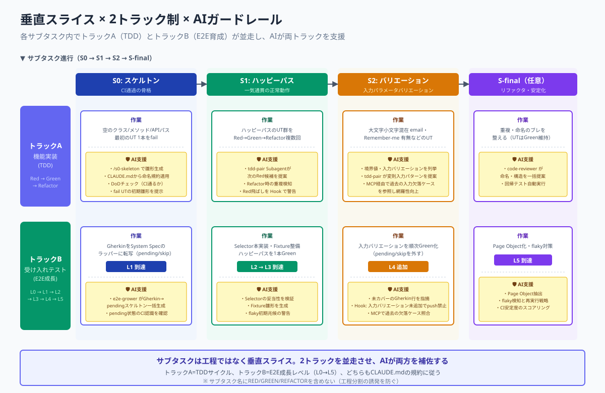

> **注意**: サブタスク名に `RED` / `GREEN` / `REFACTOR` を含めない。工程ごとの分割を誘発するため。

#### 2トラック制

各サブタスクには2つの作業トラックが並走します。

| トラック | 内容 |
| --- | --- |
| **トラックA：機能実装** | クラシックTDD（ユニットテスト主体）のRed-Green-Refactorを1サブタスク内で複数回まわす |
| **トラックB：受け入れテスト** | E2Eテストを進化的に成長させる（L0〜L5の成長レベルで管理） |

このトラックAのリズムは、本書を貫く進化型開発のフラクタル構造のLevel 1に当たります（第3章「中核となる原則」の「行動原則を貫くリズム（進化型開発のフラクタル構造）」）。

#### Storyのサブタスク構造

```
S0（準備）→ S1〜Sn（垂直スライス）→ S-final（仕上げ、任意）
```

#### 各サブタスクの定義

##### S0：準備サブタスク

| トラック | 作業内容 | 成果物 | DoD |
| --- | --- | --- | --- |
| **A: 機能実装** | スケルトン（空のクラス/メソッド/APIパス）を作る、最初のユニットテストを1本書きfailさせる | スケルトンコード、failしているユニットテスト1本 | ユニットテストがコンパイルエラーではなく値の不一致でfailしている |
| **B: 受け入れテスト** | StoryのGherkinを自動化フレームワーク上のラッパースクリプトとして転写、各シナリオはpending/skipでOK、Selectorやテストデータは仮置きでOK | L1到達：Gherkinと1対1対応するテストファイル、CIでpending/skipとして認識 | テストランナーが全シナリオをpending/skipとして正しく認識、CI上でfailではなくpending状態 |

##### S1：垂直スライス①（ハッピーパス）

| トラック | 作業内容 | 成果物 | DoD |
| --- | --- | --- | --- |
| **A: 機能実装** | ハッピーパスをユニットテストレベルでRed→Green→Refactorを複数回まわす、関連クラス・メソッドを実装 | 追加されたユニットテスト群、Red-Green-Refactorのコミット履歴 | ハッピーパスがユニットテストレベルで全てGreen |
| **B: 受け入れテスト** | L1→L2→L3の段階的進化、ハッピーパスシナリオのpending/skipを外しSelectorを本実装、Fixture整備、アサーション実装 | L3到達：ハッピーパスシナリオがGreenになったE2E、Fixture、Selector定義 | ハッピーパスのE2Eが1本Green |

##### S2以降：バリエーション（入力パラメータの追加 Example）

| トラック | 作業内容 | 成果物 | DoD |
| --- | --- | --- | --- |
| **A: 機能実装** | 入力バリエーションシナリオをユニットテストレベルでRed→Green→Refactorを複数回まわす | 追加されたユニットテスト群 | 入力バリエーションシナリオがユニットテストレベルで全てGreen |
| **B: 受け入れテスト** | 当該シナリオのpending/skipを外しSelectorとアサーションを埋める | L4追加：該当シナリオがGreenになったE2E | 当該シナリオのE2EがGreen |

> **注**: 振る舞いが異なる異常系（権限エラー・セキュリティ違反・外部システム停止など）は同一ストーリの S2 として詰め込まず、別ストーリとして切り出します（本章の「垂直スライスと避けるべき分割」「避けるべき分割の例」②参照）。

##### S-final：仕上げ（必須ではない）

| トラック | 作業内容 | 成果物 | DoD |
| --- | --- | --- | --- |
| **A: 機能実装** | サブタスクまたぎの重複・命名のブレを整える | リファクタ済みコード | 全ユニットテストがGreenのまま |
| **B: 受け入れテスト** | E2Eのリファクタ、Page Object化、flaky対策 | L5到達：安定したE2Eテストスイート | 全受け入れテストGreen、CIで安定 |

> **Phase 別の主体シフト**: 上記 S0/S1/S2/S-final の作業内容（スケルトン作成・ユニットテスト・受け入れテストの段階的成長・DoD 判定）は、どの Phase でも構造は不変です。誰が一次起票・実装するかが Phase で変化します（第13章「AI協働の成熟度モデル」の「行動原則③ GenAIとの協働は段階的に深化する」・本章の「共同作業の促進」参照）。
>
> - **Phase 1**: 人間が S0/S1/S2 の実装・ユニットテスト・E2E ラッパーを主体的に書く。ナビゲーター AI は副操縦士として補助。
> - **Phase 2**: バディ AI がスケルトン・ユニットテスト・E2E ラッパーを先行起票し、人間がレビューと採否を担う（ドライバー／ナビゲーターは交代しえる）。
> - **Phase 3**: 自律 AI が S0/S1/S2 の実装・テストを並走起票し、人間はゴール提示とレビューア（採否）として関与する。
>
> **不変項**: DoD 判定基準・L0〜L5 の到達タイミング（本章の「E2E受け入れテストの成長レベル」）・S2 再定義（バリエーション）・採否は人間に残る原則の 4 点は、どの Phase でも不変です。

##### DoDは成熟する ― DoDの観点そのものが時間とともに拡張する

上の S0／S1／S2／S-final の表は、1つのStoryを進める中で各サブタスクが満たすべき完了基準を示しています。これはStory内での「DoDの中身の移り変わり」ですが、それとは別に、**DoDが対象とする観点そのものが、チームの成熟に伴って時間をかけて拡張していく**という、より長い時間軸があります。

着手当初のDoDは「動く」「ユニットテストがGreen」「E2Eが1本通る」といった最小限の観点に留まりがちです。チームが開発を重ねる中で、ここに性能、セキュリティ、運用監視（ログ・ヘルスチェック）、アクセシビリティ、ドキュメントといった「リリースに耐える観点」が段階的に加わっていきます。DoDは固定不変のものではなく、初期は緩く、チームの能力向上に応じて厳格化していくのが本来の姿です。これはスクラムにおけるDoDの正統な捉え方でもあります。

また、成熟して加わる観点の一つに「後工程が手戻りなく引き取れる条件」があります。これは第3章「中核となる原則」の「工程を繋ぐ条件（バリューストリーム）」で述べた、DoDが後工程の受け入れ条件を含むべきだという自工程完結の考え方を、DoDの成熟という時間軸で捉え直したものです。着手当初は自工程の内部が動くことを完了とみなしがちですが、成熟に伴い「次の工程がそのまま引き取れるか」までを完了の観点に含めていきます。そもそもDoDを先に定めるという営み自体、第3章「中核となる原則」の「テストとレビューは欠陥を見える化する行為である」で述べた「何を見つけにいくかを定める」目的論の具体化にほかならず、DoDの成熟とはこの目的論を工程の広がりに応じて言葉に落とし直していく行為でもあります。

この拡張は、上表（各サブタスクのDoD）の中身を書き換えるだけでは完結しません。新しく加わった観点を、**チームの各人が「何を満たせば採用してよいか」の判断基準として内面化する**こととセットで進めます（第13章「AI協働の成熟度モデル」の「言葉の定義と正確性を大事にする」で扱うAC／DoD語彙の内面化規律）。表に1行足しても、各人がその観点で採否を下せなければ、DoDは拡張されたことになりません。

このDoDの成熟という時間軸は、本書の2つの論点に直結します。

第一に、**WIP拡張の前提条件**です。本章の「WIPの拡張条件」の条件①「DoDが最小観点からリリース基準まで拡張され、内面化されている」は、まさにこのDoDの成熟を指しています。DoDが最小観点に留まったままWIPを増やすと、各レーンの完了品質が担保されないまま並行数だけが増えることになります。

第二に、**自律ループの停止条件**です。第13章「AI協働の成熟度モデル」の「自律ループの自律度レベルとPhaseの段階運用」で述べたとおり、自律ループの停止条件は拡張されたDoDにほかなりません。DoDが「動けばOK」のレベルに留まったままPhase 3の自律ループを回すと、AIは「動くが本番に出せないもの」を高速で生産してしまいます。DoDの成熟は、WIP拡張と自律ループの両方にとっての土台です。

なお、各プロジェクトで実際にどの観点をDoDに含めるか（性能の具体的な閾値、セキュリティチェックの項目、必要なドキュメントの範囲など）は、プロジェクトごとの`CLAUDE.md`やDoR/DoD定義文書で定めます。本書が示すのは「DoDは成熟する」という時間軸の存在と、それがWIP拡張・自律ループの前提になるという接続関係です。

#### E2E受け入れテストの成長レベル

| レベル | 状態 | 到達タイミング |
| --- | --- | --- |
| **L0: Gherkin合意** | Storyの受け入れ条件が文字として記述されている | Story起票・Refinement時（サブタスク対象外） |
| **L1: ラッパースクリプト作成済み** | Gherkinの各シナリオが自動化ツール上に実行可能なガワとして存在（pending/skip） | **S0完了時** |
| **L2: Selectorとダミー実行** | スケルトンに対して実行可能、アサーションはゆるい | S1の途中〜前半 |
| **L3: ハッピーパスGreen** | 1つの代表ケースがE2Eで通る | **S1完了時** |
| **L4: シナリオ追加** | 入力バリエーション（境界値・別パラメータパターン）が順にGreen | S2〜Sn各完了時 |
| **L5: 網羅Green＋安定** | 全シナリオGreen、flaky解消、Page Object化などの安定化 | Sn（またはS-final）完了時 |

> **Phase 別の主体シフト**: 上記 L0〜L5 のレベル定義・到達タイミング（S0/S1/Sn 連動）は、どの Phase でも構造は不変です。誰が各レベルを書き上げるかが Phase で変化します（第13章「AI協働の成熟度モデル」の「行動原則③ GenAIとの協働は段階的に深化する」・本章の「各サブタスクの定義（DoD）」参照）。
>
> - **Phase 1**: 人間が L0（Gherkin 合意）から L5（網羅 Green ＋安定）まで主体的に書き上げる。ナビゲーター AI は副操縦士として補助。
> - **Phase 2**: バディ AI が下位レベル（L1 ラッパー作成・L2 Selector とダミー実行）を分担で先行起票し、人間がレビューと採否を担う。L3 以上は人間とバディ AI が交代しながら進める。
> - **Phase 3**: 自律 AI が L1〜L4 を並走起票し、人間は L0（Gherkin 合意）の方向付けと L5（網羅性・安定性）の品質判断、および各レベルの採否ゲートに集中する。
>
> **不変項**: L0〜L5 の定義・S0/S1/Sn との到達タイミング連動（本章の「各サブタスクの定義（DoD）」）・採否は人間に残る原則・「Gherkin 合意は Story 起票時」の位置付け、の 4 点は、どの Phase でも不変です。

#### S0 スケルトンチェックリスト

S0（スケルトン）完了時に揃えるべき成果物を、言語/Framework 非依存の汎用カテゴリで示します。各カテゴリは、後続の S1/S2 で「コードを書き足す土台」となる最小骨格を表します。具体的な技術スタック例（Ruby on Rails + RSpec + FactoryBot + Capybara 構成）は [rails_examples/S0_SKELETON_EXAMPLE.md](./rails_examples/S0_SKELETON_EXAMPLE.md) を参照してください。

**トラックA（機能実装）**

- [ ] データモデル定義: スキーマ定義ファイル（マイグレーション等）／ドメインモデルクラスの空骨格（必要最小限のバリデーションのみ）
- [ ] エンドポイント／インターフェース定義: HTTP ルーティング・関数シグネチャ・CLI コマンド等、外部から呼び出される入口の空実装（未実装応答を返してよい）
- [ ] 表示／レスポンス層スケルトン: テンプレート・シリアライザ・レスポンス DTO 等、出力境界の空骨格
- [ ] 最初のユニットテスト（fail する 1 本）: 期待動作を 1 つだけ宣言し、必ず Red で開始すること

**トラックB（受け入れテスト）**

- [ ] E2E テストのラッパースクリプト: シナリオ名のみ宣言し、本体は `pending` / `skip` で待機させる
- [ ] テストデータ生成の下書き: Factory／Fixture／Builder／Mock いずれかの形式で、後続テストが参照する最小限の生成ロジックを置く

**Project 固有の確認事項テンプレート**

下表はチームやリポジトリごとに埋め直す前提のテンプレートです。新規 PBI に取り掛かる前に、自プロジェクトの規約・既存資産を確認しておきます。

| 項目 | 確認ポイント |
| --- | --- |
| テストフレームワーク | プロジェクトで採用しているテストランナーとディレクトリ規約 |
| テストデータ生成 | Factory / Fixture / Builder / Mock のどれを標準とするか |
| E2E | ブラウザ自動操作・API レベル等、E2E の実施手段とテスト配置 |
| サービス層 | ビジネスロジックを集約するレイヤの有無と配置規約 |
| 入出力境界の整形 | Form Object／DTO／Validator 等、境界整形の責務担当 |
| スキーマ命名 | マイグレーション・テーブル・カラム名の命名規約 |

### 設計タスクの分割とサブタスクのサイズ原則

サブタスク（S0/S1/S2 等）は、**1つの検証可能な垂直スライスに収まり、1セッションで完結できるサイズ**に分割します（サブタスクのサイズ原則）。
「設計」は作業の性質上、時間のかかるタスクになりがちですが、本章の「垂直スライスと避けるべき分割」の垂直スライスに沿って細分化することで、このサイズ原則を適用できます。

#### サイズの上限は「時間の絶対値」ではなく「完結できる単位」で決まる

サブタスクのサイズを律するのは、何時間かけてよいかという時間の絶対値ではありません。守るべきは次の2点であり、これは作業主体が人間でもエージェントでも変わらない不変の原則です。

第一に、**1つの検証可能な単位に収まっていること**。そのサブタスクが完了したかどうかを、DoD（本章の「各サブタスクの定義（DoD）」）に照らして明確に判定できる粒度であること。
第二に、**1セッションで完結できること**。本章の「セッションの全体像」で定めた「1セッション = 最大1SubTask」の規律に収まり、セッションをまたいで持ち越さずに完了できること。

この2点さえ満たせば、それが何分の作業か何時間の作業かは、サイズ原則の本質ではありません。

#### 時間の「単位」は作業主体によって変わる

一方で、サイズの目安として時間を語るときには、**作業主体によって時間の単位そのものが変わる**ことに注意が必要です。

人間が主体となって実装する Phase 1（第13章「AI協働の成熟度モデル」の「行動原則③ GenAIとの協働は段階的に深化する」）では、1サブタスクの目安は「人間が集中して一気に完了できる作業量」であり、おおむね**数時間**のオーダーになります。ナビゲーター AI は副操縦士として補助しますが、実装の律速は人間の集中時間です。

バディ AI と分担する Phase 2 では、AI がスケルトン・ユニットテスト・E2E ラッパー等を先行起票し、人間がレビューと採否を担います。AI の起票速度に律速が移るため、1サブタスクの実時間は人間単独より縮み、おおむね**数十分〜1 時間**のオーダーになります。

自律 AI が並走する Phase 3 では、律速するのは人間の作業時間ではなく、**1セッションのコンテキストで完結できる単位**です。AI が S0/S1/Sn を並走起票し、人間は採否ゲートと品質判断に集中するため、1サブタスクの実時間は**分〜数十分**のオーダーまで縮みうります。

つまり時間の数値そのもの（数時間か、数十分か、分オーダーか）は Phase に応じて読み替えるべき変動項であり、固定的な基準ではありません。**重要なのは時間の絶対値ではなく、「1つの検証可能な単位に収め、1セッションで完結させる」という不変の原則**です。具体的な時間の目安は、自分が今どの Phase で作業しているかに応じて読み替えてください。なお、Phase が進んでも採否（Yes/No）の最終判断は人間に残ります（第13章「AI協働の成熟度モデル」の「AIと人間の責務境界」）。

> **注記（図中の時間表現について）**: 本節以降のいくつかの分割例には `(2H)` `(3H)` のような工数表記が含まれます。これらは Phase 1（人間主体）を前提とした一例であり、サイズ原則そのものは別の時間単位（例：Phase 2/3 における分オーダー）でも同様に成立します。例中の時間は固定の閾値ではなく、作業主体に応じて読み替わる目安として捉えてください。

S0（スケルトン）に入る前に最低限必要な設計判断は、次のように分割します。

| 分割するタスク | 目的 |
| --- | --- |
| PBIのスコープと境界定義 | 「このPBIでどこまで実装するか？」を明確にする。 |
| 技術的な選択肢の比較と決定 | 例: 「認証にOAuthを使うか、独自トークンを使うか？」の調査と決定。 |
| 新しいデータモデルの定義とレビュー | 新しいテーブル設計案を文書化し、チームでレビューする。 |

**ポイント**: PBIの設計全体を一度に行うのではなく、「作業を始めるために最低限必要な決定」をサブタスクとして切り出し、チームで素早く合意します。この「素早く」が意味する時間の長さもまた、作業主体の Phase に応じて変わります。

---

### Local開発フロー

本章はコンセプト①「小さく作って、大きく繋げる」と原則③「GenAIとの協働は段階的に深化する」を、1人のエンジニアの日々の作業にどう落とし込むかを示します。

今回の開発スタイルの趣旨としては「物理的なエンジニア1人＋仮想メンバーとしてのGenAI（Claude、Subagent、Slash Command、Hooks、MCP）」の協働で進めます。GenAIはPhaseに応じた自律度で動き、Phase 1では副操縦士として、Phase 2では「あなたの相棒」として、Phase 3では自律エージェントとして機能します。採否ゲートは全Phaseで人間に残ります。

本章が描くのは、第3章「中核となる原則」の「行動原則を貫くリズム（進化型開発のフラクタル構造）」のフラクタル構造における **Level 1（Subtask 内のループ、分〜時間のリズム）** です。1回の開発セッションは、セッション開始で状態を取得し、1つの SubTask を実装サイクル（本章の「実装サイクル（Ⓐ〜Ⓔ）」の Ⓐ〜Ⓔ）で仕上げ、セッション終了で完了処理を行うまでを1単位とします。このセッションという論理単位が Level 1 のループであり、特定の IDE（VSCode 等）に依存しません。ターミナルで Claude を起動して作業する場合も、同じ流れが成立します。

続く3つのサブセクションで、この1セッションの流れを段階的に詳述します。

- **本章の「セッションの全体像」セッションの全体像**: 1セッションを構成する5つのフェーズと Level 1 の循環
- **本章の「セッション開始の判定と分岐」セッション開始の判定と分岐**: `/dev:start-session` の3ステップ判定と例外系
- **本章の「実装サイクル（Ⓐ〜Ⓔ）」実装サイクル（Ⓐ〜Ⓔ）**: 1 SubTask を仕上げる Level 1 の TDD の刻み

#### セッションの全体像

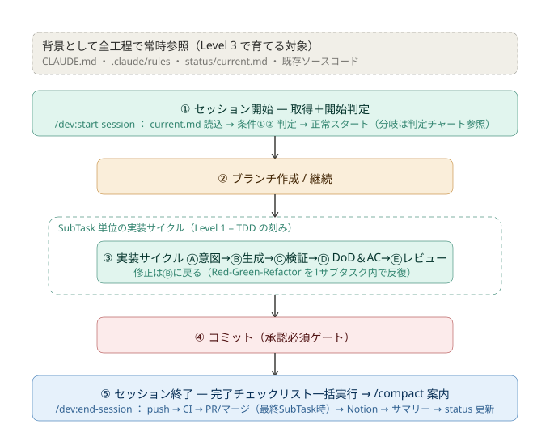

*図：1セッションの流れ（Level 1）— セッション開始から /compact 案内まで*

1回の開発セッションは、次の5つのフェーズで構成されます。特定の IDE ではなく「セッション」という論理単位を起点にしている点が重要です。

1. **セッション開始（取得＋開始判定）**: `/dev:start-session` を実行し、`status/current.md` から現在の作業状況を取得したうえで、作業を開始できる状態かを2つの条件で判定します。判定と分岐の詳細は 本章の「セッション開始の判定と分岐」で扱います。
2. **ブランチ作成 / 継続**: Story または Task 単位でブランチを切ります（既に同一ブランチでの継続作業であればそのまま続けます）。
3. **実装サイクル（Ⓐ〜Ⓔ）**: 1つの SubTask を、意図記述→コード生成→即時検証→DoD＆AC確認→レビューの順で仕上げます。この内部は 本章の「実装サイクル（Ⓐ〜Ⓔ）」で扱います。
4. **コミット（承認必須ゲート）**: 生成物の採否は人間が判断します。ここは自動では通過しない関所です。
5. **セッション終了**: `/dev:end-session` を実行し、push・CI 確認・（最終 SubTask 時の）PR/マージ・チケット更新・作業履歴保存・`status/current.md` 更新までを一括で行い、`/compact` を案内します。

図の上部にある帯（CLAUDE.md・MCP・`.claude/rules`・`status/current.md`・既存ソースコード）は、全工程を通じて常時参照される背景です。この5つをまとめて文脈供給層と呼び、本章の「実装サイクル（Ⓐ〜Ⓔ）」で定義します。この背景は Level 1 では「消費される前提知識」ですが、Level 3（スプリントのふりかえり、第10章「Claude Codeリファレンス実装」の「AIガードレールの設計と継続的アップデート」）では「育てられる対象」でもあります。

このセッションは「**1セッション = 最大1SubTask**」を原則とします。複数の SubTask をまとめて1セッションで処理しません。`/compact` 後は新しいセッションとして、再びセッション開始から始めます。この循環が Level 1 のループです。

#### セッション開始の判定と分岐

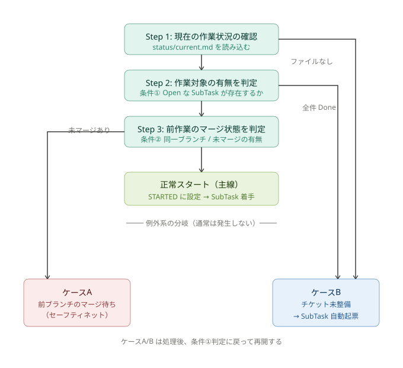

*図：/dev:start-session の開始判定 — 正常スタートと2つの例外系*

セッション開始（`/dev:start-session`）は、状態の取得と、作業を開始できる状態かの判定・分岐までを一体で行います。判定は3つのステップで進みます。

- **Step 1: 現在の作業状況の確認**: `status/current.md` を読み込みます。ファイルが存在しなければケースB（チケット未整備）へ分岐します。
- **Step 2: 作業対象の有無を判定**: 条件①として、Open な SubTask（「⏳ 待機中」または「🔄 作業中」）が存在するかを確認します。全件 Done であればケースB へ分岐します。
- **Step 3: 前作業のマージ状態を判定**: 条件②として、現在のブランチが継続作業か、未マージのコミットが残っていないかを確認します。未マージがあればケースA（マージ待ち）へ分岐します。

3つの条件をすべて満たせば **正常スタート** となり、フェーズマーカーを STARTED に設定して最初の SubTask の作業に着手します。CLAUDE.md「自律実行の原則」に従い、ここから `/dev:end-session` 完了までルーティン操作の承認をユーザーに求めません。

分岐は、通常は発生しない例外系です。

- **ケースA（前ブランチのマージ待ち）**: 通常は `/dev:end-session` で PR マージ・ブランチ削除まで完了しているため到達しません。前セッションの終了処理が中断された場合のセーフティネットとして、残務（PR マージ・ブランチ削除）を実行してから条件①判定に戻ります。
- **ケースB（チケット未整備）**: `status/current.md` の「次のアクション」に次の Task があれば、その SubTask をチケット管理システムに自動起票し、`current.md` を更新して条件①判定に戻ります。候補がなければユーザーに報告して停止します。

「1セッション = 最大1SubTask」の原則により、正常スタート後は1つの SubTask だけを扱います。

#### 実装サイクル（Ⓐ〜Ⓔ）

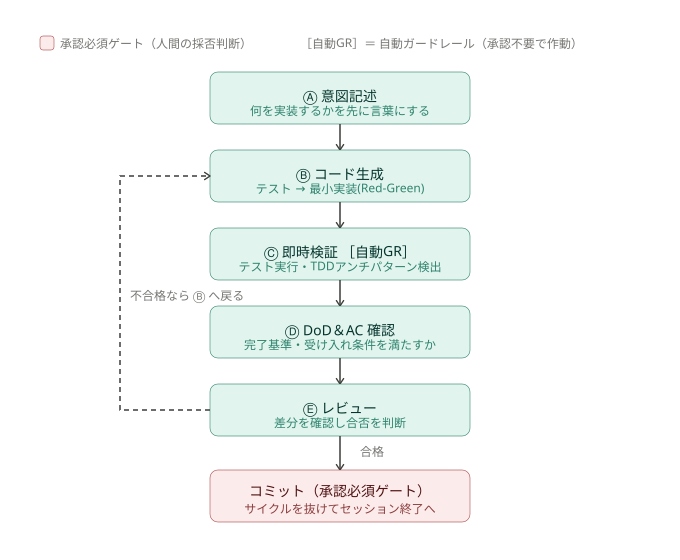

*図：実装サイクルの内部 — Level 1 の TDD の刻み*

実装サイクルは、1つの SubTask を仕上げる Level 1 のループそのものです。Red-Green-Refactor を1つの SubTask 内で複数回まわすリズムに相当します（本章の「サブタスクの設計原則（2トラック制）」のトラックA のリズムと同じ Level 1）。

このサイクルの全工程を通じて、AI と人間は共通の背景情報を常時参照します。この背景情報を **文脈供給層** と呼びます。文脈供給層は、CLAUDE.md／MCP／.claude/rules／status/current.md／既存ソースコードの5つで構成されます。CLAUDE.md はプロジェクト規約・命名規則・過去の意思決定を、MCP は外部情報源（Notion／Jira 等）を、.claude/rules は個別のルール定義を、status/current.md は現在の作業状況を、既存ソースコードは踏襲すべき実装パターンを、それぞれ供給します。Ⓐ〜Ⓔ のどのステップも、この5つを前提知識として動きます（本章の「セッションの全体像」の図で全工程の背景として帯状に示したものがこれです）。この層の質を人間が継続的に維持する責務は 第13章「AI協働の成熟度モデル」の「文脈の質を保つ」で扱います。

- **Ⓐ 意図記述**: 何を実装するかを先に言葉にします。人間主導のフェーズで、GenAI はまだ動かしません。
- **Ⓑ コード生成**: テストを書き、それを通す最小実装を行います（Red-Green）。Slash Command・Subagent・CLAUDE.md を参照します。
- **Ⓒ 即時検証（自動ガードレール）**: テストを実行し、型チェック・lint・format を走らせます。TDD のアンチパターン（テストなし実装など）もここで検出されます。これらは Claude Hooks（PostToolUse）等により**承認不要で自動的に作動します**。ビルド・型チェックが起点であり、ここが通らなければ他は無意味です。
- **Ⓓ DoD＆AC 確認**: 完了基準（DoD）と受け入れ条件（AC）を満たすかを確認します（UT/AC/アーキチェック）。
- **Ⓔ レビュー**: 差分を確認し、合否を判断します。

検証が通らない、またはレビューで不合格となった場合は、Ⓑ（コード生成）に戻って修正します（図の破線ループ）。合格すればサイクルを抜けてコミットに進みます。

ここで区別すべきは、**自動ガードレール**と**承認必須ゲート**です。Ⓒ の即時検証は自動ガードレール（承認不要で作動し、規律を機械的に守らせる仕組み）であるのに対し、サイクルを抜けた先の**コミットは承認必須ゲート**であり、AI 生成物の採否という人間の判断が必ず入ります。この2種類の関所を混同しないことが、Level 1 のループを健全に保つ鍵です。

TypeScript・Ruby on Rails・Node.js のようなスクリプト言語には、Java/C# のような物理的なコンパイル制約がありません。そのため、命名規約・型宣言（`any` 禁止・明示型）・import 順序・未使用変数の除去などは、**規律で守る**必要があります。Claude Hooks（PostToolUse）による即時検証（Ⓒ）が、「コンパイル言語なら自然に効く制約」の代替として機能します。これらを S0 の段階から守らないとデバッグが崩壊し、AI 生成の精度にも影響します。

### Value StreamとLocal合格ゲート

ここまでの 本章の「Local開発フロー」は Local 環境の内部 ― セッションの開始からセッションの終了までの流れを描いてきました。本章では、Local 環境が右側（CI/CDパイプライン）とどう接続されるかを示します。

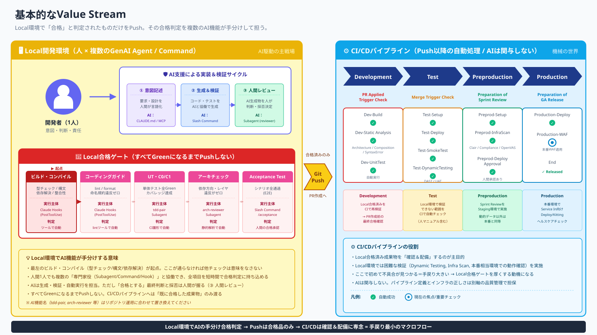

図は左右の2ゾーンで構成されます。

- **左ゾーン（黄色）―Local開発環境**：物理エンジニアとGenAIが協働する領域です。本章の「Local開発フロー」で詳述した作業フロー全体がここに収まります。「人が操縦桿を握り、GenAIが副操縦士として補佐する」AI駆動の主戦場です。
- **右ゾーン（青）―CI/CDパイプライン**：Pushを境にした自動処理の領域です。Development → Test → Preproduction → Productionの4ステージが流れますが、このゾーンにAIは関与しません。機械が機械的に処理する世界です。
- **境界の「Git Push」**：Local合格ゲートを通過したコードだけがここを越えます。Push前にゲートを通していないコードは、右ゾーンで失敗します。

#### Local合格ゲートの5項目

図中の赤枠で示すLocal合格ゲートは、Pushする前にLocal環境で通しておくべき5つのチェック項目です。左から順に厚くなる設計であり、前の項目が通って初めて次の項目が意味を持ちます。

| # | 項目 | 確認内容 |
| --- | --- | --- |
| 1 | **ビルド・コンパイル（起点）** | 型チェック・構文エラー・依存解決・整合性。ここが通らなければ他は無意味 |
| 2 | コーディングガイド | lint / format / 命名規約の遵守 |
| 3 | UT・C0/C1 | 単体テストGreen・カバレッジ達成 |
| 4 | アーキチェック | 依存方向・レイヤ違反の検出 |
| 5 | Acceptance Test | シナリオ全通過 |

ビルド・コンパイルを起点とする理由は 本章の「実装サイクル（Ⓐ〜Ⓔ）」で述べた通りです。Script言語（TypeScript / Ruby on Rails / Node.js）はコンパイルエラーが自然には出ません。型チェックとlintをLocal合格ゲートの最左に配置し、規律として強制することで「コンパイル言語なら自然に効く制約」を代替します。

Local合格ゲートを厚くするほど、CI/CDパイプラインでの失敗による手戻りが最小化されます。「Localで潰せるものはLocalで潰す」という姿勢が、1人のエンジニアとGenAIによるチームの生産性を支えます。なお、CI/CDパイプラインの4ステージは参考として配置しており、本書のスコープはLocal合格ゲートまでです。

上図は Phase 1（ナビゲーター・AIは副操縦士）視点での静止画です。Value Stream 上で人間とAIがどこに位置するかは第13章「AI協働の成熟度モデル」の「行動原則③ GenAIとの協働は段階的に深化する」のPhaseモデルによって大きく変化します。

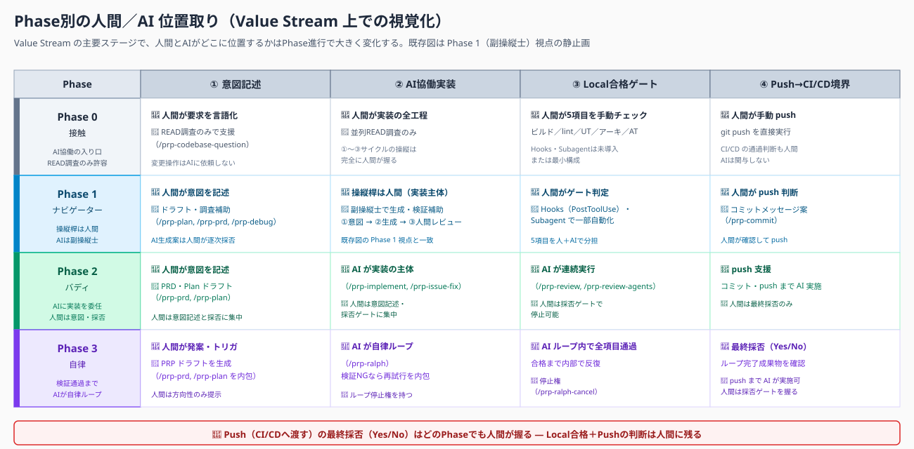

*図：Phase別の人間／AI 位置取り（Value Stream 上での視覚化）*

Phase 0では人間が Value Stream のほぼ全領域に位置し、AIは READ調査（`/prp-codebase-question`）のみで支援します。Phase 1では人間が①意図記述から③合格ゲートまで操縦桿を握り、AIは生成・検証補助の副操縦士として②AI協働実装の領域に位置します（既存図はこの状態の表現）。Phase 2ではAIが②実装〜③合格ゲートを担い、人間は①意図記述と採否ゲートに位置を移します。Phase 3では②〜③をAIが自律ループ（`/prp-ralph`）で内包し、人間は発案・トリガと最終採否のみに位置します。**Push（CI/CDへ渡す）の最終採否（Yes/No）はどのPhaseでも人間が握ります。**

---

### 見積もりの範囲

スクラムのバーティカルスライス（垂直分割）の考え方に基づいて見積もります。
また見積もりにあたり、最小のPBIに基づいて相対的に見積もることが重要です。

そこで、スウォームの観点で再定義します。

```text
1ポイントのPBI定義：システムの全階層を貫通し、疎通が確認できる最小限の変更（静的表示）」
```

具体的には：「特定の新しいURLパスにアクセスすると、データベースから取得した固定の文字列（例：'Hello, World!'）が、定義されたUIコンポーネント経由でブラウザに表示される」

このPBIを1ポイントとする理由は、ビジネスロジック（計算や分岐）がゼロであり、「各層のつなぎ込み（配管作業）」の難易度のみを測定できるからです。

---

## 9. なぜGitHub Flowか — Why GitHub Flow?

我々は、**ソースコードバージョン管理ルールとしてGitHubFlowを採用**します。`main`ブランチを常にリリース可能な状態に保ち、フィーチャーブランチで開発を進め、Pull Requestを通じてレビュー・マージする運用です。詳細な運用は [branch_strategy/README.md](./branch_strategy/README.md) で定めます。

GitHub Flow を Reference Workflow として採用するのは、GitHub という製品そのものを必須化するためではありません。「Work Item → Branch → Commit → Pull Request → CI → Review → Merge」という構造が、第3章・第4章で定めた Small Batch・Fast Feedback・Traceability・Human Accountability・Executable Quality Gates の各原則を具体的な手順として説明しやすいために採用しています。GitHub 以外のツールを採用する場合の読み替え方は第11章（Project Adaptation）を参照してください。

---

## 10. Claude Code リファレンス実装 — Claude Code Reference Implementation

### AIガードレールの設計と継続的アップデート ― 人間の責務②

第13章「AI協働の成熟度モデル」の「AIが性能を発揮できる環境を整える」では、AIが性能を発揮できる環境を整える責務を扱いました。本節はその延長として、環境の一部であるAIガードレール（CLAUDE.md／Subagent／Slash Command／Hooks／MCP／Git pre-commit）を、どう設計し、どう運用し、どう改廃していくかを扱います。

ガードレールは一度作って終わりではありません。プロジェクトの進化、技術スタックの変更、失敗からの学習、新しい規約の追加に応じて、継続的にアップデートしていく必要があります。アップデートを怠ると、ガードレールは現実から乖離し、AIへの指示として機能しなくなります。最悪の場合、誤った方向へAIを誘導する原因になります。

#### ガードレールはチームに迎え入れる新メンバー

ガードレールを「機能」や「ツール」として扱うと、運用が硬直化します。本書ではガードレールを**チームに迎え入れる新メンバー**として扱うことを推奨します。

新メンバーを迎えるときに何をするでしょうか。最初は手取り足取り教え、徐々に独立して動けるようにし、ベテランになったら任せる。失敗したら一緒に振り返って次回に活かす。役割が変わったら担当範囲を見直す。退職するときは引き継ぎをして送り出す。ガードレールも同じです。

この比喩を採用することで、ガードレールに対するチームの態度が変わります。「Subagentがうまく動かない」は「新メンバーがまだ習熟していない」になり、教育の問題として扱えます。「CLAUDE.mdが古くなっている」は「メンバーの引き継ぎが不十分」になり、組織の問題として扱えます。「Hooksが過剰反応する」は「新メンバーが空気を読めていない」になり、調整の問題として扱えます。

ガードレールは人間と同じく、完璧ではありません。育てる対象であり、付き合っていく相手です。

#### アップデートのトリガーを見逃さない

ガードレールのアップデートは「気が向いたとき」ではなく、明確なトリガーに基づいて行います。トリガーを見逃すと、ガードレールは少しずつ現実から乖離していきます。

以下は第13章「AI協働の成熟度モデル」の「AIが性能を発揮できる環境を整える」の運用が機能していないサインであり、同時にガードレール改善のトリガーでもあります。日常作業の中でこれらに気づいたら、その場でメモを残し、レトロスペクティブで議題に挙げます。

- **AIに同じ質問を繰り返している** → CLAUDE.mdに書くべき情報が抜けているサイン。プロンプトで毎回補足している内容は、CLAUDE.mdに移す対象です
- **AIが同じ間違いを繰り返している** → 規律の機械可読化が不足しているサイン。HooksやLintで自動検出できないか検討します
- **AIの出力が毎回微妙に違う** → 判断が固定化されていないサイン。設計判断をCLAUDE.mdに明文化します
- **チケットを読んでもAIが何をすべきか分からないと言う** → チケット品質が低いサイン。チケット記述の規約をCLAUDE.mdに追加するか、リファインメントの進め方を見直します
- **レビュー指摘が同じパターンで繰り返される** → 規約の明文化または機械化が不足しているサイン。Subagent化やLintルール追加の候補です
- **新しい技術スタックを導入した** → 既存CLAUDE.mdが古くなるサイン。導入と同時にCLAUDE.md更新を計画します
- **Hooksが過剰反応している(false positive)** → ルールが厳しすぎるか、例外パターンの明示が不足しているサイン。調整します

これらのトリガーは「ガードレールが壊れている」という意味ではなく、「ガードレールを育てる機会が来た」という意味です。気づくこと自体に価値があります。

#### ガードレールのライフサイクル

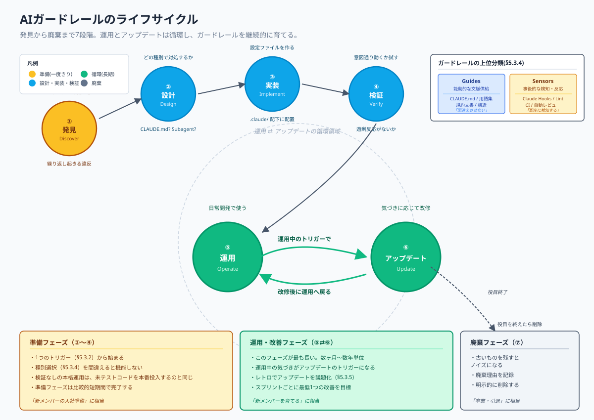

ガードレールには明確なライフサイクルがあります。各段階で何をするかを意識すると、思いつきの追加や放置による陳腐化を避けられます。

**発見**：失敗・違反のパターンに気づく段階です。本章の「アップデートのトリガーを見逃さない」のトリガーがここに該当します。チームメンバーやAI自身が「これは繰り返し起きている」と認識することから始まります。

**設計**：どの種類のガードレールで対処するかを決める段階です。CLAUDE.md追記で済むのか、Subagent化が必要か、Hooksでブロックすべきか、Slash Commandとして定型化するか。種別の選択を間違えると、過剰なガードレールになるか、機能しないガードレールになります。判断基準は本章の「種別ごとの責任とアップデート頻度」で後述します。

**実装**：ガードレールを実際に作って設置する段階です。CLAUDE.mdへの追記、`.claude/agents/` 配下のSubagent定義作成、`.claude/commands/` 配下のSlash Command定義、`.claude/settings.json` のHooks設定など、具体的なファイル変更を伴います。

**検証**：実装したガードレールが意図通り動くかを試す段階です。期待した違反パターンを検知できるか、過剰反応(false positive)を起こさないか、開発作業の妨げにならないか。検証なしの本格運用は、未テストのコードを本番投入するのと同じです。

**運用**：日常開発の中でガードレールを使う段階です。チーム全員がガードレールの存在と意図を認識している必要があります。新メンバーが入ったらガードレールの説明も引き継ぎ事項に含めます。

**アップデート**：プロジェクトの進化に応じてガードレールを改修する段階です。技術スタックの変更、規約の更新、失敗の蓄積に応じて、ガードレールの内容や閾値を調整します。アップデートのトリガーは本章の「アップデートのトリガーを見逃さない」で述べた通りです。

**廃棄**：役目を終えたガードレールを削除する段階です。古いガードレールを残し続けると、ノイズになり、新しいガードレールとの整合性も失われます。「もう必要ない」と判断したら明示的に削除し、削除した理由を記録します。

ライフサイクルの各段階を経るのに時間はかかりますが、急ぐ必要はありません。1つのガードレールが「発見」から「廃棄」まで数年かかることも普通です。

#### 種別ごとの責任とアップデート頻度

ガードレールの種別は、Martin Fowler が2026年4月に確立した **Guides（能動的な文脈供給）** と **Sensors（事後的な検知・反応）** という2つの上位分類で整理できます。

- **Guides**：AIが動き出す前に「正しい方向」を示す。CLAUDE.md・用語集・規約文書・ディレクトリ構造がここに当たる
- **Sensors**：AIが動いた後に「意図通りか」を検知する。Claude Hooks（PostToolUse）・Lint/CI・自動レビューがここに当たる

Guidesは「そもそも間違えさせない」、Sensorsは「間違えたら即座に検知する」という役割の違いを意識すると、以下の種別表が論理的に整理できます。

ガードレールには複数の種別があり、それぞれに特性があります。種別ごとに、誰が責任を持ち、どのくらいの頻度でアップデートされるかの目安は次の通りです。

| 種別 | 主な責任者 | アップデート頻度の目安 | 主なきっかけ |
| --- | --- | --- | --- |
| CLAUDE.md | チーム全員 | 高頻度(週単位) | 規約変更、失敗の蓄積、新技術導入 |
| Subagent | スキル所有者 | 中頻度(月単位) | 専門領域の規約整理、レビューパターンの蓄積 |
| Slash Command | 作業実施者 | 中頻度(月単位) | 定型作業の発見、コマンド化の機会 |
| Claude Hooks | チーム合意 | 低頻度(四半期単位) | 強制制約の追加、誤検知の調整 |
| MCP Server接続 | インフラ担当 | 低頻度(必要時) | 情報源の追加・廃止、認証方式の変更 |
| Git pre-commit Hook | チーム合意 | 低頻度(四半期単位) | 不可逆制約の追加、CI/Localの整合 |

頻度の目安はあくまで参考であり、プロジェクトの状況によって変わります。重要なのは「いつアップデートしてもよい」と「アップデートには合意が必要」の境界です。CLAUDE.mdは個人の気づきで即座に更新できる対象であり、Hooksはチーム合意なしに変更してはいけない対象です。この境界を意識することで、軽量な改善と重要な変更が混在せず、両方が機能します。

**ガードレールの種別選択の判断基準**は次の通りです。

- 規約・知識を伝えたい → CLAUDE.md
- 専門領域のレビューを自動化したい → Subagent
- 定型作業を簡単に呼び出したい → Slash Command
- ツール実行前後に強制的に介入したい → Claude Hooks
- 外部情報源にアクセスしたい → MCP Server
- コミットを許可・不許可で振り分けたい → Git pre-commit Hook

新しいガードレールを作る前に、上記のどれに該当するかを確認します。複数に該当する場合は、最も軽量な選択肢から試します。CLAUDE.md追記で済むなら、Hooks化は不要です。後から強化する余地は常に残っています。

#### Phase別のガードレール強度設計

本章の「種別ごとの責任とアップデート頻度」ではガードレールの種別ごとの責任とアップデート頻度を扱いました。同じ種別のガードレールでも、チーム・個人がどのPhaseにいるかによって、どこまで厳格に効かせるかは変わります。本節ではガードレール強度を「厳格ブロック／警告／事後ログ」の3段階で捉え、Phase 0〜3にどう対応させるかの設計原則を整理します。

ガードレール強度を一律に設定すると、Phase 0の新メンバーには弱すぎて事故を防げず、Phase 3の自律的メンバーには厳しすぎて生産性を阻害します。Phaseに応じた強度設計は、「育つ余地」と「事故防止」のバランスを保つための仕組みです。

**ガードレール強度の3段階**は次の通りです。

| 強度 | 意味 | 主な手段 |
| --- | --- | --- |
| 厳格ブロック | 違反を検知したら処理を停止し、修正なしには先に進めない | PreToolUse Hooks、Git pre-commit、CIのブロッキングジョブ |
| 警告 | 違反を検知したら通知するが処理は継続する | Lintのwarning、PostToolUse Hooks、PRレビューコメント |
| 事後ログ | 違反を後から検知できるよう記録するが、即時の通知はしない | post-merge監査、運用統計、レトロでの議題化 |

3段階は連続的なグラデーションです。同じ種別のガードレール（例：CI）でも、ブロッキングジョブ／警告ジョブ／記録ジョブの組み合わせで強度を調整できます。

**Phase × 強度の対応**は次の通りです。

| Phase | 中心となる強度 | 設計の狙い |
| --- | --- | --- |
| Phase 0 接触 | 厳格ブロック中心 | AI出力の誤りがコードベースに混入することを防ぐ。AIによる変更は人間の逐次確認が前提 |
| Phase 1 ナビゲーター | 厳格ブロック + 警告 | 基本ルール（コミット規約・ブランチ命名等）はブロックし、スタイル指摘は警告で通知 |
| Phase 2 バディ | 警告中心 + 事後ログ | AIの自律性を尊重しつつ、違反パターンを統計的に把握する |
| Phase 3 自律 | 事後ログ中心 | 事前ブロックは不可逆操作と採否を伴う操作に限定し、その他は事後検知と監査で運用 |

ただし**採否と不可逆操作は全Phase共通で厳格ブロックを維持します**。これは第13章「AI協働の成熟度モデル」の「AIと人間の責務境界」で定めた「採否は必ず人間が下す」原則に基づきます。Phase 3で運用が自律的になっても、Yes/Noの最終決定権と、削除・本番反映等の不可逆操作の発火点だけは、人間の判断を経由するガードレールで担保します。

**設計原則**は次の3点です。

- 強度緩和は実績ベース：「Phaseが上がったから自動的に緩和」ではなく、当該領域での運用実績(誤検知の少なさ・違反の収束)に基づく
- 個人Phase差をチームで吸収する：チーム内でPhaseがばらつく場合、最も低いPhaseに合わせるか、個人別設定を許容するかをチームで合意する。後者を選ぶ場合は「個人別設定を許容する範囲」を明文化する
- 緩めた強度の戻し条件を決めておく：警告から事後ログに緩めた後、同種の違反が再発したらどの強度に戻すかを事前に決めておく。戻し条件がないと、緩めた強度がそのまま定着する

具体的な `.claude/settings.json` のHooks設定、CIジョブの分類、Lintルールのseverity調整等の実装は本節の範囲外です。Phaseモデル全体の運用が固まった段階で、`.claude/settings.json` 設計の独立タスクを起票し、本節の原則を実装に落とします。本章の「レトロスペクティブでガードレールを育てる」で扱うレトロスペクティブが、その独立タスクの起票トリガーになります。

ガードレール強度の話と並行して、Phaseが上がるにつれて使い分ける `prp-core` コマンド群も整理しておきます。

ここで言う **PRP(Product Requirement Prompt)** とは、PRD(仕様)・実装コンテキスト・検証ループの3要素を1つのプロンプト文書にまとめた成果物のことです。AIが1回で実装まで到達できるよう、必要な文脈を一気に与えるための足場として使います。`prp-core` は、このPRPワークフロー(PRD作成 → Plan作成 → Implement → Review → PR化)を支えるスラッシュコマンド群を `.claude/commands/prp-core/` 配下に揃えたものです。

下図は、`prp-core` 配下のコマンドがPhase 0〜3のどこから導入されるかを1枚で示したマッピングです。

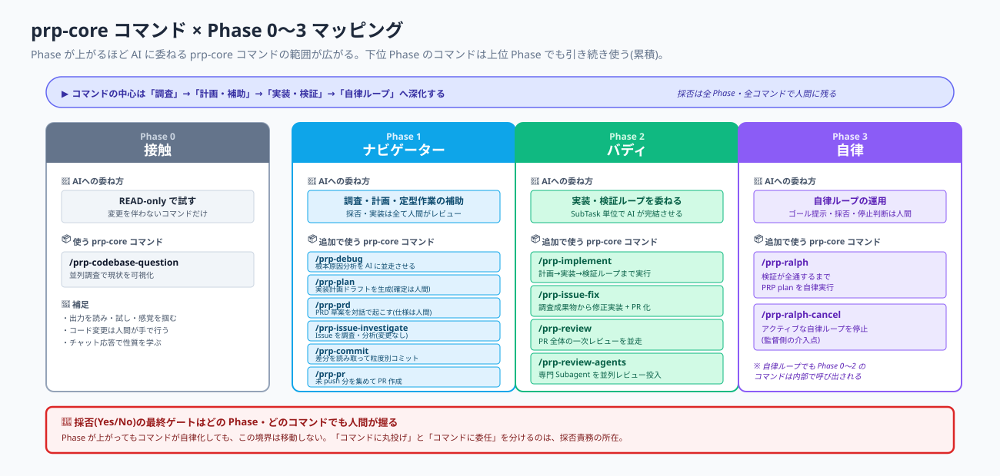

下位Phaseのコマンドは上位Phaseでも引き続き使えるため、累積的に活用範囲が広がります。採否(Yes/No)の最終ゲートは、どのPhase・どのコマンドでも人間が握ります。

#### レトロスペクティブでガードレールを育てる

ガードレールのライフサイクルを運用に組み込むため、**レトロスペクティブの正式議題としてガードレールのアップデートを扱う**ことを推奨します。

スプリント中に気づいたトリガー(本章の「アップデートのトリガーを見逃さない」)はその場でメモに残し、レトロで議題化します。レトロでは以下を扱います。

- **トリガーの共有**：誰がどんな違和感を感じたか
- **対処の検討**：どの種別のガードレールで対処するか、誰が担当するか
- **既存ガードレールの見直し**：機能していないもの、過剰反応しているもの、廃棄候補
- **新メンバー(ガードレール)の歓迎**：新しく追加したガードレールの紹介と運用開始
- **会話ターンの均等さの点検**：レトロでの発言が特定の人に偏っていないか。集合的知性は、特定個人の突出よりも、会話のターンが参加者に均等に分布しているチームで高くなることが知られています(第8章「実践のリファレンス」の「共同作業の促進」)。発言が一部に偏っていた場合は、その回のふりかえり自体が一部の視点しか拾えていないサインとして扱い、次回の進め方を調整します

レトロでガードレールを扱うことで、ガードレール運用はチーム全体の関心事になります。1人のメンバーが独自に設定したガードレールが他メンバーには伝わっていない、という事態を防ぎます。

レトロで取り上げないと、ガードレールはいつまでも個人作業として扱われ、チーム全体での合意形成が進みません。結果として、ガードレールの品質はメンバーごとにばらつき、AIへの指示として機能しなくなります。

スプリントごとに最低1つは、ガードレールの追加・更新・廃棄を行うことを目標とします。これは無理な目標ではなく、日常作業で生じるトリガーを素直に拾えば、自然に達成できる頻度です。むしろ「今スプリントは何もガードレールを触らなかった」という状態が続く場合、それはトリガーを見逃しているサインです。

ガードレールへの投資は複利で効きます。コードベースが育ち、規約が充実し、過去の意思決定の記録が蓄積するほど、AIはより正確に・より一貫して動くようになります。逆に言えば、ガードレールを育てずに放置するほど、その差は広がり続けます。スプリントごとに最低1つ触り続けることは、この複利を働かせるための最小限の投資です。「今スプリントは何もガードレールを触らなかった」という状態が続く場合は、複利を止めているサインとして受け止めてください。

レトロでガードレールを育てるこの循環は、進化型開発のLevel 3（第3章「中核となる原則」の「行動原則を貫くリズム（進化型開発のフラクタル構造）」）そのものです。

---

## 11. Project Adaptation（他ツールへの読み替え） — Project Adaptation

本章は、PLAN.md が定義する原則「Project Adaptation」を本書に明文化するための章です。本文は Issue #8（本リポジトリのTask）で執筆予定です。

> この章は現時点ではスタブです。詳細は Issue #8 を参照してください。

---

## 12. Security / Governance — Security / Governance

本章は、PLAN.md が定義する原則「Security / Governance」を本書に明文化するための章です。本文は Issue #9（本リポジトリのTask）で執筆予定です。

> この章は現時点ではスタブです。詳細は Issue #9 を参照してください。

---

## 13. AI協働の成熟度モデル — AI Collaboration Maturity Model

### 行動原則③ GenAIとの協働は段階的に深化する

我々はGenAIをチームの生産性向上に積極的に活用します。同時に、その活用は固定的ではなく、メンバーの習熟と環境整備に応じて段階的に深化します。AIと人間の協働の成熟度を、次の4段階のPhaseとして捉えます。

| Phase | AIの位置付け | 人間の役割 |
| --- | --- | --- |
| Phase 0 接触 | 試行対象 | 触る・対話する |
| Phase 1 ナビゲーター | 道具・副操縦士 | 判断・採否は全て人間 |
| Phase 2 バディ | あなたの相棒 | 発案・トリガ・結果確認 |
| Phase 3 自律 | 自律エージェント | ゴール提示と監督 |

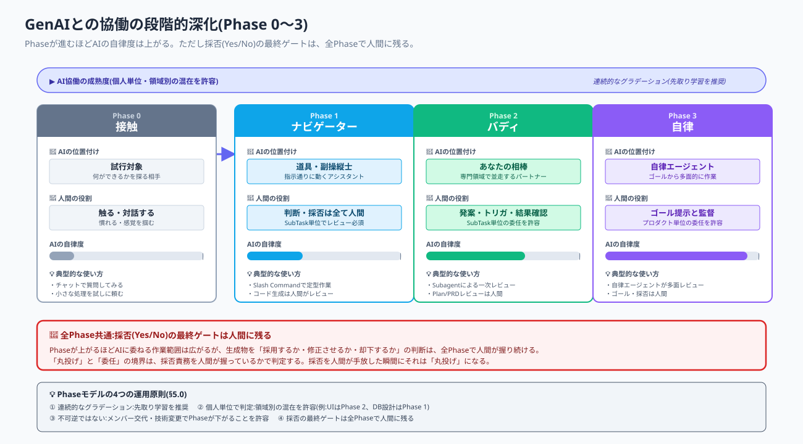

Phaseは個人単位で判定され、領域別（UI／DB設計など）に混在することを許容します。Phase境界は連続的なグラデーションであり、Phase 1のメンバーがPhase 2の要素を試すことを禁じません。むしろ推奨します。

Phaseが上がっても変わらない原則があります。**採否（Yes/No）の最終ゲートは、全Phaseで人間に残ります**。AIは判断材料の生成・選択肢の提示・判断の蓄積を担い、人間は何を採用するかを最終決定します。「丸投げ」と「委任」の境界は、採否責務を人間が握っているかで判定します。

この原則は本書の第8章「実践のリファレンス」の「実装サイクルと、本章で扱うAI活用の規律で具体化されます。AIと人間の責務境界、ガードレール構成、スクラムイベントごとのAI活用方針、レビューと品質保証の規律はすべて、この原則から導かれます。

具体的には、本章の「言葉の定義と責務境界」でAIに渡す言葉の正確性とAIと人間の責務境界（本章の「AIと人間の責務境界」）を、本章の「AIが性能を発揮できる環境を整える」で人間がAIの環境を維持する4つの観点を、第10章「Claude Codeリファレンス実装」の「AIガードレールの設計と継続的アップデート」でCLAUDE.md・Subagent・Slash Command・Hooks・MCP等のガードレールの設計と運用を扱います。

本章は、「行動原則③ GenAIとの協働は段階的に深化する」を、日々の作業に落とし込むための規律を定めます。AIとの協働はPhase 0〜3の4段階で深化し、Phaseによって規律の重心は変わります。本章はPhase共通の土台と、Phase別に重心が変わる運用の両方を扱います。

### Phaseモデル概観

本章の「行動原則③ GenAIとの協働は段階的に深化する」で4段階のPhaseモデル（Phase 0 接触／Phase 1 ナビゲーター／Phase 2 バディ／Phase 3 自律）を導入しました。本節は本章の「言葉の定義と責務境界」以降の規律を読む前提として、Phaseモデルの運用ルールを4点に絞って規律化します。

第一に、**Phaseは連続的なグラデーション**です。Phase 1のメンバーがPhase 2の要素を試すことを禁じません。むしろ先取り学習として推奨します。Phaseは固定的なラベルではなく、AI協働の成熟度を粗く位置づけるための座標です。

第二に、**Phaseは個人単位で判定**します。チーム全体が同一Phaseである必要はありません。さらに、領域別の混在（例：UIはPhase 2、DB設計はPhase 1）も許容します。各メンバーが自分のPhaseを自覚し、適切な運用を選べることが要点です。

第三に、**Phaseは不可逆ではありません**。メンバー交代、技術スタックの変更、新領域への着手などによってPhaseが下がる場合があることを前提とします。Phaseが下がることは失敗ではなく、新しい文脈に直面したサインです。

第四に、**採否（Yes/No）の最終ゲートは全Phaseで人間に残ります**。Phaseが上がるほどAIに委ねる作業範囲は広がりますが、生成物を採用するか・修正させるか・却下するかの判断は、全Phaseで人間が握り続けます。これは本章の「AIと人間の責務境界」で詳述する責務境界の核心です。

本章の「言葉の定義と責務境界」〜第10章「Claude Codeリファレンス実装」の「AIガードレールの設計と継続的アップデート」はこの4原則の上に乗ります。本章の「言葉の定義と責務境界」と本章の「AIが性能を発揮できる環境を整える」はPhase共通の土台として全Phaseで適用されます。第10章「Claude Codeリファレンス実装」の「AIガードレールの設計と継続的アップデート」は種別と運用の枠組みは共通ですが、強度（厳格ブロック／警告／事後ログ）の選択はPhaseに応じて段階設計します。Phase別の責務拡張・運用差分・ガードレール強度設計の詳細は、本書の継続改訂で順次反映していきます。

### 言葉の定義と責務境界

本節は、本章の「行動原則③ GenAIとの協働は段階的に深化する」を実装する規律の中で、最も基礎となる2つを扱います。
第一に、AIに渡す言葉そのものの定義と正確性。
第二に、AIと人間それぞれが何を担うかの責務境界です。
この2つはAI活用の土台であり、後続の本章の「AIが性能を発揮できる環境を整える」以降のすべての規律はこの土台の上に乗ります。

#### 言葉の定義と正確性を大事にする

人間同士の会話は、文脈と空気で言葉のずれを補正できます。多少の言葉のずれがあっても、聞き手が意図を汲んで補正します。しかしAIには空気がありません。入力された言葉をそのまま処理します。**人間が混同したまま入力した情報を、AIは混同しないまま処理します**。これがAI駆動開発において言葉の定義と正確性が決定的に重要になる理由です。

例えば「このPBIの価値は何ですか」と問われて、課題（Issue）を答えてしまう場面があります。発話者の中では価値と課題はほぼ同じものとして扱われていますが、AIにとっては別の概念です。価値（Why）を聞かれているのに課題（What）が入力されると、AIは「課題への対処策」を返してきて、価値の言語化という本来の目的が達成されません。

##### なぜ言葉の定義が決定的に重要か

第一に、**AIの出力品質はインプットの正確性に直結します**。曖昧な語彙で投げれば、曖昧な出力しか返りません。

第二に、**ガードレールが機能する前提になります**。CLAUDE.mdに「Issueから始めよ」と書いていても、現場の「Issue」が実は「解決策」を指していたら、ガードレールは正しい方向に効きません。

第三に、**蓄積された記録が将来の資産になります**。save-summaryやチケットに記載される語彙が一貫していれば、過去の意思決定を未来のAIが正しく参照できます。語彙が揺れていれば、記録は読み返すたびに解釈が変わるノイズになります。

##### 特に混同しないよう注意する語彙

以下は、リファインメントから実装着手までの過程で頻繁に登場し、かつ混同が致命的な8語です。これらの定義はチーム全員で共有し、AIに渡す前に自分の語彙が正しいかを確認します。

「Agent = Model + Harness」（Mitchell Hashimoto, 2026.02）という業界定義が確立しつつあります。本書でいう「ガードレール」は個々の仕掛け（CLAUDE.md・Hooks等）を指し、「ハーネス」はそれらGuides+Sensorsの総体を指します。

| 語 | 意味 | 混同されやすい語 |
| --- | --- | --- |
| Issue / 課題 | 何に困っているか | 解決策、要求、価値 |
| 価値 | 課題が解決されると誰にどんな利益があるか | 機能、効果、Issue |
| 解決策 / Solution | どう実現するか | Issue、要求、PBI |
| Story / PBI | 課題と価値を1つの単位にまとめたバックログ項目 | Epic、SubTask、解決策のリスト |
| 受け入れ条件（AC） | 価値が実現されたと判定する基準 | DoD、ユニットテスト |
| DoD | サブタスクが完了したと判定する基準。後工程が手戻りなく引き取れる条件を含む。 | AC、品質基準一般 |
| SubTask | 1つの検証可能な単位・1セッションで完結する最小作業単位（サブタスクのサイズ原則。第8章「実践のリファレンス」の「設計タスクの分割とサブタスクのサイズ原則」） | Task、Story |
| ハーネス | GuidesとSensorsの総体。AIを本番で機能させるための環境構成全体 | ガードレール（個別の仕掛け）、CLAUDE.md（種別の1つ） |

より広い用語の整理（Story / Epic / PBI の階層関係、AC / DoD / DoR の使い分け、リファインメントとプランニングの違いなど）は [用語集](./docs/glossary.md) を参照してください。

##### 実装の規律（人間の振る舞いとして）

- **答える前に、本当にその語を聞かれているか確認する**：「Issueは？」と聞かれたとき、それは課題を聞いているのか解決策を聞いているのか、一拍置いて確認します
- **AIに入力する前に、用語が正しいか1回見直す**：プロンプトを送信する前に、自分が使った語が用語集の定義と一致しているかを確認します
- **AIの出力に違和感があったら、まず自分の語彙を疑う**：出力がズレている場合、AIの問題である前に、入力した語彙が正確だったかを点検します
- **新しい用語を導入する前に、既存用語との関係を確認する**：似た概念の用語が既にある場合は、既存用語を使うか、明確に区別される新しい定義を立てます

##### チームでの運用

用語の揺れに気づいた場合、その場で指摘するか、レトロスペクティブで取り上げます。揺れがチーム全体に広がっている場合は、用語集と CLAUDE.md を更新し、AIへの入力時にもその定義を参照できる状態を作ります。

AIが「Issueと書かれているが、これは解決策ではないか」と指摘してきた場合、それは人間側のレビュー機会です。AIの指摘を素直に受け入れて、自分の語彙を見直します。

##### 聞き返し技法 3 種

AIとの対話で意図と違う答えが返ってきたり、ゴールに辿り着けなかったりする状況は避けられません。そのときに使える聞き返し方を 3 つ持っておくと、自分の前提抜けや理解の壁が見えやすくなります。

| 技法 | 使うタイミング | 投げかけ方 | 効果 |
| --- | --- | --- | --- |
| **期待差分型** | AIの答えが意図と違うと感じたとき | 「期待した答えは○○だったが、なぜそうならなかったか」 | 自分の前提の抜け・言葉のズレが見える |
| **背中押し型** | AIに聞いてもゴールに辿り着けないとき | 「どうして私はそこに辿り着けないのか」 | 自分の理解の壁・スキルギャップが見える |
| **提案無視型** | AIが「〜しますか」と次の作業を提案してきたとき | ゴール到達優先で半分無視してよい | 寄り道を防ぎ、本来の目的に集中できる |

これらはいずれも、AIに改善を求めるのではなく、自分の理解の解像度を上げるための問いです。「言葉の定義と正確性」の規律は、こうした聞き返しによって日々鍛えられます。

##### AIの性質への注意 ― AIは殆ど否定的なことを言ってこない

AIは多くの場合、人間の入力に対して肯定的・協力的に応答します。「その方針でいきましょう」「分かりました、実装します」と提案を受け入れがちな性質を持っています。

このため、人間側が能動的に「期待した答えと違っていないか」「アバウトに聞いていないか」をチェックしないと、誤った前提のまま実装が進む危険があります。AIから「それは違うのではないか」と差し戻されることを期待してはいけません。

この性質はPhaseに関わらず共通です。気づいてチェックを入れられるかどうかは、人間の成長ポイントでもあります。違和感を覚えた瞬間に立ち止まり、上記の聞き返し技法を使って自分の入力を点検することで、AI出力の盲信を避けられます。

#### AIと人間の責務境界

AI駆動開発において、AIと人間がそれぞれ何を担うかを明確にします。第8章「実践のリファレンス」の「実装サイクル（Ⓐ〜Ⓔ）」で実装サイクル内の責務分担（Ⓐ〜Ⓔ）を図示しましたが、本節ではサイクル内に閉じない、より上位の責務境界を扱います。さらに本章の「行動原則③ GenAIとの協働は段階的に深化する」・本章の「Phaseモデル概観」で示した4段階Phaseモデルに沿って、AI側の関与度がPhase 1〜Phase 3でどう変化するかを示します。

##### 3種類の責務

チームの責務は次の3種類に分類できます。

**第一に、判断の責務**。何を作るか、なぜ作るか、どう判断するか。これらは本章の「行動原則③ GenAIとの協働は段階的に深化する」で述べた通り、人間が握り続ける責務です。AIに「判断してください」と依頼することはありません。AIは判断材料を提供する役割であり、判断そのものは人間が下します。

**第二に、採否の責務**。AIが生成した成果物（コード、テスト、ドキュメント、設計案）を採用するか、修正させるか、却下するかを決める責務です。これも人間が握ります。AIの出力を確認せずに採用することは、判断の責務を放棄することと同じです。

**第三に、環境管理の責務**。AIが性能を発揮できる前提（CLAUDE.md、命名規約、ディレクトリ構造、チケットの記述品質、用語集など）を整える責務です。これは本章の「AIが性能を発揮できる環境を整える」で詳述しますが、AIに任せられない人間固有の責務です。AIは与えられた環境の中でしか動けません。

##### 責務の分担表（Phase 別）

3種類の責務は、本章の「Phaseモデル概観」で示したPhase 1（ナビゲーター）／Phase 2（バディ）／Phase 3（自律）の各段階で、AI側の関与度が変化します。一方で、**採否の最終ゲートは全Phaseで人間に残り続けます**（本章の「Phaseモデル概観」Phaseモデル運用原則 4）。

| 責務 | Phase 1: ナビゲーター | Phase 2: バディ | Phase 3: 自律 |
| --- | --- | --- | --- |
| **判断（What/Why）** | 人間 ◎ ／ AI × | 人間 ◎ ／ AI △（案提示） | 人間 ◎ ／ AI ○（案提示＋選択肢） |
| **採否（Approve/Reject）** | 人間 ◎ ／ AI × | 人間 ◎ ／ AI △（一次レビュー） | 人間 ◎ ／ AI ○（多面レビュー） |
| **環境管理（CLAUDE.md等）** | 人間 ◎ ／ AI × | 人間 ◎ ／ AI △（更新提案） | 人間 ○ ／ AI ○（共同更新） |

◎は主担当として責任を持つ、○は明確な役割を担う、△は補助的に関わる、×は関わらないことを意味します。

Phaseが進むにつれてAIの関与度は深まりますが、AIが「一次レビュー」「多面レビュー」を担っても、最終的な採用判断を人間が手放すわけではありません。Phase 3でAIが多面レビューを行う段階に到達しても、人間は最後のゲートとして残り、AIの示した案を採用するかどうかを明示的に決めます。

##### scope の区別 ― 何の責務かを明確にする

責務境界を語るときは、「どのscopeの話か」を区別する必要があります。

- **開発scope** — 何を作るか／どこまで作るか
- **レビューscope** — 何を確認するか／どの角度から確認するか（細部・内部ログ・通信ログなどの多角性）

scopeを区別しないと、「採否は人間」と言っても何の採否なのかが曖昧になります。たとえばPhase 2でAIが「一次レビュー」を担うとき、それは「レビューscopeの細部チェックをAIに委ねる」のであって、「開発scopeの判断をAIに任せる」ことではありません。Phase 3でAIが多面レビューを担うときも、レビューscopeの多角化を委任しているのであって、開発scopeのゴール設定や最終採否を委任しているわけではありません（この開発scope／レビューscopeの権限分離をモデル選択に適用した具体は本章の「モデル選択ポリシー」）。

##### 「丸投げしない」「採否は必ず人間が下す」

責務境界を運用する上で守るべき2つの原則があります。

第一に、**作業を丸投げしない**。「このSubTaskを全部やっておいて」とAIに任せきりにしません。AIが生成したものは人間が必ず確認します。確認には時間がかかりますが、確認しないことで生まれる手戻りはそれ以上の時間を奪います。

第二に、**採否は必ず人間が下す**。AIの生成物に対して「採用する」「修正させる」「却下する」のいずれかを人間が明示的に判断します。判断を保留したまま次の作業に進むことは、責務の放棄です。

この2つを守れない状況が続く場合、それは個人の問題ではなく、SubTaskが大きすぎる、サブタスクのサイズ原則（第8章「実践のリファレンス」の「設計タスクの分割とサブタスクのサイズ原則」）に収まっていない、判断材料が不足している、といった構造的な問題のサインです。レトロスペクティブで議題に挙げます。

**Phase 別の解釈**: 「丸投げしない」の具体的な許容範囲は Phase によって変化します。

| Phase | 解釈 |
| --- | --- |
| Phase 1 | 作業の丸投げ禁止。SubTask 単位でレビュー必須 |
| Phase 2 | SubTask 単位の委任を許容。Plan/PRD のレビューと最終採否は人間 |
| Phase 3 | プロダクト単位の委任を許容。ゴール提示と最終採否は人間 |

「丸投げ」と「委任」の境界は、**採否責務を人間が握っているか**で判定します。Phaseが進むほど作業の委任範囲は広がりますが、採否を人間が手放した瞬間にそれは「丸投げ」になります。Phase 2/3でSubTaskやプロダクト単位の委任が許容されるのは、その単位での採否ゲートを人間が握っていることが前提です。

##### 責務境界が崩れる典型的なシーン

責務境界は明文化していても日常では崩れがちです。崩れやすい典型シーンを認識しておくと、自覚的に踏みとどまれます。

- **時間が迫っているとき**：AIの出力を確認せずにコミットしたくなる → 採否の責務を放棄
- **AIの出力が一見もっともらしいとき**：判断材料の提示と判断そのものを混同しやすい → 判断の責務を放棄
- **AIに同じ質問を繰り返しているとき**：CLAUDE.mdを更新すべきなのに、毎回プロンプトで補足している → 環境管理の責務を放棄
- **失敗が繰り返されているとき**：個別に対処しているが、ガードレール化していない → 環境管理の責務を放棄

これらのシーンに気づいたら、その場で立ち止まり、責務境界に沿った行動を取り直します。

**ガードレールが守れないもの**: ガードレール（Hooks・Lint・型チェック・CI）は「コードの正しさ」を守ります。しかし、仕様の解釈が誤っていた場合—「この機能をこう作るという判断そのものが間違い」という場合—はすり抜けます。コードが型チェックを通り、テストが全件Greenであっても、解いている問題が違えば意味がありません。これは行動原則②「まずはIssueから始めよ」および本節の「判断の責務は人間が握る」が不可欠である根拠の一つです。ガードレールを過信せず、仕様レベルの採否判断を人間が常に行うことを忘れないでください。

### AIが性能を発揮できる環境を整える ― 人間の責務①

本章の「AIと人間の責務境界」の責務分担表（Phase 別）では、環境管理の責務をPhase 1〜2では人間中心、Phase 3ではAIと共同で担うと位置づけました。本節はPhase 1〜2における人間主担当の具体実装を示します。Phase 3でAIが共同担当に加わっても、人間が組み立てた環境管理の規律は土台として残り続けるため、本節の内容はどのPhaseでも基礎となります。

AIは与えられた環境の中でしか動けません。CLAUDE.mdが古い、規約が曖昧、コードベースに統一感がない、チケットが雑、といった状態ではAIは混乱し、結果として開発の生産性も品質も落ちます。

人間がAIの上司・環境管理者として何をすべきかを4つの観点で整理します。文脈の質を保つこと、規律を機械可読にすること、不要な複雑さを持ち込まないこと、判断を固定化することです。

なお本節は第3章「中核となる原則」の「大前提 ― 常に健康な状態を保ち続けるソフトウェアであれ」「常に健康な状態を保ち続けるソフトウェアであれ」の具体実装でもあります。健康なソフトウェアはAIにとっても扱いやすいソフトウェアです。両者は別物ではなく、同じものを別の角度から見たものです。Phaseが進んでAIが環境管理に共同で関わるようになると、この命題は「人間にとっても、AIにとっても、健康なソフトウェアは扱いやすい」という双方向の意味合いを帯びてきます。

#### 文脈の質を保つ

AIは与えられた文脈の質に応じてしか動けません。第8章「実践のリファレンス」の「実装サイクル（Ⓐ〜Ⓔ）」で示した文脈供給層（CLAUDE.md／MCP／.claude/rules／status/current.md／既存ソースコード）の質を、人間が継続的に維持する必要があります。

**CLAUDE.md を最新に保つ**。プロジェクト規約、命名規則、禁止事項、依存ライブラリの選定理由、過去の意思決定をここに集約します。AIは作業のたびにこれを読み込んで前提とします。古い情報が残っていれば、AIは古い情報に従って動きます。CLAUDE.mdの更新は「気が向いたとき」ではなく、規約や方針が変わった時点で即座に行います。

**チケットを「課題と価値」で書く**。これは行動原則②と直接接続する話です。Issueと価値が明確に書かれていないチケットをAIに渡すと、AIは何を解決すべきかを推測で動きます。推測は外れることが多く、結果として手戻りが生じます。チケットを書く時点で、本章の「言葉の定義と正確性を大事にする」で定義した8語を正確に使い分けて記述します。

**過去の意思決定を記録する**。save-summary、Architecture Decision Record、レトロ記録など、過去の判断を残す手段はいくつかあります。「なぜこの方針を選んだか」が記録されていなければ、AIは毎回同じ議論を再演します。さらに悪い場合、過去に却下された案を提案してきます。記録は未来のAIへの引き継ぎ書類です。

**ディレクトリ構造・モジュール境界を明確に保つ**。AIは既存パターンから学習します。構造にばらつきがあると、AIは「どのパターンに従えばいいか」を毎回迷い、選択が揺らぎます。新しいファイルを作る時、新しいモジュールを切る時、既存構造との一貫性を確認することが人間の責務です。

**AIに渡す情報の切れ目を、人間の動き方と揃える**。第3章「中核となる原則」の「健康な状態とは何か」で述べたコンウェイの法則は、作業主体がAIのときも働きます。AIにとっての切れ目は、渡す情報の構造——コードのモジュール分け、CLAUDE.mdの章立て、チケットの切り方——です。ここに落とし穴があります。人間のチームがスウォームで1つのPBIを縦一体に、切れ目なく進めていても、AIに渡す情報がレイヤー別(フロント／バック／DBで分断)に切れていれば、AI側の切れ目だけが横方向に走ります。人間側の切れ目は縦方向にない、AI側の切れ目は横方向にある——この2つが食い違うと、成果物には人間の作った継目とAIの作った継目が二重に入り、どちらつかずの継目だらけになります。

したがって、人間の動き方を垂直スライス・スウォームで縦一体に保つなら、AIに渡す情報の構造も同じ縦方向に揃えなければなりません。ディレクトリやCLAUDE.mdをレイヤー別のまま放置して人間側だけ一体化しても、コンウェイの法則が二重に食い違って効くだけです。AI側の切れ目を人間側と揃えることは、環境管理の中でも見落とされやすく、かつ成果物の構造を直接左右する重要な責務です。

**ログとヘルスチェックはAIにとってのSensorでもある**。第3章「中核となる原則」の「健康な状態とは何か」で定めたログ収集・ヘルスチェックの自動化は、「人間が見るのと同じものを、AIも見ている」状態を作るための仕組みです。本番の状態を可視化することは、人間の運用判断を助けるだけでなく、AIが問題を調査・特定する際の情報源にもなります。観測可能性の整備は、AIとの協働においても不可欠な環境管理の一部です。

#### 規律を機械可読にする

「気をつけて」という人間向けの注意書きは、AIには伝わりません。正確には、AIは「気をつける」というメタな指示を受けても、何を具体的にチェックすればよいかを判断できません。規律は機械が判定できる形にする必要があります。

**「気をつけて」を型・lint・Hooks・CIに落とす**。たとえば、TypeScriptでの開発の場合は、「`any` を使わないように気をつけて」ではなく、TypeScriptの厳格モードを有効にし、`no-explicit-any` lintルールを設定し、Claude HooksのPostToolUseでチェックします。「コミット前にテストを実行してください」ではなく、Git pre-commit Hookで自動実行します。採用する言語やフレームワークが変わっても、規律を機械可読にするという原則は変わりません。具体的なツール・設定はその言語・フレームワークに応じた最良の手段を選びます。人間の意志に頼る規律は、忘れた瞬間に破られます。機械に判定させれば破られません。

**暗黙知を明文化する**。「うちでは大体こうやる」という暗黙のルールが、ベテランメンバーの頭の中にだけ存在する状態は、AIにとっては存在しないのと同じです。暗黙知を CLAUDE.md やSubagent定義に書き起こすことで、初めてAIが従える規律になります。新メンバーが入ったときに「これも教えとかないと」と思うことは、すべてAIにも教える必要があると考えてください。

**「規約はあるが従っていない」状態をなくす**。最も避けるべき状態です。既存コードに違反が残っていると、AIは違反コードを正しい規約として学習し、新しいコードでも違反を再生産します。規約と既存コードに乖離がある場合、規約を緩めるか、既存コードを直すか、どちらかを選択します。両者が乖離したまま放置することは、AIを意図的に混乱させていることと同じです。

機械可読化できない領域（センスや美的判断、設計の妥当性など）は、人間レビュー（第8章「実践のリファレンス」の「実装サイクル（Ⓐ〜Ⓔ）」のⒺ）に残します。すべてを機械化する必要はありません。機械化できるものは確実に機械化し、人間の判断力を機械化できない領域に集中させることが重要です。

#### 不要な複雑さを持ち込まない

人間にとって読みにくいコードは、AIにとっても扱いにくいコードです。この命題は本書のコンセプト一貫性の要であり、第3章「中核となる原則」の「大前提 ― 常に健康な状態を保ち続けるソフトウェアであれ」と本章の「AIが性能を発揮できる環境を整える」を結ぶ橋でもあります。

**健康なソフトウェアはAIにとっても扱いやすい**。深いネスト、巨大なファイル、過度に抽象化されたクラス階層、目的不明のヘルパー関数。これらはレビュアーが読み解くのに時間がかかるコードであり、同時にAIが文脈を把握するのに苦労するコードです。「人間にとって読みやすい」と「AIにとって扱いやすい」は、概ね同じものを指しています。両者は別の指標ではなく、同じ品質の表と裏です。

**リファクタリングを後回しにしない**。技術的負債は人間の生産性を下げるだけでなく、AIの精度も下げます。負債が積み上がったコードベースでは、AIは「既存パターン」として負債を学習し、再生産します。行動原則①「小さく作って大きく繋げる」は、繋げるたびにリファクタを織り込む前提で成立します。S-final（仕上げサブタスク）はこの織り込みの場所です。

**新しい複雑さを足す前に既存の複雑さを問う**。新機能を追加するとき、新しい抽象を導入するとき、それが本当に必要かを問います。既存のパターンで対応できないか、既存の関数を拡張できないか、を先に検討します。「とりあえず新しいクラスを作る」「とりあえず新しいオプションを足す」を繰り返すと、AIは「どれを使えばいいか」を毎回迷うことになります。

第3章「中核となる原則」の「大前提 ― 常に健康な状態を保ち続けるソフトウェアであれ」で述べた「健康な状態を保ち続けるソフトウェア」は、AIと協働する時代において、人間のためだけのものではありません。AIという仮想メンバーが性能を発揮するためにも、健康さは不可欠です。テストの自動化、疎結合なアーキテクチャ、ログの可視化、これらすべてがAIにとっての作業環境でもあります。

#### 判断を固定化する

設計判断をAIに毎回させると、揺らぎが生じます。同じ問題に対して、ある日はAパターンを提案し、別の日はBパターンを提案する、ということが起こります。これはAIの欠陥ではなく、判断を固定化していない人間側の責務不履行です。一度決めた判断は文書化して固定するのが人間の責務です。

**設計判断は人間が決めてCLAUDE.mdに書く**。採用フレームワーク、データモデルの方針、認証方式、エラーハンドリング戦略、ロギング規約、命名規則、ディレクトリ構造の方針。これらはAIに毎回判断させるものではなく、人間が一度決めて文書化する対象です。

**「AIに毎回判断させない」**。判断は1回、文書化は1回、参照は何回でも。これがAI駆動開発における判断のリズムです。「同じ質問をAIにするたびに違う答えが返ってくる」と感じたら、それは判断を固定化していないサインです。CLAUDE.mdに書き足すタイミングです。

**判断を変える時は明示的に**。固定した判断を変える必要が出た場合、CLAUDE.mdを更新し、変更点と理由をチームに通知します。古い判断の痕跡がコードベースに残っていれば、それも更新の対象です。判断の変更を曖昧に進めると、新旧の判断が混在し、AIはどちらに従えばよいか分からなくなります。

判断の固定化は、本章の「AIと人間の責務境界」で述べた「判断の責務」を環境管理の文脈で実装する活動です。判断を握ること（責務）と、判断を残すこと（実装）は別物であり、両方を担うのが人間の責務です。

#### 正解の所在を整える ― AIだけが正解を知る状況を意図的に作る

AIとの協働では、解こうとしている問題の「正解の所在」が状況によって異なります。
この所在を整えること自体が、本章の「文脈の質を保つ」〜本章の「判断を固定化する」で扱った文脈・規律・複雑さ・判断の管理を貫く、本章の「AIが性能を発揮できる環境を整える」全体の核心です。

| 状況 | 特徴 | エンジニアの依存先 |
| --- | --- | --- |
| 人もAIも正解を知らない | なかなかゴールに辿り着けない | エンジニアの経験値・ナレッジへの依存度が高い |
| AIだけが正解を知る | 意図的に作り出せる状況 | 良いモデルの選択／RAG／ドキュメント整備／codebaseの構造化 |

前者の状況では、人間が手探りで仮説検証を回す必要があります。
AIに頼っても正解の手がかりが存在しないため、得られるのは曖昧な提案や推測の繰り返しになります。

一方、**後者の状況は人間が意図的に作り出せます**。良いモデルの選択（モデルグレードを作業の性質で選び分ける具体的な判断軸は本章の「モデル選択ポリシー」）、RAGの活用、ドキュメントの整備、コードベースの構造化、これらすべてが「正解をAIに届ける」ための環境管理の活動です。本章の「文脈の質を保つ」〜本章の「判断を固定化する」はそれぞれ次のように本節と接続しています。

- 本章の「文脈の質を保つ」：CLAUDE.md・チケット・過去の意思決定を整える＝AIが正解を引き出せる前提を作る
- 本章の「規律を機械可読にする」：型・lint・Hooks・CIを整える＝AIが「正解の判定」をできる状態にする
- 本章の「不要な複雑さを持ち込まない」：コードベースから雑音を取り除く＝AIが正解を見通せる視界を確保する
- 本章の「判断を固定化する」：意思決定をCLAUDE.mdに書き起こす＝AIが過去の正解を再利用できる土台を作る

**codebaseはAIにとって構造化された効率の良いドキュメント**でもあります。健康なコードベース＝AIにとって質の高いドキュメント、という命題は第3章「中核となる原則」の「大前提 ― 常に健康な状態を保ち続けるソフトウェアであれ」と本章の「不要な複雑さを持ち込まない」の双方を支える前提です。ドキュメントとしてのコードベースを意識すると、命名・ディレクトリ構造・モジュール境界・依存関係といった要素が、すべて「AIに正解を読み取らせる装置」として再評価できます。

「AIだけが正解を知る」状況を意図的に作る技術は、Phaseが進むほど重要になります。Phase 1〜2では人間が主担当としてこの環境を組み立て、Phase 3でAIが共同で関わるようになっても、土台となる構造化の規律は引き続き人間の責務です。

### Phase を貫く土台 ― 全Phase共通の運用原則

本章の「言葉の定義と責務境界」〜第10章「Claude Codeリファレンス実装」の「AIガードレールの設計と継続的アップデート」はPhase軸で強度や責務分担が変化する規律を扱ってきました。
本節は対照的に、**Phase 0〜3すべてに共通する運用原則**を整理します。Phase進行による緩和はなく、Phase 3で運用が自律的になってもこれらは維持される土台です。

ここで扱う3つの原則(PIVループ／1歩目を早く出す／悪いニュースが下から上へ流れる状態を保つ)は、いずれもAIとの協働、そしてチームでの協働を「単発の出力で終わらせない」「迷う時間を作らない」「まずい兆候を握り潰さない」という運用態度です。Phaseが何であっても、AIの出力に対して、そして人間どうしでどう振る舞うかという基本姿勢として共通します。

#### PIVループ ― 出力したら多角的に確認し、違和感から逆戻りする

AIの出力を一度受け取って終わりにすると、ハルシネーションや指示出しの誤りが検知されず、コードベースに混入します。これを防ぐために、出力後の確認・修正・再回しを意図的にループ化します。

**PIVループ**(Plan / Implement / Verify の頭文字。AIに渡す計画→実装→検証の運用ループ)は次の5ステップで構成します。

1. PIVでアウトプットを出力する
2. 細部・内部(デバッグログ)・通信ログを多角的に確認する
3. 違和感を起点に、逆戻りでハルシネーションや指示出しの間違いを探す(AIと一緒に探してもよい)
4. 実装とプロンプト(skill/agent)を修正する
5. 時間が許せばPIVをもう一度回す

このループはPRD単位／プロダクト単位で回します。コード片単位の小さな修正ではなく、「出来上がったプロダクトを多角的に検証して回す」粒度です。

PIVループを前提に置くと、**プロダクトの作り直しや大規模リファクタを恐れない・迷わない**という運用態度が成立します。1回目の出力で完成させる必要がないため、思い切った作り直しがコストではなく工程の一部になります。逆に「1回で完成させなければ」という前提に立つと、検証で見つけた違和感を見送る圧力が働き、品質が落ちます。

#### 1歩目を早く出す ― 迷う時間を作らない

PIVループが回せる前提として、**最初のアウトプットを早く出す**運用態度が必要です。迷ったまま手が止まる時間は、ループを1周も回せていない時間です。

実運用では次の3点を意識します。

- **迷わずに1歩目を出す**：「割と良いものが出てくる」前提でまず出力させる。検証はPIVループで行えばよいので、最初の出力の完成度を高めようとしない
- **細かいPoCを日々行う**：本番タスクの前に、技術要素やプロンプト形式の小さな試作を日常的に積み重ねる。これがPIVループを回す素地になる
- **良質なコードへのリンクを管理する**：自分が書いたか、AIが書いたか、外部参照かを問わず、後でAIに参照させたい良質な成果物のリンクを管理しておく。クリエイティブな成果物ほど、AIに食べさせる素材として価値が高い

1歩目を早く出すこととPIVループは双子の原則です。早く出すからループが回り、ループが回るから「早く出して構わない」と判断できます。どちらかが欠けると、迷う時間か、検証されない出力か、どちらかが増えます。

#### 悪いニュースが下から上へ流れる状態を保つ

前の2つの原則(PIVループ／1歩目を早く出す)は、AIの出力に対する人間の振る舞いを扱いました。本節はそれと対になる、人間どうし──とりわけ立場の上下がある人間の間──の振る舞いを扱います。この原則もまた、Phaseに関わらず全Phaseで維持される土台です。

PIVループ(本章の「PIVループ」)は、違和感を起点に逆戻りして誤りを探すループでした。このループが成立する前提は、**違和感やまずい兆候が、握り潰されずに表に出てくること**です。個人がAIの出力に感じた違和感を自分の中で握り潰せばPIVループは回りません。同じことがチームの規模でも起きます。誰かが気づいた失敗・懸念・悪いニュースが、上位者や中心メンバーに届く前に握り潰されると、チームとしての検証ループが回らなくなります。

ここで守るべき原則は、**悪いニュース・失敗・懸念ほど、下位から上位へ、末端から中心へ、滞りなく速く流れる状態を保つ**ことです。良いニュースは放っておいても上がってきますが、悪いニュースは自然には上がってきません。報告すれば叱られる、無能だと思われる、場の空気を壊す──こうした予期が働くと、人は悪いニュースを飲み込みます。悪いニュースが上がってこないチームは、健全なのではなく、問題が見えなくなっているだけです。これは第3章「中核となる原則」の「テストとレビューは欠陥を見える化する行為である」で述べた「見える化を止めた瞬間、健康かどうかは誰にも分からなくなる」の、人間の情報伝達版にほかなりません。

悪いニュースの流れが止まることが致命傷になりうることは、事故調査の分野で繰り返し確認されてきました(航空機事故では、副操縦士が機長の誤りに気づきながら進言をためらったことが惨事につながった事例が知られています)。裏を返せば、立場の弱い側が懸念を口に出せる状態を保つことが、システム全体の安全を左右します。

この状態を保つ責務は、悪いニュースを**上げる側**と**受け取る側**の双方にあります。

**上げる側の振る舞い**:

- 確証が持てなくても、違和感の段階で早く出す。「まだ確信がないから」と抱え込まない(本章の「1歩目を早く出す」「1歩目を早く出す」と同じ態度を、対人の報告にも適用する)
- 犯人探しではなく事実を共有する。「誰が悪いか」ではなく「何が起きているか」を言葉にする
- 解決策とセットでなくてよい。問題の存在を伝えることそのものに価値がある

**受け取る側(とりわけ上位者・中心メンバー)の振る舞い**:

- 悪いニュースを持ってきた人を責めない。報告した行為そのものを歓迎する。ここで一度でも叱れば、次から悪いニュースは上がってこなくなる
- 反応を返す。握った悪いニュースにどう対処したかを報告者に返し、「上げても無駄だった」という学習を防ぐ
- 沈黙を同意と解釈しない。誰も懸念を出さないことは、懸念がないことを意味しない。特に立場の弱いメンバーの沈黙には、こちらから問いかける

この原則は、本書の他の仕組みが機能するための土台でもあります。レトロスペクティブでトリガーを共有する(第10章「Claude Codeリファレンス実装」の「レトロスペクティブでガードレールを育てる」)のも、用語の揺れをその場で指摘する(本章の「言葉の定義と正確性を大事にする」)のも、責務境界が崩れているシーンに気づいて立ち止まる(本章の「AIと人間の責務境界」)のも、すべて「まずいと気づいたことを、その場で・上に向かって言える」状態があって初めて回ります。悪いニュースが下から上へ流れる状態は、第10章「Claude Codeリファレンス実装」の「AIガードレールの設計と継続的アップデート」〜本章の「Phaseを貫く土台」で述べてきた各種のふりかえり・気づきの仕組みが空回りしないための、最も底にある前提です。

### Phase 1 メンバーの自己研鑽経路 ― Phase 2 への先取り学習

本章の「Phaseを貫く土台」までは全Phase共通の土台を扱いました。本節は対照的に、**Phase 1 メンバー独自の自己研鑽**を扱います。Phase 1 でAIにナビゲーター役を任せる経験を積むだけでは、生産スピードは本質的に変わりません。Phase 2(バディ)へ移行するには、Phase 1 のうちに次段階の要素を**先取り学習**として日常に組み込む必要があります。

本節は本章の「Phaseモデル概観」で示した「Phase 境界は連続的・グラデーション」の実装でもあります。ある日突然 Phase 2 に切り替わるのではなく、Phase 1 のうちに積み重ねた自己研鑽が Phase 2 への移行を実現します。

自己研鑽経路は次の4段階で構成します。

| 段階 | 学習活動 |
| --- | --- |
| Phase 1 での自己研鑽 | Anthropic engineer blog / OpenAI blog の読み込み |
| Phase 1.5 相当 | Context Engineering の深い理解、コンテキスト積み上げ戦略の獲得 |
| Phase 2 移行準備 | commands / skills / agents の意図的作成・修正・フィッティング練習 |
| Phase 2 移行判定 | token・model 意識、AI の反応予測、要件提示＋レビューのみでプロダクト作成 |

4段階を貫く動作原理は、**「思い通りの結果を AI から取り出す。改善を繰り返す」**です。これは本章の「PIVループ」の PIV ループ(出力→検証→修正→再回し)と同型の動作で、AI 活用スキルそのものを対象に PIV ループを回すことに相当します。Phase 1 メンバーの自己研鑽は、本章の「Phaseを貫く土台」で示した全 Phase 共通の運用態度を、自分自身の AI 活用スキルを対象に実践する場でもあります。

Phase 1.5 という中間段階を置いているのは、Context Engineering の理解が Phase 1 と Phase 2 の境界そのものだからです。Context Engineering を理解しないまま commands / skills / agents を作っても、AI に渡す文脈設計が雑なため出力品質が安定しません。Phase 2 (バディ) として AI に判断を委ねるには、AI が判断するための文脈を意図的に設計できる能力が前提になります。

Phase 2 移行判定の段階は、本章の「Phaseモデル概観」で示した「Phase は個人単位で判定」の判定基準としても機能します。token・model の選択を意識し、AI の反応を予測でき、要件提示とレビューだけでプロダクトを完成させられる状態に至ったとき、そのメンバーは Phase 2 に到達したと判断できます。

---

### AI活用のコストと自律ループの段階運用

本章までは、AIとの協働を「何を委ねるか（責務境界・本章の「AIと人間の責務境界」）」「どう環境を整えるか（本章の「AIが性能を発揮できる環境を整える」）」「どう規律を効かせるか（第10章「Claude Codeリファレンス実装」の「AIガードレールの設計と継続的アップデート」）」という観点で扱ってきました。本節はそれらに通底する、もう1つの観点を扱います。**コスト**です。

AIの活用が深まるほど、トークンコストは無視できない変数になります。安価なモデルで足りる作業に高級モデルを充てれば浪費になり、逆に品質を左右する作業に安価モデルを充てれば手戻りという別のコストを生みます。さらにPhaseが進んでAIが自律的にループを回すようになると、人間が見ていない間にコストが累積する構造が生まれます。

本節はこのコスト観点を3つの小節で扱います。本章の「モデル選択ポリシー」では作業の性質に応じてモデルグレードを選ぶ**モデル選択ポリシー**を、本章の「コスト観測の段階的な仕組み」では実際にかかったコストを観測・評価する**コスト観測の段階的な仕組み**を、本章の「自律ループの自律度レベルとPhaseの段階運用」では自律ループを安全に増やしていく**自律度レベルとの段階運用**を扱います。いずれも新しい哲学ではなく、本章の「AIと人間の責務境界」のscope区別・本章の「正解の所在を整える」の「良いモデルの選択」・第10章「Claude Codeリファレンス実装」の「Phase別のガードレール強度設計」の段階強度設計といった既存の原則を、コストという軸で具体化したものです。

### モデル選択ポリシー ― 作業の性質でグレードを選ぶ

すべての作業に同じモデルを使う必要はありません。作業の性質に応じてモデルのグレードを選び分けることで、品質を保ちながらコストを最適化できます。

#### 判断軸 ― 不可逆性とレビューscopeの重さ

モデルグレードを選ぶ判断軸は、次の2つです。

第一に、**作業の不可逆性とやり直しの効きやすさ**。量産的で、間違えてもやり直しが効き、結果を機械的に検証できる作業（一般的なコーディング、定型実装、スケルトン生成など）は、安価なモデルで十分です。失敗してもLocal合格ゲート（第8章「実践のリファレンス」の「Value StreamとLocal合格ゲート」）やテストで検知でき、低コストで作り直せるからです。

第二に、**レビューscopeの重さと下流への波及**。誤りが下流に波及し、採否の質そのものを左右する作業には、高級なモデルを充てます。具体的には、検証・レビュー（本章の「AIと人間の責務境界」のレビューscope）、設計判断の材料生成、そしてガードレール・Skill・Subagent・CLAUDE.md自体の改善です。

この第二の軸は、本章の「AIと人間の責務境界」で定めた「実装したエージェント自身にレビューさせない」という権限分離の、モデル選択版です。実装を担うモデル（開発scope）と検証を担うモデル（レビューscope）を分け、後者により高いグレードを充てることで、「実装者が自分の答案を採点する」構造を二重に防げます。

#### なぜガードレール・Skillの改善に高級モデルを充てるのか

ガードレール・Skillの改善を高グレード側に置く理由は、それが**他のすべての作業の品質を規定するメタ作業**だからです。第10章「Claude Codeリファレンス実装」の「ガードレールはチームに迎え入れる新メンバー」で述べたとおり、ガードレールはチームに迎え入れる新メンバーであり、その教育・改善は1回かぎりの作業ではありません。1回のSkill改善は、以後そのSkillが実行される何百回ぶんの出力品質に効きます。第10章「Claude Codeリファレンス実装」の「レトロスペクティブでガードレールを育てる」で述べた「ガードレールへの投資は複利で効く」という性質がここに直結します。複利が効く投資対象には、単価が高くてもグレードの高いモデルを充てる価値があります。

逆に、複利の効かない使い捨ての量産作業に高級モデルを充てても、単価が嵩むだけで複利は働きません。「複利が効くか」がモデルグレード選択のもう1つの目安になります。

#### 具体的なモデル名はCLAUDE.mdに書く

本節が定めるのは、あくまで**判断軸**です。「どのモデルを実装に使い、どのモデルを検証に使うか」という具体的な対応は、本書には書きません。モデルは世代交代が速く、固有名を本書に書けば、その瞬間から陳腐化が始まるからです。

具体的なモデル名と作業の対応は、プロジェクトごとの`CLAUDE.md`に記述します（第1章「本書が扱わない範囲」の方針に従います）。モデルが世代交代したときは、CLAUDE.mdの対応表だけを更新し、本書の判断軸はそのまま維持します。これは本章の「判断を固定化する」「判断を固定化する」で述べた、判断軸（本書）と具体的設定（CLAUDE.md）を分離する作法そのものです。

CLAUDE.mdに書くべき内容の骨子は次の通りです。実装・定型作業に充てるモデル、検証・レビューに充てるモデル、ガードレール/Skill改善に充てるモデル、そしてそれぞれを選んだ理由（コスト実測値があれば併記）。理由を残すのは、将来モデル構成を見直すとき、過去の判断根拠を未来のAIと人間が参照できるようにするためです（本章の「文脈の質を保つ」「過去の意思決定を記録する」）。

#### モデル選択はコスト観測とセットで効く

モデル選択ポリシーは、単独では「正しく選べているか」を確認できません。実際にどの作業にどれだけコストがかかったかを観測して初めて、ポリシーの妥当性を評価できます。このコスト観測の仕組みは本章の「コスト観測の段階的な仕組み」で扱います。モデル選択（単価の最適化）とコスト観測（実績の可視化）は、セットで運用して初めて機能します。

### コスト観測の段階的な仕組み

本章の「モデル選択ポリシー」で定めたモデル選択ポリシーは、実際にどの作業へどれだけコストがかかったかを観測できて初めて、妥当だったかを評価できます。本節は、そのコスト観測の仕組みを段階的に整えていく方針を定めます。

現状、コストを観測・評価する仕組みはまだ整備されていません。これを一度に作り込むのではなく、本章の「自律ループの自律度レベルとPhaseの段階運用」で扱う自律ループの自律度レベルと同じ作法で、暴走リスクの低いものから3段階で育てます。

#### 第一段：観測のみ（コストを記録するだけ）

最初の段階は、各作業セッションが消費したコストを記録するだけの仕組みです。集計も判定も停止もしません。ただ記録を残します。

この段階の狙いは、コストの実態を可視化することにあります。どの作業がどれだけコストを使っているか、その肌感覚をチームが持っていない状態では、モデル選択（本章の「モデル選択ポリシー」）が妥当かどうかも判断できません。記録するだけなので開発作業を一切妨げず、暴走のリスクもありません。これは第10章「Claude Codeリファレンス実装」の「Phase別のガードレール強度設計」で定めたガードレール強度の「事後ログ」に対応する、最も軽量な第一歩です。

#### 第二段：集計・評価（ブランチ・SubTask単位でまとめる）

第二段階は、記録されたコストをブランチ単位・SubTask単位で集計し、レトロスペクティブ（第10章「Claude Codeリファレンス実装」の「レトロスペクティブでガードレールを育てる」）で見られるダイジェストにまとめる仕組みです。

ここで初めて「このSubTaskは想定よりコストがかかった」という評価が可能になります。これは第8章「実践のリファレンス」の「設計タスクの分割とサブタスクのサイズ原則」で定めたサブタスクのサイズ原則を、コストの面から観測する指標になります。サイズ原則に収まらない大きすぎるSubTaskは、往々にしてコストも嵩むため、コストの集計はサイズ原則違反の早期発見にも使えます。また、本章の「自律ループの自律度レベルとPhaseの段階運用」で自律ループの実績指標の1つに挙げた「コスト」は、この第二段が供給します。

#### 第三段：予算ガード（上限を超えたら止める）

第三段階は、累計コストが事前に決めた上限に達したら処理を止める仕組みです。日次やブランチ単位で上限を設け、到達したら停止します。

ここで重要な原則があります。**予算超過による停止は、全Phase共通の厳格ブロックとして設計します**。第10章「Claude Codeリファレンス実装」の「Phase別のガードレール強度設計」では、Phaseが上がるとガードレール強度を緩めてよいが、採否と不可逆操作だけは全Phase共通で厳格ブロックを維持する、と定めました。コストの発生は取り消せない金銭の発生であり、不可逆操作と同じ性質を持ちます。したがって、Phaseがいくつであっても、予算上限による停止は例外なく効かせます。自律ループ（本章の「自律ループの自律度レベルとPhaseの段階運用」）がPhase 3で自走している最中であっても、予算ガードは止めます。

#### 課金経路の違いを最初から区別する

コスト観測の仕組みを作るうえで、最も注意すべき点があります。**AIの利用コストは、利用経路によって課金の出どころが異なります**。

プログラムから自動実行する経路と、ローカルで対話的に使う経路、スケジュール実行する経路とでは、コストが引き落とされる先（サブスクリプションの枠なのか、別建てのクレジットや従量課金なのか）が分かれることがあります。さらに、ツールが出力する「コスト」の数値は、API定価に換算した参考値であって、サブスクリプション枠で動いた分の実際の請求額とは一致しないことがあります。

この区別を最初から仕組みに織り込んでおかないと、「数字は集計できるが、それが何の請求を表しているのか読めない」という、観測の意味をなさない状態に陥ります。コスト観測Skillを設計する際は、コストの数値と一緒に「どの経路で発生したか」を必ず記録します。

なお、課金体系は変更が頻繁です。コスト観測の仕組みを実装する前には、必ず最新の課金仕様を公式ドキュメントで確認してください。具体的なコスト取得の方法、経路ごとの単価、cost-logのスキーマ、上限値などの実装詳細は、本書ではなくプロジェクトの`CLAUDE.md`およびリポジトリのドキュメントで定めます（第1章「本書が扱わない範囲」）。

### 自律ループの自律度レベルとPhaseの段階運用

Phaseが進むと、AIは単発の生成にとどまらず、実行・検証・反映までを自律的に回す「自律ループ」を担えるようになります（本章の「行動原則③ GenAIとの協働は段階的に深化する」Phase 3）。本節は、この自律ループをいきなり完全自律で動かすのではなく、スクラムのリズムに乗せて段階的に育てる運用を定めます。

#### 自律度は3つのレベルで捉える

自律ループの自律度を、次の3段階で捉えます。

| 自律度レベル | 自律度 | 人間の関与 |
| --- | --- | --- |
| L1 | 報告のみ。AIは調査・提案を出すが、変更は人間が判断する | すべての変更を人間が判断 |
| L2 | 一部修正。AIが安全な範囲を修正し、危険な変更は人間が見る | 危険な変更のみ人間が確認 |
| L3 | 条件を満たす範囲で、AIが実行・検証・反映まで自律する | ゴール提示と最終採否のみ |

このL1/L2/L3は、本章の「行動原則③ GenAIとの協働は段階的に深化する」のPhaseモデルとほぼ一対一で対応します。L1がPhase 1（ナビゲーター）、L2がPhase 2（バディ）、L3がPhase 3（自律）に相当し、それ以前の「5行スクリプトを仕組み理解のために動かす」段階がPhase 0に当たります。本章の「AIと人間の責務境界」・第10章「Claude Codeリファレンス実装」の「Phase別のガードレール強度設計」で触れたPhase 3の自律ループ（`/prp-ralph`）は、このL3に位置づきます。

> **注意 ― 実行基盤の段階と自律度レベルは別物**: 自律ループの「実行基盤」（手元のシェルループ、セッション内ループ、スケジュール実行、検証者を分離する構成、Agent SDK、リポジトリ常駐のCI連携など）には、低自律から高自律までの技術的な発展段階があります。これは「どこで・どう動かすか」という技術詳細であり、自律度レベル（自律度）やPhase（個人の習熟度）とは別の軸です。実行基盤の具体的な選定・設定はCLAUDE.mdやリポジトリのドキュメントで定めます（第1章「本書が扱わない範囲」）。本節が扱うのは、あくまで自律度レベルの段階運用です。

#### 個人のPhaseと、個別ループの自律度レベルは別管理である

ここが最も誤解を生みやすい点です。**個人のPhaseと、個別の自律ループの自律度レベルは、別の軸として管理します**。

個人のPhaseが高いこと（例：Phase 3）は、「AIに委ねる判断力が備わっている」という人間側の成熟を意味します。一方、特定の自律ループが信頼に足ること（例：L3で回してよい）は、「そのループ自身が実績で信頼を証明した」というループ側の成熟です。この2つは別物です。

したがって、**誰であっても、新しく作った自律ループは必ずL1（報告のみ）から始めます**。個人がPhase 3に到達していても、新ループをいきなりL3で回すことはしません。これを許すと、未検証のループが自律的に実行・反映まで行う状態を生み、「コードは型チェックを通るが解いている問題が違う」（本章の「AIと人間の責務境界」）ような誤りを、人間が気づかないまま高速で量産する危険があります。

では、Phase 3に到達した熟練メンバーは自律ループに対して何をするのか。**自分のループを最初からL3で回す主体**ではなく、**そのループの価値と意味をチームに共有し、チーム全体としてL2・L3へ発展させていく貢献を担う主体**です。これは第8章「実践のリファレンス」の「スウォームにおける作業の進め方（プルシステム）」で促す知識共有（KT）や、第10章「Claude Codeリファレンス実装」の「レトロスペクティブでガードレールを育てる」のレトロでガードレールを育てる文化と同じ姿勢です。熟練者の役割は「個人で速く回す」ことではなく「チームのループを育てる」ことにあります。

#### 自律度レベルはPhaseに準じて段階的に上げる

新ループはL1で雇い入れ、実績を積んでからL2・L3へ昇格させます。これは自律ループを第10章「Claude Codeリファレンス実装」の「ガードレールはチームに迎え入れる新メンバー」の「チームに迎え入れる新メンバー」として扱い、第10章「Claude Codeリファレンス実装」の「ガードレールのライフサイクル」のライフサイクル（発見→設計→実装→検証→運用→アップデート→廃棄）に乗せることに相当します。最初の本番ループには、変更を伴わず報告のみで暴走リスクの低い用途（例：日次のトリアージや棚卸し）をL1で据えるのが無難です。

昇格の判断は、第8章「実践のリファレンス」の「WIPの拡張条件」で定めたWIP拡張の判定と同じ作法に従います。すなわち、感覚ではなく実績に基づき、レトロスペクティブ（第10章「Claude Codeリファレンス実装」の「レトロスペクティブでガードレールを育てる」）でチームが点検したうえで上げます。第10章「Claude Codeリファレンス実装」の「Phase別のガードレール強度設計」で述べた「強度緩和は実績ベース。Phaseが上がったから自動的に緩和するのではない」という原則を、ループの自律度レベル昇格にもそのまま適用します。

ループの実績は、次の3つの観点で観測します。

- **誤検知率（false positive の少なさ）**: ループが誤った検知・提案をどれだけ出しているか。多ければL1に留める。
- **コスト**: そのループが消費するトークンコスト（本章の「コスト観測の段階的な仕組み」で観測する対象）。コストに見合う価値を出しているか。
- **違反の収束**: そのループが対象とする問題（同種の差し戻し・指摘）が、運用を重ねるごとに減っているか。

#### 自律度レベルの昇格は人間が明示的に承認する

ループが実績を出したからといって、自動的に自律度レベルを上げることはありません。**L1→L2→L3への昇格は、すべて人間が明示的に承認します**。これは本章の「AIと人間の責務境界」で定めた「採否は必ず人間が下す」という原則の、ループ運用版です。

ループの昇格を自動化すると、「実績指標が閾値を超えたから自律度が上がった」という、人間の採否を経由しない自律度の拡大が起こります。これは第10章「Claude Codeリファレンス実装」の「Phase別のガードレール強度設計」で「採否と不可逆操作は全Phase共通で厳格ブロックを維持する」と定めた原則に反します。自律度レベルの昇格は自律度の拡大そのものなので、レトロでチームが実績を点検し、人間が明示的に「このループはL2に上げてよい」と承認するゲートを必ず通します。

なお、ループが信頼を失う方向の変化（誤検知の増加、対象問題の再発など）が観測された場合は、自律度レベルを一段戻す判断も行います。戻し条件をあらかじめ決めておく作法は、第10章「Claude Codeリファレンス実装」の「Phase別のガードレール強度設計」に準じます。

ここまでは Phase 別の規律と全 Phase 共通の土台を扱いました。本節はそれらの規律とは独立した運用課題として、**メンバーがどのように Phase を行き来するか**を扱います。Phase 移行は、ここまでの規律から自動的には起きません。判定の場・判定の方法・移行を促す仕掛けを意図的に運用に組み込むことで初めて動きます。

本章は 本章の「Phaseモデル概観」で示した「Phase は個人単位で判定」「Phase 境界は連続的なグラデーション」「Phase は不可逆ではない」の 3 原則を、実際の判定運用とレトロスペクティブに落とし込むことを目的とします。

### 移行条件はアンケート方式で判定する

Phase 移行の判定は**テストではなくアンケート(自由回答形式)**で行います。テスト形式が成立しないのは、Phase が単一指標のスコアではなく、AI 協働で何ができているかという複合的な状態だからです。スコア化できない以上、自由回答で複数人の観察を突き合わせる方式が運用上の現実解になります。

判定の運用は次のとおりです。

| 項目 | 暫定方針 |
| --- | --- |
| 形式 | アンケート(自由回答) |
| 判定者 | 複数人レビュー必須・大勢は不要(3名想定) |
| 頻度 | スプリントレトロ等の節目／個別ナレッジ注入後の再判定 |
| 個別判定 | 「ナレッジ注入で移行可」「後押しだけで移行可」のような個人別コメントを返す |

判定者を複数人(3名想定)とするのは、Phase が観察者の主観で揺らぐためです。単一の判定者だけだと、その判定者の AI 活用観に Phase 判定が引きずられます。3名程度の複数レビューでその揺らぎを平均化します。一方で大勢は不要としているのは、判定コストを運用負荷として現実的な範囲に収めるためです。

個別判定で「ナレッジ注入で移行可」「後押しだけで移行可」のような中間状態を返すのは、Phase 境界の連続性(本章の「Phaseモデル概観」)を判定運用に組み込むためです。境界付近のメンバーには、不足しているナレッジを指し示し、何を注入すれば次 Phase に到達できるかを明示します。Yes/No の二値判定だけでは Phase 1.5 のような中間状態(本章の「Phase 1メンバーの自己研鑽経路」)を扱えません。

> **有識者のアンケート案受領後に詳細仕様化します**。アンケート項目の具体形は、有識者から提示される案を取り込んで本書を改訂します。本節の暫定方針は受領前の運用骨子として位置付けます。

### 補助的な代理指標(参考)

アンケートと並行して観測する代理指標を補助的に置きます。**代理指標はあくまで参考であり、最終判定はアンケートで行います**。代理指標を判定主体に据えると、指標を稼ぐ行為が目的化し、Phase の本来の意味(AI 協働の成熟度)から乖離します。

観測候補は次の 4 点です。

- **用語集準拠率**: 本章の「言葉の定義と正確性を大事にする」で扱う用語集の主要語(Issue／価値／解決策／Story・PBI／受け入れ条件（AC）／DoD／SubTask／ハーネス)を正しく使えているか
- **レビュー指摘の質**: AI の出力に対する指摘の的確さ(=AI が何をしくじったかを言語化できているか)の頻度
- **「同じ質問の繰り返し」「同じ間違いの繰り返し」発火頻度の減少**: 第10章「Claude Codeリファレンス実装」の「アップデートのトリガーを見逃さない」で定義したガードレール・アップデートトリガーの発火が減るほど、ナレッジ注入が定着しガイドが効いていることを意味する
- **「アバウトな質問」の頻度減少**: AI に対する質問が「何を作るか／どこまで作るか」の輪郭を持ち始めること(有識者の指摘)

代理指標を最終判定から外しているのは、各指標が独立し切らないからです。例えば用語集準拠率が高くても、それは語彙を覚えただけで AI 出力を実運用で改善する力が伴うとは限りません。アンケート判定が中心、代理指標は判定者が判断する際の補助観察項目という位置付けで運用します。

### Phase 移行を促す仕掛け

Phase は不可逆ではありませんが、同時に**意図的に動かさなければ動きません**。Phase が固定化しないよう、運用側に移行を促す仕掛けを組み込みます。次の 4 点を運用ルールとして置きます。

- **レトロスペクティブの正式議題に「メンバーの Phase 判定と必要なナレッジ注入」を入れる**: 場が用意されていなければ Phase は議題に上がらず、結果として動きません。レトロ正式議題化により、Phase 判定とナレッジ注入を定例運用に組み込みます
- **個人別 Phase コメントをフォローアップ運用に紐付ける**: 本章の「移行条件はアンケート方式で判定する」で示した「ナレッジ注入で移行可／後押しで移行可」のコメントを判定の一回性で終わらせず、注入や後押しを次回レトロまでに実施する循環を作ります
- **CLAUDE.md に蓄積した人間の判断を AI に渡せる形に育てる**: 本章の「判断を固定化する」で扱う環境管理の発展系として、一度人間が下した判断を CLAUDE.md に書き、AI が参照して提案を返せるようになった項目は「AI に任せる」候補に昇格させます。これは Phase 2／Phase 3 への移行を後押しする具体的な仕組みです
- **Phase 1 メンバーが Phase 2 要素を試すことを推奨する**: 本章の「Phase 1メンバーの自己研鑽経路」で扱った Phase 1 メンバーの自己研鑽経路は、Phase 1 に留まったまま生産スピードが頭打ちになる状態を避けるための仕掛けです。「禁じない」ではなく「推奨する」が運用態度として正しい解です

これらは 本章の「Phaseモデル概観」「Phase 境界は連続的なグラデーション」「Phase は個人単位で判定」を、レトロという定例の場と CLAUDE.md という蓄積媒体に紐付けて実装するものです。Phase 移行運用は 本章の「移行条件はアンケート方式で判定する」のアンケート判定だけで完結せず、本章の「Phase移行を促す仕掛け」の仕掛けと組み合わせて初めて Phase が動く状態を作れます。

