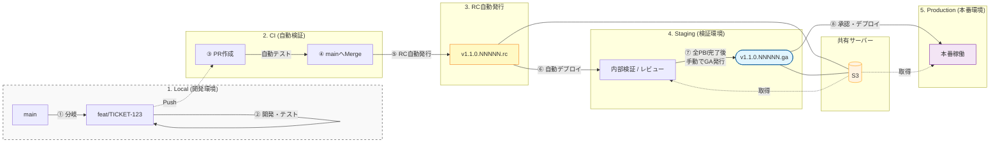
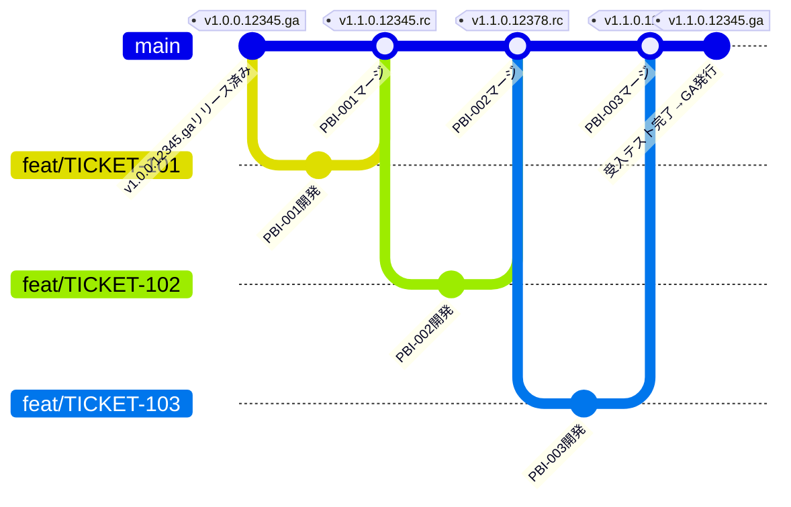
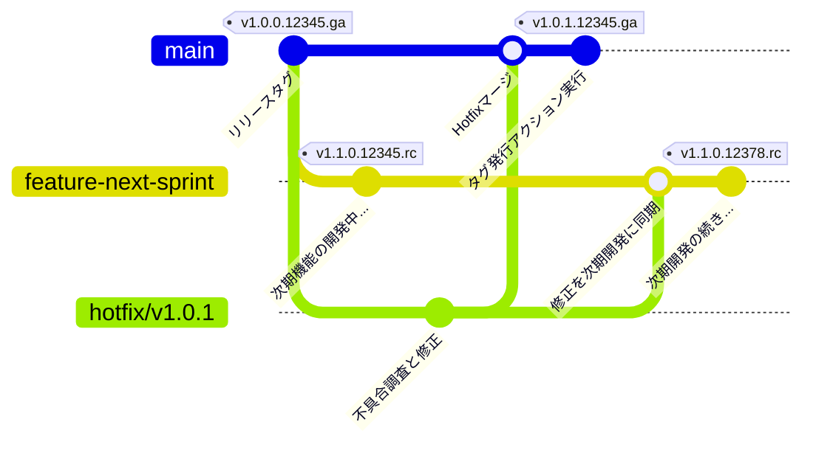
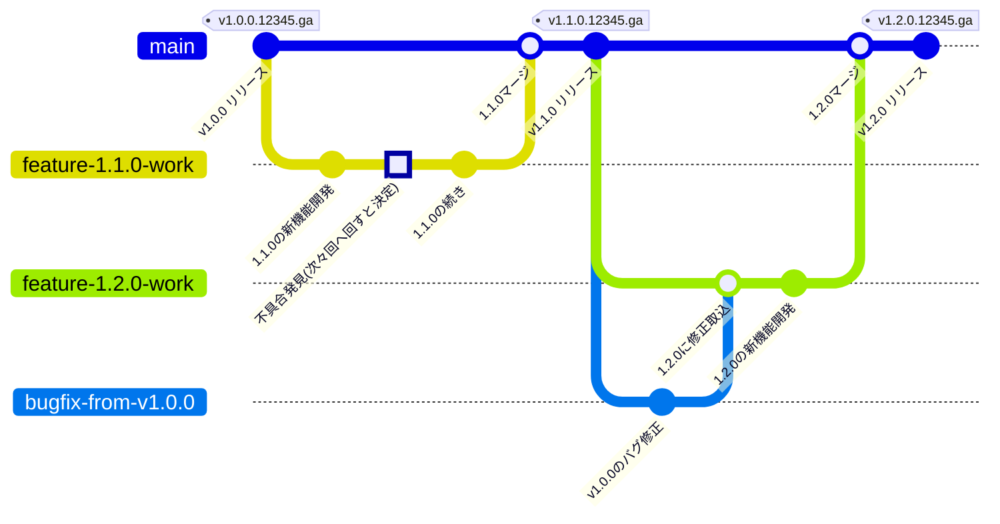

# ブランチ戦略およびリリースフロー

## ⚠️ ドキュメントの運用ステータス：暫定（Interim）

- **現状の制約**: 現在、開発者の受け入れテスト専用の環境とフェーズが存在しないため、Staging環境が「開発者の受け入れテスト」と「スプリントレビュー」の両方を担う暫定運用を行っています。
- **理想像**: 本来は環境を分離し、各テストフェーズでのテスト目的を独立させるべきです。
- **移行計画**: 必要な環境を定義し次第、本ガイドラインを「恒久版」へアップデートし、検証フローを正式に分離します。

## 開発の基本方針

- **GitHub Flow ベースの運用**: 常に `main` ブランチをデプロイ可能な状態に維持します。
- **Build Once, Deploy Many**: CIでビルドした同一のアーカイブを各環境に展開し、検証済みモジュールの同一性を保証します。
- **バージョン管理**: セマンティックバージョニングに基づくバージョン管理を行います。
  - **メジャー (1.x.x)**: プロジェクトの破壊的な変更や大規模な刷新時に更新
  - **マイナー (x.2.x)**: 定常的なスプリント開発の成果を main に統合する際に更新
  - **パッチ (x.x.3)**: リリース済みのバージョンに対する不具合修正（パッチ）時に更新
  - **ビルド識別子 (x.x.x.12345)**: GitHub Actions実行IDを付与し、ビルドの一意性を保証
  - **リリース識別子 (x.x.x.xxxxx.rc/ga)**: プロモーションの状態を識別（rc: リリース候補、ga: 本番リリース）

## 全体フロー図

開発フェーズから本番稼働までの時系列の流れと環境の対応関係です。


## 環境定義とテスト目的（TBD）

各環境の役割と、そこで実行されるテストの内容を定義します。

| 環境 | 定義・役割 | 主なテスト目的 | 実行主体 |
|---|---|---|---|
| **Local** | 各開発者のローカルPC環境 | 個別のスライス機能検証: 実装した機能がDoDを満たしているかの確認 | 開発者 |
| **Staging** | 本番相当の検証環境 | 受入検証（暫定）: 受入基準（AC）を満たしているかの最終確認<br>スプリントレビュー: ビジネス側への成果物デモ | チーム / PO |
| **Production** | 最終的な本番稼働環境 | 導通確認: 本番デプロイ直後の主要機能の動作確認（スモークテスト） | チーム |

## バージョン管理とリリース識別子（リリース候補）

### バージョンタグの種類

| タグ種別 | 形式 | 例 | 発行タイミング | 説明 |
|---------|------|-----|--------------|------|
| **RC（Release Candidate）** | `vX.Y.Z.NNNNN.rc` | `v1.1.0.12345.rc` | mainマージ時（自動） | リリース候補版。Staging環境での検証用。NNNNNはGitHub Actions実行ID |
| **GA（General Availability）** | `vX.Y.Z.NNNNN.ga` | `v1.1.0.12345.ga` | 受入テスト完了後（手動） | 本番リリース版 |

### RC自動発行の目的

スプリント内で複数のPBIが段階的にStagingにデプロイされる際、**「今Stagingで動いているのはどのビルドか」を明確に追跡**するため、mainマージ時にRC（リリース候補）タグを自動発行します。

### version.rbとリリース識別子

- **version.rb**: リリース識別子（GitHub Actions実行ID）を含める
  - 例: `VERSION = "1.1.0.12378.rc"`
  - Staging環境で「RC版である」ことが明示される
  - ログ出力: `[INFO] Application v1.1.0.12378.rc started`
  
- **アーティファクト名**: リリース識別子をそのまま使用
  - 例: `AppName-v1.1.0.12378.rc.zip`
  - シンプルで、Gitタグとアーティファクトが1対1対応
  
## 「v1.1.0」完成までの詳細開発フロー

スプリント開発からGA（本番リリース）までの完全なフローを示します。

### 開発フロー図（RC自動発行含む）



### 運用ルールと作業手順

#### 1. Remoteブランチの作成（代表者作業）
チームの代表者が `main` からフィーチャーブランチを切り、**Remote**に作成します。これは、複数人の開発結果を統合し、最低限の品質チェック（CI）を行うためのハブとなります。

**ブランチ命名規則**:
- **PBI全体を開発する場合**: `feat/TICKET-123_description`
  - 例: `feat/TICKET-123_login-page`, `feat/TICKET-456_user-profile`
- **バックログID**: チケット番号（チケット管理ツールとの連携のため必須）
- **説明部分**: 簡潔な英語の説明（スネークケース推奨）
- **注意**: SubTask（`Type: SubTask`）単位でブランチを切らない。ブランチは Story/Task 単位。

#### 2. Local環境へのPullと作業開始
開発者は、Remoteにあるフィーチャーブランチ（例: `feat/TICKET-123_login-page`）を各自のLocal環境に `Pull` してから開発を開始します。

**重要**: 個人が勝手にLocalでブランチを作成して作業を始めず、必ずRemoteのフィーチャーブランチから作業を開始します。

#### 3. Local環境での実装
各開発者は、Pullした `feat/TICKET-123` ブランチ上で直接、担当する機能を開発・テストします。

**作業の進め方**:
- **PBI全体を1人で担当する場合**: `feat/TICKET-123` ブランチ上で作業
- **PBI内で複数人が作業を分担する場合**: 各自が同一の `feat/TICKET-123` ブランチ上で作業し、SubTask（`Type: SubTask`）単位で担当範囲を明確化

自身のLocal環境におけるDoDを満たすまで、実装と修正を繰り返します。

**コミットメッセージの規則（推奨）**:
コミットメッセージにチケット番号を含めることを推奨します。これにより後から検索や並び替えが容易になります。
```bash
# 推奨例（SubTaskがある場合）
git commit -m "[TICKET-123/TICKET-124] ユーザーAPIのエンドポイント実装"

# 推奨例（SubTaskがない場合）
git commit -m "[TICKET-123] ログイン画面のバリデーション追加"
```

**コミットメッセージフォーマット（推奨）**
- **SubTaskあり**: `[TICKET-親ID/TICKET-SubTaskID] 変更内容の簡潔な説明`（SubTask は `Type: SubTask`）
- **SubTaskなし**: `[TICKET-123] 変更内容の簡潔な説明`

#### 4. RemoteへのPushとCI検証
Localでの検証が完了した成果物を、Remoteのフィーチャーブランチへ `Push` します。
```bash
# フィーチャーブランチへPush
git push origin feat/TICKET-123_login-page
```

この `Push` をトリガーに、統合環境での自動テスト（CI）が実行され、受け入れ基準を満たしているかが検証されます。

#### 5. mainブランチへのマージとRC自動発行
すべての開発者の成果が統合され、品質が確認された段階で `main` ブランチへマージします。マージされると、**GitHub Actionsが自動的にRCタグを発行**します。

**自動実行される処理**:
1. GitHub Actions実行IDを取得（例: 12378）
2. `version.rb` を更新（例: `VERSION = "1.1.0.12378.rc"`）
3. Gitタグを作成（例: `v1.1.0.12378.rc`）
4. アーティファクトをビルド（例: `AppName-v1.1.0.12378.rc.zip`）
5. S3にアップロード
6. Staging環境へ自動デプロイ

#### 6. Staging環境での受入テストと完了確認
各PBIが `main` にマージされるたびに、新しいRCタグが発行され、Staging環境へ自動デプロイされます。

**Staging環境での確認事項**
- どのRC版が動いているか: ログまたは管理画面で確認（例: `v1.1.0.12401.rc`）
- 各PBIの受入基準（AC）を満たしているか確認
- **全てのPBIがマージされ、受入テスト完了した時点で**、スプリントの成果物が確定

**番号の見方**
- 数字が大きいほど新しいビルド
- 例: `12345` → `12378` → `12401`（12401が最新）

#### 7. GAタグの手動発行
受入テストが完了した段階で、**GitHub ActionsのGAタグ発行ワークフローを手動実行**します。

**自動実行される処理**
1. `version.rb` を更新（例: `1.1.0.12401.rc` → `1.1.0.12345.ga`）
2. 変更をコミット
3. Gitタグを作成（例: `v1.1.0.12345.ga`）
4. アーティファクトをビルド（例: `AppName-v1.1.0.12345.ga.zip`）
5. S3にアップロード

これにより、Production環境へのデプロイが可能になります。

#### 8. Production環境へのデプロイ
GAタグが発行されたアーティファクトを使用して、本番環境へデプロイします。デプロイ後はスモークテストで主要機能の動作を確認します。

## 緊急対応（Hotfix）の運用

本番環境で不具合が発覚した場合、**不具合が発生している特定のバージョンタグ**を起点として修正を行います。

### 緊急対応の判断基準

#### A. 緊急度が高いとPOが判断した場合
- **リリース検討**: 現時点での即時リリースを検討します
- **ブランチ運用**: 不具合が発生しているリリースタグ（例: `v1.0.0`）から `hotfix/` ブランチを切り出します
- **サイクル**: スプリントとは切り離して修正・リリースを実施します

#### B. 緊急度が低いとPOが判断した場合
- 今スプリント以降での対応とし、PBIを新規作成します
- 基本的に他のPBIと同様に、`feat/` ブランチを切り出して対応します

### Pattern A: 次期スプリント開発中の緊急Hotfix

Ver1.1.0の開発スプリントが既に始まっており、そのスプリントの終了を待たずに緊急リリースが必要な場合を考えます。



#### ブランチ構成

| Repository Type | Branch Name | Description |
|------|--------------------------------------|------------------------------|
| Remote | feature-next-sprint | 今スプリントのPBIに対して複数の開発者の開発結果を最低限の品質チェックを行うためのブランチ |
| Remote | hotfix/v1.0.1 | 既にGAリリースされたv1.0.0に対するバグFix版を開発し最低限の品質チェックを行うためのブランチ |

#### 運用の流れとルール

1. **今スプリントの開発用ブランチ作成**: 前回同様フィーチャーブランチとしてRemoteに作成し、各開発者はこのブランチをPullして開発を行います
2. **Hotfix用ブランチ作成**: 今スプリントの開発用ブランチとは別にHotfixの開発用ブランチをRemoteに作成します。Hotfix開発作業者はこのブランチをPullして開発（バグ修正）を行います
3. **Hotfixのマージと検証**: Hotfixが無事リリースされたらHotfix用のブランチを今スプリントのフィーチャーブランチにマージし、Regression TestでHotfixブランチと同じ品質と機能性が確認できたら、Hotfix用ブランチは削除されます
4. **バージョン番号の注意点**: v1.0.0をベースに今スプリント版もHotfix版も開発されていますが、Hotfix版がマージされたものはv1.1.1にはなりません。※SemVerのルールに従い、桁が大きい方の番号が上がる場合、桁の小さい方の番号はリセットされることに留意します

### Pattern B: 今スプリント以降での修正対応

Ver1.1.0の開発スプリントが既に始まっている場合で、v1.0.0に対してバグが見つかったがすぐに修正する必要がない場合（少なくともv1.1.0中に修正は不要の場合）を考えます。

下図はv1.0.0に対して見つかったバグ修正を、v1.1.0のGAリリース後、v1.2.0の開発としてリリースする場合のブランチ図になります。なお、v1.2.0の機能開発がなくバグ修正版だけリリースする場合はv1.2.0ではなくv1.1.1になります。



### 具体的な実行手順（Remote/Local の厳密な区分）

#### 1. 修正用ブランチの作成【Remote作業 / 代表者】
まずは、GitHub（Remote）上でリリース済みタグ `v1.0.0` から `hotfix/v1.0.1` ブランチを作成します。

**ブランチ命名規則**:
- **形式**: `hotfix/vX.X.X` （修正対象のバージョンを明記）
- **例**: `hotfix/v1.0.1`

**※個人が勝手にLocalで作成して作業を始めず、必ず統合用ブランチをRemoteに用意します。**

#### 2. 作業環境の準備【Local作業 / 開発者】
Remoteに作成された修正用ブランチをLocal環境に `Pull` します。

```bash
# Remoteからブランチを取り込み、Localに切り替える
git fetch origin
git checkout hotfix/v1.0.1
```

#### 3. 不具合の修正【Local作業 / 開発者】
Local環境でコードの修正と検証を行い、コミットします。

**※ `version.rb` の手動編集は不要です（GitHub Actionsで自動更新されます）。**

```bash
# 修正後にコミット
git add .
git commit -m "Fix: 致命的な不具合を修正"
```

#### 4. 修正内容のPushとマージ【Remote作業 / 開発者】
Localでの修正をRemoteへ `Push` し、PRを作成してmainへマージします。

```bash
# Remoteへプッシュ
git push origin hotfix/v1.0.1
```

その後、GitHub上でPRを作成し、レビュー・承認を経て `main` ブランチへマージします。

#### 5. Staging環境での検証（必要に応じて）
mainへマージされると、Staging環境へ自動デプロイされます。必要に応じて修正内容を検証します。

#### 6. タグ発行【Remote作業 / GitHub Actions】
検証完了後、**GitHub Actionsのタグ発行ワークフローを手動実行**します。
ワークフローが以下を自動実行します。
- `version.rb` の更新（v1.0.0.12345.ga → v1.0.1.12345.ga）
- Gitタグ `v1.0.1.12345.ga` の作成

## ブランチ命名規則

| ブランチ種別 | 命名規則 | 例 | 説明 |
|------------|---------|-----|------|
| **フィーチャーブランチ（PBI単位）** | `feat/TICKET-123_description` | `feat/TICKET-123_login-page` | PBI単位の開発用ブランチ（Remoteに作成）。複数人で分担する場合も同一ブランチを使用 |
| **Hotfixブランチ** | `hotfix/vX.X.X` | `hotfix/v1.0.1` | 緊急修正用ブランチ（Remoteに作成） |
| **Bugfixブランチ** | `bugfix/TICKET-123_description` | `bugfix/TICKET-456_login-error` | 緊急度の低いバグ修正用 |
