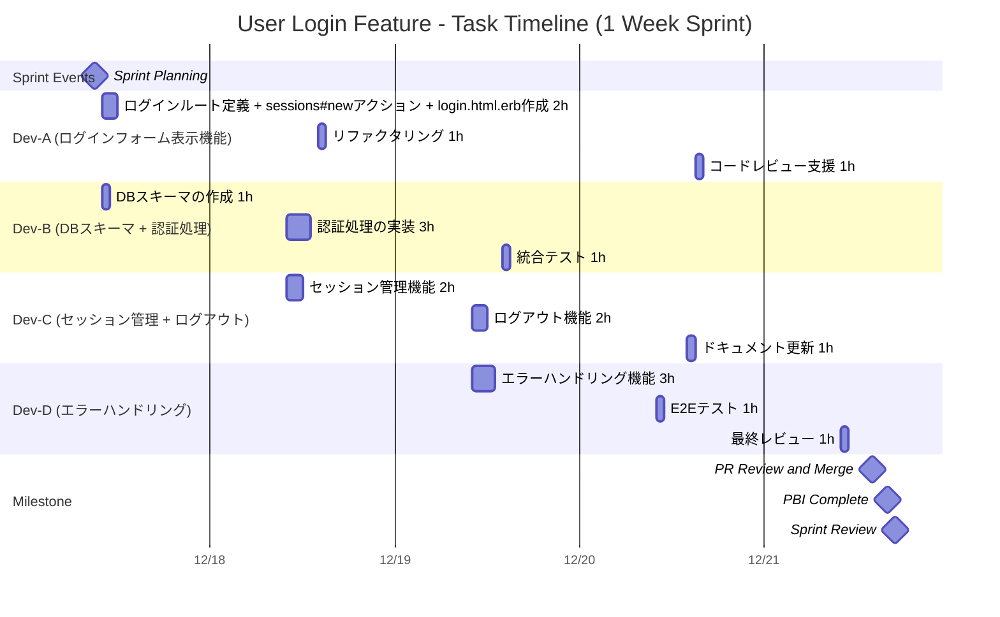
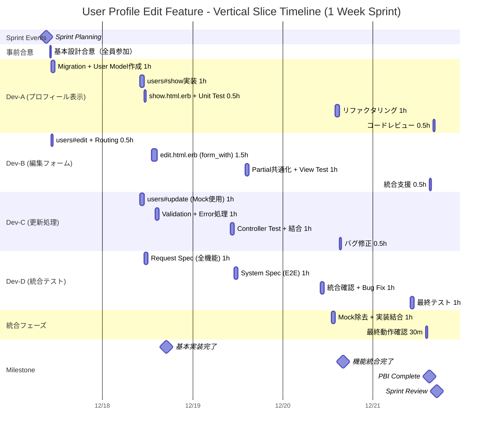

# Rails Example (Ruby on Rails Erb Version)

## Example 1: 推奨される分割（スウォーム的）をErbを用いたWeb Appの場合

ここでは、「ユーザーログイン機能の実装」というPBIを想定し、サブタスクのサイズ原則（README.md §3.5）を意識して分割したタスクの具体例を示します。これにより、4人の開発者が同時に一つのPBIに取り組むことが可能になります。

> **注記（時間表記について）**: 本ドキュメントの表・ガントチャートに含まれる個別の時間（`1H`、`2.5時間`、`2h` など）は、人間が主体となって実装する Phase 1（README.md §1.4）を前提とした目安です。エージェントが実装を担う Phase 2/3 では、サブタスクの所要時間の単位は大幅に小さくなりうる（分オーダーになることもある）ため、時間の数値は固定の閾値ではなく作業主体に応じて読み替えてください。守るべき不変の原則は時間の絶対値ではなく、「1つの検証可能な単位に収め、1セッションで完結させる」ことです（サブタスクのサイズ原則）。

| 開発層 | タスクの具体例（サブタスクのサイズ原則を適用） | 知識共有のポイント |
| --- | --- | --- |
| DBスキーマの作成 | 認証に必要なUserテーブルのマイグレーションファイル作成 + User model作成 (1H） | バックエンド実装者がプルすることでDB知識を習得。 |
| ログインフォーム表示機能 | ログインルート定義 + sessions#newアクション + login.html.erb作成（2H） | 最小限のログイン画面が表示され、画面確認が可能。 |
| 認証処理の実装 | sessions#createアクション　+ User.authenticate実装 + 成功時リダイレクト（3H） | 正しい認証情報でログインが成功する。認証ロジックを共有。 |
| エラーハンドリング機能 | バリデーション追加 + エラーメッセージ表示 + login.html.erbにflash表示（3H） | 不正な認証情報での適切なエラー表示。バリデーションを共有。 |
| セッション管理機能 | helper作成 + application_controller.rbに共通処理（2H） | ログイン状態の判定とセッション管理。Controllerの共通処理を共有。 |
| ログアウト機能 | sessions#destroyアクション + ログアウトリンク + ルート定義（2H） | ログアウトが完動作する完全なログイン機能。 |

この分割により、4人の開発者が同時に（スウォーム）一つのPBIに取り掛かることが可能になります。

**並行作業例：**

- Aさん：ログインフォーム表示機能
- Bさん：DBスキーマの作成 + 認証処理の実装
- Cさん：セッション管理機能 + ログアウト機能
- Dさん：エラーハンドリング設計

全員が作業を終えると、次の最も緊急なタスク（例：ロジック結合）をプルして進めます。

### 上記PBIをメンバーごとに作業分担して対応する際のメンバー毎の作業タイムライン

### Example 2: Railsの規約を活かしたタスク分割のポイント

Rails開発において、1つのPBI（例：商品出品機能）を分割する際は、**「データの流れ（Request → Router → Controller → Model → View）」**を意識して、以下の3つの境界でタスクを切り出すのがコツです。

    1. Controller & Routing層（Interface）: データの入出力を繋ぐ「配管」を作る。
    2. Model層（Data/Logic）: データベース構造とビジネスロジックの「芯」を作る。
    3. View & Assets層（UI）: ユーザーが触れる「ガワ」を作る。

### RailsでのPBIタスク構成例（1ポイント基準を応用）

「ユーザーがプロフィールを編集できる」というPBIを例に、Mock/Stubを活用したバーティカルスライス型のサブタスク分割案を示します。

**基本設計の事前合意（全員参加・15分）**
- User モデルの基本属性（name, email, bio）
- RESTfulルート（users#show, users#edit, users#update）
- 基本的なバリデーションルール

| 担当者 | バーティカルスライス（機能単位） | 想定時間 | Mock/Stub活用方法 | スウォーム/知識共有の狙い |
|---------|----------------------------------|----------|-------------------|------------------------------|
| Dev-A | プロフィール表示機能（show） | 2.5時間 | 初期データをFactoryBotで作成 | Rails規約に沿ったMVC実装をチーム全体で共有 |
| Dev-B | プロフィール編集フォーム（edit） | 2.5時間 | Controller stubでView先行実装 | form_withとPartialの使い方を全員に周知 |
| Dev-C | プロフィール更新処理（update） | 2.5時間 | Model mockでController/Validationテスト | Strong ParametersとError Handlingのベストプラクティス共有 |
| Dev-D | 統合テスト＆品質保証 | 2.5時間 | 全機能のRequest/System Spec実装 | テスト戦略とCapybaraの使い方をチーム統一 |

### プロフィール編集機能のタスクタイムライン（4人完全並行作業・依存関係なし）

### Rails開発におけるvertical slice Taskのポイント（Mock/Stub活用）

Railsでバーティカルスライス型の並行開発を実現するため、以下のMock/Stub戦略を活用します：

#### Mock/Stub活用による並行開発戦略

**1. 事前の最小設計合意（15分）**
- API仕様（ルート、パラメータ、レスポンス形式）を全員で決定
- Model属性とバリデーションルールの基本方針を共有
- 各担当者が依存する部分のインターフェースを明確化

**2. 各開発者のMock/Stub活用法**
- **Dev-A（表示機能）**: FactoryBotで初期データ生成、実際のDBスキーマを先行作成
- **Dev-B（編集フォーム）**: Controller stubを使ってView先行実装、Rails規約のパス名を活用
- **Dev-C（更新処理）**: Model mockでController/Validationを先行テスト実装
- **Dev-D（統合テスト）**: API仕様に基づく期待値でRequest/System Spec実装

**3. 統合時の注意点**
- Mock/Stubを実装に置き換える際の動作確認を30分で実施
- 各機能の組み合わせ時の想定外動作をペアで確認
- 「Serviceクラスの切り出し判断はモブプロで！」: Controller肥大化時は全員で設計議論

e.g. 1ポイント（Hello World）のRails版
Railsにおける1ポイントは、**「Scaffoldで1つのリソース（例：Message）を作成し、DBから1件取得して表示するまで」**とするのが最も分かりやすい基準です。

    - db/migrate（DB）
    - models/message.rb（Model）
    - controllers/messages_controller.rb（Controller）
    - views/messages/index.html.erb（View）

  これら一式が揃って初めて、Railsの「1ポイント」としてのバーティカルスライスが完成します。
